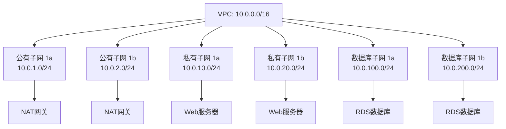
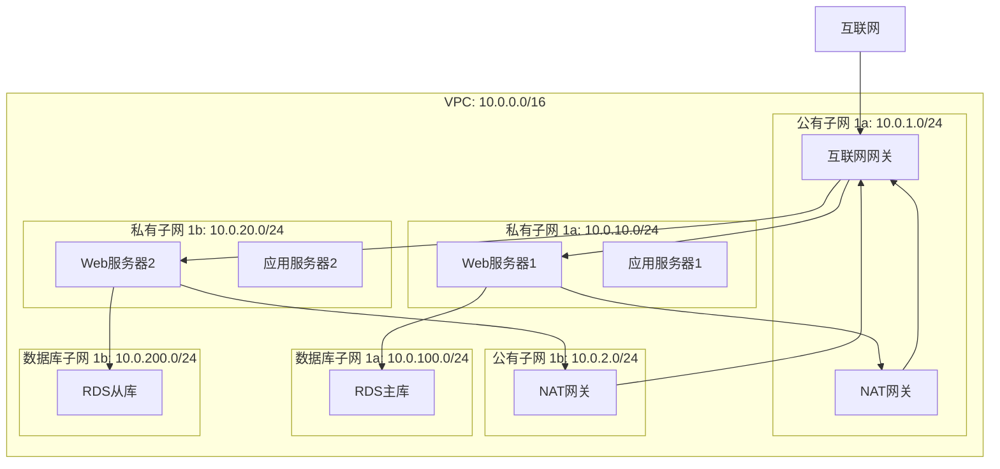
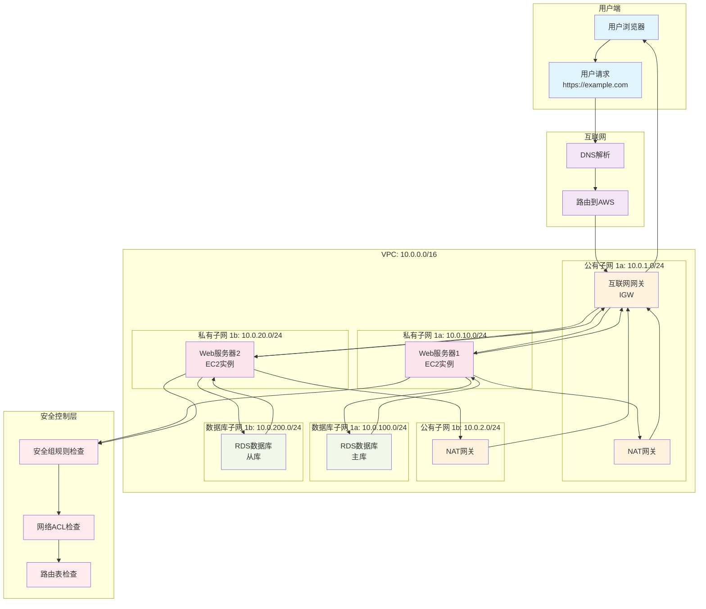

> 🌐 **AWS网络架构** 是云计算的基础设施核心，理解VPC、子网、路由等概念对于构建安全、高效的云应用至关重要。本文将用通俗易懂的方式，带你深入理解AWS网络组件的每一个细节，并通过实际配置示例，让你真正掌握云网络架构的设计精髓。

本篇将系统性地解析AWS网络核心概念，帮助你从零开始理解云网络架构，掌握VPC设计、安全配置和最佳实践，最终能够独立设计和部署企业级云网络环境。

---

# AWS网络架构深度解析

## 什么是AWS网络架构？

**AWS网络架构** 是亚马逊云服务提供的虚拟网络基础设施，它模拟了传统数据中心的网络环境，但具有更高的灵活性、可扩展性和安全性。通过VPC（Virtual Private Cloud）等核心组件，你可以在云端构建完全隔离的私有网络环境。

::: info 📚 为什么需要云网络架构？

**传统数据中心 vs 云网络**:

**传统方式**:
- 需要购买物理服务器、交换机、路由器
- 网络配置复杂，需要专业网络工程师
- 扩展性差，成本高，维护困难

**AWS云网络**:
- 虚拟化网络，按需创建和销毁
- 图形化界面配置，降低技术门槛
- 弹性扩展，按使用量付费
- 内置安全防护和监控

**核心优势**:
```yaml
灵活性: 随时调整网络配置，无需物理设备
安全性: 多层安全防护，网络隔离
可扩展性: 支持从单机到大规模集群
成本效益: 按需付费，无需前期投资
```

:::

## Virtual Private Cloud (VPC) - 虚拟私有云

**VPC (Virtual Private Cloud)** 是AWS网络架构的核心，它为你提供了一个逻辑隔离的虚拟网络环境，就像在云端拥有自己的数据中心。

### VPC的核心特性

**VPC的主要功能**:

1. **网络隔离**: 每个VPC都是独立的网络环境
2. **IP地址管理**: 自定义IP地址范围
3. **子网划分**: 将VPC分割成多个子网
4. **路由控制**: 管理网络流量的走向
5. **安全防护**: 通过网络ACL控制访问

### VPC工作原理

**1. 创建VPC**：
- 在AWS控制台或CLI中创建VPC，指定IPv4 CIDR块（如10.0.0.0/16）
- AWS在后台分配虚拟网络资源，包括虚拟路由器、交换机等

**2. 网络隔离**：
- 每个VPC都有独立的网络空间，与其他VPC完全隔离
- 即使使用相同的IP地址范围，不同VPC之间也无法直接通信

**3. 子网划分**：
- 在VPC内创建子网，每个子网属于一个可用区
- 子网继承VPC的IP地址范围，形成更小的网络段

**4. 路由管理**：
- 每个子网关联一个路由表，控制流量的走向
- 每个路由表都包含本地路由，处理VPC内部通信

**5. 安全控制**：
- 通过安全组控制实例级别的访问
- 通过网络ACL控制子网级别的访问

### VPC配置示例

```yaml
# VPC基本配置
VPC配置:
  名称: "my-production-vpc"
  IPv4 CIDR: "10.0.0.0/16"  # 支持65536个IP地址
  区域: "us-east-1"
  租户: "default"  # 共享硬件，成本更低
```

## Subnet (子网) - 网络细分

**子网 (Subnet)** 是VPC内的网络细分，每个子网属于一个可用区，用于部署不同类型的资源。

### 子网类型详解

::: warning ⚠️ 子网类型选择很重要

**Public Subnet (公有子网)**:
- 有到互联网网关的路由（0.0.0.0/0 → IGW）
- 适合部署NAT网关、负载均衡器等面向互联网的服务
- 通过路由表路由到互联网网关访问互联网

**Private Subnet (私有子网)**:
- 没有到互联网网关的路由
- 适合部署数据库、应用服务器
- 通过NAT网关访问互联网，更安全

**Database Subnet (数据库子网)**:
- 专门用于数据库部署
- 通常配置为私有子网
- 额外的安全隔离
:::

### 子网工作原理

**1. 子网创建**：
- 在VPC内创建子网，指定CIDR块（如10.0.1.0/24）
- 每个子网必须属于一个可用区，不能跨可用区

**2. IP地址分配**：
- 子网从VPC的CIDR块中分配IP地址
- 每个子网有4个保留IP地址（网络地址、广播地址、AWS保留地址）

**3. 路由表关联**：
- 每个子网必须关联一个路由表
- 路由表决定子网内流量的走向

**4. 公有子网工作**：
- 有到互联网网关的路由（0.0.0.0/0 → IGW）
- 实例可以获得公有IP地址
- 通过路由表路由到互联网网关访问互联网

**5. 私有子网工作**：
- 没有直接到互联网的路由
- 实例只能获得私有IP地址
- 通过NAT网关访问互联网

### 子网设计最佳实践



## Route Table (路由表) - 网络流量控制

**路由表 (Route Table)** 决定了网络流量的走向，就像现实中的交通指示牌，告诉数据包应该走哪条路。

### 路由表核心概念

**路由表的主要功能**:

1. **本地路由**: VPC内部通信
2. **互联网网关路由**: 访问互联网
3. **NAT网关路由**: 私有子网访问互联网
4. **对等连接路由**: VPC间通信
5. **虚拟网关路由**: 连接企业网络

### 路由表工作原理

**1. 数据包发送**：
- 当实例发送数据包时，系统检查目标IP地址
- 根据目标IP地址查找匹配的路由规则

**2. 路由匹配**：
- 系统按顺序检查路由表中的规则
- 选择最具体的匹配规则（最长前缀匹配）

**3. 路由决策**：
- 如果匹配到本地路由（10.0.0.0/16），数据包在VPC内转发
- 如果匹配到互联网路由（0.0.0.0/0），数据包发送到指定网关

**4. 网关转发**：
- 互联网网关：处理公有子网的互联网访问
- NAT网关：处理私有子网的出站互联网访问
- 对等连接：处理VPC间通信

**5. 默认路由**：
- 每个路由表都有默认的本地路由（VPC CIDR → Local）
- 确保VPC内部通信正常工作

### 路由表配置示例

```yaml
# 公有子网路由表
公有子网路由表:
  目标: "0.0.0.0/0"        # 所有流量
  目标类型: "Internet Gateway"  # 通过IGW访问互联网
  状态: "Active"
  
# 私有子网路由表  
私有子网路由表:
  本地路由:
    目标: "10.0.0.0/16"    # VPC内部流量
    目标类型: "Local"      # 本地路由
  互联网路由:
    目标: "0.0.0.0/0"      # 所有流量
    目标类型: "NAT Gateway" # 通过NAT访问互联网
```

## Internet Gateway (互联网网关) - 连接互联网

**互联网网关 (Internet Gateway)** 是VPC与互联网之间的桥梁，为公有子网提供直接访问互联网的能力。

### 互联网网关核心特性

**互联网网关的主要功能**:

1. **双向通信**: 支持入站和出站流量
2. **NAT转换**: 公有IP与私有IP转换
3. **高可用性**: 自动扩展到多个可用区
4. **免费服务**: 不收取额外费用

### 互联网网关工作原理

**1. 出站流量处理**：
- 实例发送数据包到互联网（如访问google.com）
- 数据包通过路由表路由到互联网网关
- 互联网网关转发流量到互联网

**2. 入站流量处理**：
- 互联网上的服务器响应请求
- 响应数据包目标IP是实例的公有IP
- 互联网网关接收响应，转发到VPC中的实例

**3. 流量转发**：
- 出站：将流量从VPC转发到互联网
- 入站：将互联网流量转发到VPC
- 不执行地址转换（NAT由NAT网关处理）

**4. 高可用性**：
- 互联网网关自动扩展到所有可用区
- 无需手动配置多可用区部署
- 提供99.99%的可用性SLA

**5. 安全特性**：
- 只处理有路由表规则指向它的流量
- 不提供额外的安全过滤功能
- 依赖安全组和NACL进行安全控制

### 互联网网关配置示例

```yaml
# 互联网网关配置
互联网网关配置:
  名称: "my-igw"
  类型: "Internet Gateway"
  VPC: "my-production-vpc"
  状态: "Attached"
  
# 路由表配置
公有子网路由:
  目标: "0.0.0.0/0"        # 所有互联网流量
  目标类型: "Internet Gateway"
  目标ID: "igw-1234567890"
```


## NAT Gateway (Network Address Translation) - 安全的互联网访问

**NAT网关 (NAT Gateway)** 为私有子网提供安全的互联网访问，确保私有资源可以访问互联网，但互联网无法直接访问私有资源。

### NAT网关工作原理

​​1. 发起请求​​：
 EC2 实例 10.0.1.5发送一个数据包，源 IP 是 10.0.1.5，目标 IP 是 203.0.113.10。

2. ​​路由至 NAT 网关​​：
 - 根据私有子网的路由表规则，所有发往互联网的流量（0.0.0.0/0）都被指向 NAT 网关。
 - 数据包被发送到 NAT 网关。

​​3. 执行地址转换​​： 
这是最关键的一步​​。NAT 网关收到数据包后，会执行网络地址转换：
 - 修改源 IP​​： 它将数据包的​​源 IP​​ 从私有 IP 10.0.1.5更改为 ​​NAT 网关自己的公有 IP​​（例如 198.51.100.1）。
 - 记录映射关系​​： NAT 网关会在内部创建一个转换表条目，记录 (10.0.1.5:源端口) -> (198.51.100.1:新端口)的映射关系，以便能将返回的流量正确送回。

4. ​转发至互联网​​：
 - 修改后的数据包（源 IP=198.51.100.1，目标 IP=203.0.113.10）通过互联网网关被发送到公共互联网。

5. ​​接收响应​​：
- 公共服务器 203.0.113.10处理请求并发送响应包。这个响应包的​​目标 IP​​ 是 198.51.100.1（NAT 网关的公有 IP），源 IP 是 203.0.113.10。

6. 返回至 NAT 网关​​：
响应数据包通过互联网网关路由回 NAT 网关（因为目标 IP 是 NAT 网关的地址）。

7. ​​逆向地址转换​​
- NAT 网关查看其内部的转换表，根据目标端口号找到之前记录的映射关系。
- 它将响应数据包的​​目标 IP​​ 从自己的公有 IP 198.51.100.1改回原始的私有 IP 10.0.1.5。

8. 交付至实例​​：
- 最终，这个响应数据包被发送回私有子网中的 EC2 实例 10.0.1.5。对于实例来说，它感觉就像是直接与互联网通信了一样。

**NAT网关的核心功能**:

1. **出站连接**: 私有子网访问互联网
2. **地址转换**: 将私有IP转换为公有IP
3. **安全隔离**: 互联网无法直接访问私有资源
4. **高可用性**: 支持多可用区部署

### NAT网关配置示例

```yaml
# NAT网关配置
NAT网关配置:
  名称: "my-nat-gateway"
  子网: "public-subnet-1a"  # 必须部署在公有子网
  弹性IP: "203.0.113.1"     # 静态公网IP
  连接类型: "Public"        # 公有连接
  
# 私有子网路由配置
私有子网路由:
  目标: "0.0.0.0/0"         # 所有互联网流量
  目标类型: "NAT Gateway"   # 通过NAT网关
  目标ID: "nat-1234567890"  # NAT网关ID
```

## Network ACL (网络ACL) - 子网级防火墙

**网络ACL (Network ACL)** 是子网级别的防火墙，提供额外的安全控制层。

### Network ACL vs Security Group 对比

| 特性 | Network ACL | Security Group |
|------|---------|--------|
| **作用范围** | 子网级别 | 实例级别 |
| **规则方向** | 入站和出站 | 入站和出站 |
| **状态** | 无状态 | 有状态 |
| **规则顺序** | 按规则号顺序 | 所有规则都评估 |
| **默认行为** | 明确允许/拒绝 | 默认拒绝入站 |

### 网络ACL工作原理

**1. 子网级别过滤**：
- 网络ACL在子网边界处工作
- 所有进出子网的流量都要经过ACL检查
- 在安全组之后进行过滤

**2. 规则号顺序处理**：
- 规则按规则号从小到大顺序评估
- 找到第一个匹配的规则就停止
- 规则号越小，优先级越高

**3. 无状态处理**：
- 不记住连接状态
- 入站和出站流量需要分别配置规则
- 响应流量需要单独的出站规则

**4. 默认规则**：
- 每个NACL都有默认的拒绝规则（规则号32767）
- 如果没有匹配的允许规则，流量被拒绝
- 必须明确配置允许规则

**5. 入站和出站检查**：
- 入站：检查进入子网的流量
- 出站：检查离开子网的流量
- 两个方向都需要配置相应的规则

### NACL配置示例

```yaml
# 公有子网NACL
公有子网NACL:
  入站规则:
    - 规则号: "100"
      协议: "HTTP"
      端口: "80"
      源: "0.0.0.0/0"
      动作: "ALLOW"
    - 规则号: "110"
      协议: "HTTPS"
      端口: "443" 
      源: "0.0.0.0/0"
      动作: "ALLOW"
    - 规则号: "32767"
      源: "0.0.0.0/0"
      动作: "DENY"  # 默认拒绝规则
      
  出站规则:
    - 规则号: "100"
      协议: "All"
      目标: "0.0.0.0/0"
      动作: "ALLOW"
```

## 完整网络架构示例

### 三层架构设计



### 配置清单

```yaml
# 完整网络配置清单
网络架构配置:
  VPC:
    名称: "production-vpc"
    CIDR: "10.0.0.0/16"
    区域: "us-east-1"
    
  子网:
    公有子网:
      - 名称: "public-1a"
        CIDR: "10.0.1.0/24"
        AZ: "us-east-1a"
      - 名称: "public-1b"
        CIDR: "10.0.2.0/24"
        AZ: "us-east-1b"
        
    私有子网:
      - 名称: "private-1a"
        CIDR: "10.0.10.0/24"
        AZ: "us-east-1a"
      - 名称: "private-1b"
        CIDR: "10.0.20.0/24"
        AZ: "us-east-1b"
        
    数据库子网:
      - 名称: "db-1a"
        CIDR: "10.0.100.0/24"
        AZ: "us-east-1a"
      - 名称: "db-1b"
        CIDR: "10.0.200.0/24"
        AZ: "us-east-1b"
        
  网关:
    互联网网关: "igw-1234567890"
    NAT网关:
      - 名称: "nat-1a"
        子网: "public-1a"
        弹性IP: "203.0.113.1"
      - 名称: "nat-1b"
        子网: "public-1b"
        弹性IP: "203.0.113.2"
        
  安全组:
    Web服务器:
      - 入站: "HTTP(80), HTTPS(443), SSH(22)"
      - 出站: "All"
    数据库:
      - 入站: "MySQL(3306), PostgreSQL(5432)"
      - 出站: "None"
```

## 常见配置问题与解决方案

### 问题1: 私有子网无法访问互联网

**症状**: 私有子网中的实例无法访问互联网

**原因分析**:
- 缺少NAT网关
- 路由表配置错误
- 安全组规则过于严格

**解决方案**:
```yaml
解决步骤:
  1. 创建NAT网关:
     - 在公有子网中创建NAT网关
     - 分配弹性IP地址
     
  2. 配置路由表:
     - 私有子网路由表添加0.0.0.0/0 -> NAT网关
     
  3. 检查安全组:
     - 确保出站规则允许HTTPS(443)和HTTP(80)
```

### 问题2: 安全组规则冲突

**症状**: 实例无法正常通信

**原因分析**:
- 安全组规则相互冲突
- 规则顺序错误
- 源/目标配置错误

**解决方案**:
```yaml
最佳实践:
  1. 使用安全组引用:
     - 源: "sg-1234567890" (安全组ID)
     - 而不是: "10.0.0.0/16" (CIDR)
     
  2. 最小权限原则:
     - 只开放必要的端口
     - 限制源IP范围
     
  3. 分层安全:
     - Web层: 只允许HTTP/HTTPS
     - 应用层: 只允许来自Web层
     - 数据层: 只允许来自应用层
```

## 成本优化建议

### 网络组件成本分析

```yaml
成本构成:
  VPC:
    成本: "免费"
    说明: "VPC本身不收费"
    
  子网:
    成本: "免费"
    说明: "子网不单独收费"
    
  互联网网关:
    成本: "免费"
    说明: "IGW不收费"
    
  NAT网关:
    成本: "约$45/月"
    说明: "按小时计费 + 数据处理费用"
    
  弹性IP:
    成本: "约$3.65/月"
    说明: "未关联实例时收费"
    
  数据传输:
    成本: "按GB计费"
    说明: "跨AZ和跨区域传输收费"
```

### 成本优化策略

::: tip 💰 成本优化建议

**1. NAT网关优化**:
- 使用NAT实例替代NAT网关（小规模应用）
- 多个私有子网共享一个NAT网关
- 考虑使用VPC端点减少NAT网关使用

**2. 数据传输优化**:
- 将相关资源部署在同一可用区
- 使用CloudFront CDN减少数据传输
- 优化应用架构减少跨区域调用

**3. 弹性IP管理**:
- 及时释放未使用的弹性IP
- 合理规划弹性IP使用
:::

## 总结

AWS网络架构是构建云应用的基础，理解VPC、子网、安全组等核心概念对于设计安全、高效的云环境至关重要。

### 关键要点回顾

1. **VPC**: 提供隔离的虚拟网络环境
2. **子网**: 网络细分，支持多可用区部署
3. **路由表**: 控制网络流量走向
4. **互联网网关**: 连接VPC与互联网
5. **NAT网关**: 为私有子网提供安全的互联网访问
6. **安全组**: 实例级别的虚拟防火墙
7. **网络ACL**: 子网级别的额外安全控制

### 最佳实践

- 采用三层架构设计（Web-应用-数据库）
- 使用公有子网部署面向互联网的服务
- 使用私有子网部署应用和数据库
- 实施分层安全策略
- 定期审查和优化网络配置

通过掌握这些核心概念和最佳实践，你将能够设计出安全、高效、可扩展的AWS网络架构，为你的云应用提供坚实的基础。

## 完整用户访问流程图

### 从用户到实例的完整流程



### 详细流程说明

#### 1. 用户发起请求
```yaml
步骤1: 用户访问
  操作: 用户在浏览器输入 https://example.com
  协议: HTTPS (端口443)
  加密: TLS/SSL加密
```

#### 2. DNS解析
```yaml
步骤2: DNS解析
  操作: 解析域名到AWS实例IP
  结果: 获得EC2实例的公有IP地址
  缓存: 本地DNS缓存
```

#### 3. 路由到AWS
```yaml
步骤3: 互联网路由
  操作: 数据包通过互联网路由到AWS
  路径: 用户 → ISP → 互联网 → AWS边缘位置
  优化: AWS CloudFront CDN (如果配置)
```

#### 4. 进入VPC
```yaml
步骤4: VPC入口
  组件: 互联网网关 (IGW)
  功能: 
    - 接收来自互联网的流量
    - 执行NAT转换
    - 路由到目标子网
```

#### 5. 安全组检查
```yaml
步骤5: 安全组验证
  组件: Security Group
  检查项:
    - 源IP地址
    - 目标端口 (80/443)
    - 协议类型 (HTTP/HTTPS)
    - 连接状态
```

#### 6. 网络ACL检查
```yaml
步骤6: 网络ACL验证
  组件: Network ACL
  检查项:
    - 子网级别访问控制
    - 入站/出站规则
    - 规则优先级
```

#### 7. 路由表检查
```yaml
步骤7: 路由表查询
  组件: Route Table
  功能:
    - 确定目标实例位置
    - 选择最佳路径
    - 跨可用区路由
```

#### 8. 到达后端实例
```yaml
步骤8: 实例处理
  组件: EC2实例 (Web服务器)
  处理:
    - 接收HTTP请求
    - 处理业务逻辑
    - 查询数据库 (如需要)
    - 生成响应
```

#### 9. 数据库访问 (如需要)
```yaml
步骤9: 数据库查询
  组件: RDS数据库
  功能:
    - 接收SQL查询
    - 执行数据库操作
    - 返回查询结果
    - 主从复制 (如配置)
```

#### 10. 响应返回
```yaml
步骤10: 响应流程
  路径: 数据库 → Web服务器 → 互联网网关 → 用户
  处理:
    - 加密响应数据
    - 互联网网关NAT转换
    - 通过互联网返回用户
```

### 关键网络组件作用

| 组件 | 作用 | 层级 |
|------|------|------|
| **互联网网关** | 连接VPC与互联网 | 网络层 |
| **安全组** | 实例级防火墙 | 实例层 |
| **网络ACL** | 子网级防火墙 | 子网层 |
| **路由表** | 流量路由决策 | 网络层 |
| **NAT网关** | 私有子网出站访问 | 网络层 |

### 性能优化要点

::: tip 🚀 性能优化建议

**1. 缓存策略**:
- 使用CloudFront CDN缓存静态内容
- 启用数据库查询缓存
- 配置应用层缓存

**2. 连接优化**:
- 配置HTTP/2支持
- 启用连接复用
- 优化SSL/TLS配置

**3. 监控指标**:
- 响应时间监控
- 错误率统计
- 吞吐量测量
- 健康检查状态
:::

---

> 💡 **学习建议**: 建议先在AWS免费套餐中实践这些概念，通过实际操作加深理解。记住，网络架构设计需要平衡安全性、性能和成本，根据实际需求选择合适的方案。