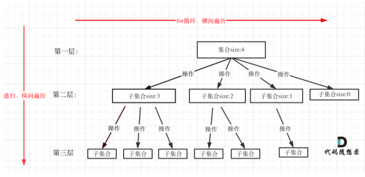
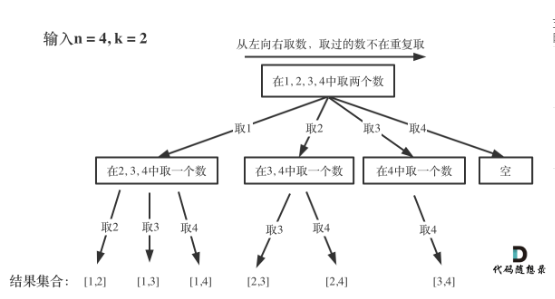
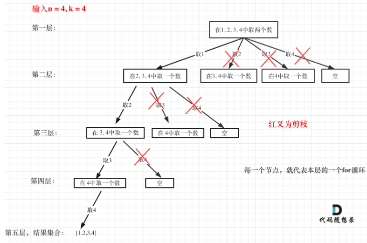
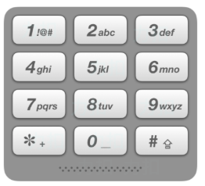
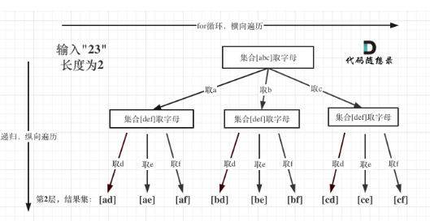
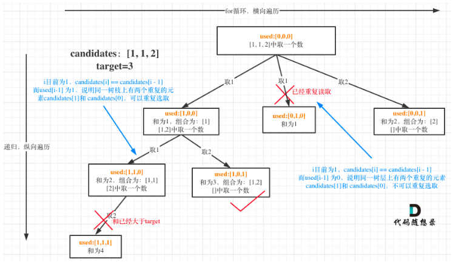
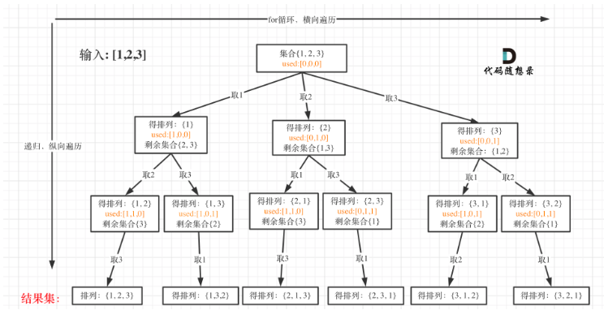
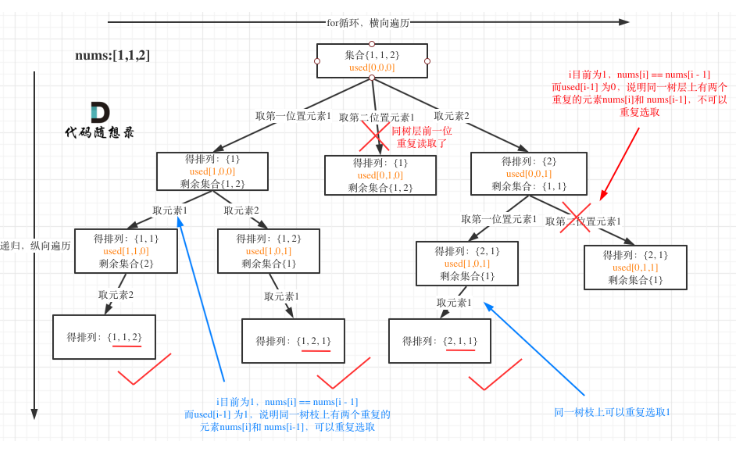
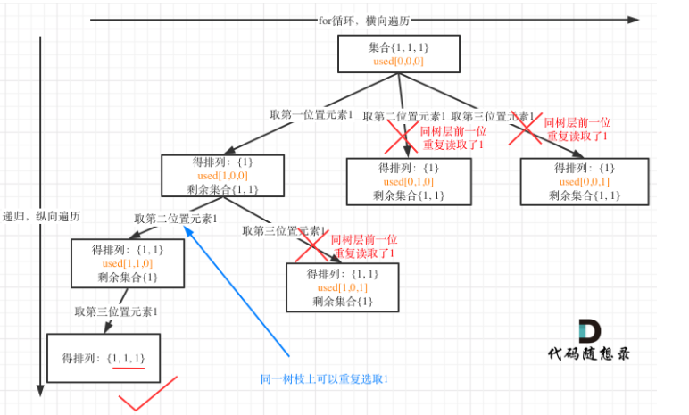
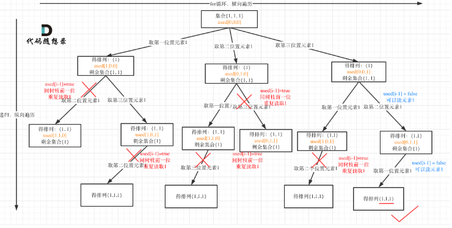

回溯算法是一种通过构建决策树来解决问题的算法，它通过深度优先搜索的方式，系统地尝试所有可能的解决方案，直到找到满足条件的答案。本文将深入浅出地讲解回溯算法的核心思想、实现方法以及常见应用场景。

---

## 1. 回溯算法的基本概念

### 1.1 什么是回溯算法？

回溯算法是一种通过试错的方式来寻找问题解的方法。当我们在搜索过程中发现当前路径不可能是正确答案时，就回退到上一步，尝试其他可能的路径。这种 **"走不通就回头"** 的算法思想，就是回溯法的核心。

### 1.2 回溯算法的基本框架

回溯算法的基本框架可以概括为：

```js
function backtrack(路径, 选择列表) {
    if (满足结束条件) {
        收集结果;
        return;
    }
    
    for (选择 in 选择列表) {
        做选择;
        backtrack(路径, 选择列表);
        撤销选择; // 回溯
    }
}
```

这个框架包含了回溯算法的三个关键步骤：
- **选择**：在当前状态下，从可选的选项中选择一个
- **探索**：基于这个选择，继续探索下一步
- **回溯**：如果当前路径不能得到有效解，撤销选择，回到上一步

### 1.3 回溯算法与决策树

回溯法解决的问题都可以抽象为树形结构，也称为决策树：
- **树的宽度**：由集合的大小决定（for循环的范围）
- **树的深度**：由递归的深度决定（递归的层数）

因为回溯法解决的都是在集合中递归查找子集，集合的大小就构成了树的宽度，递归的深度就构成了树的高度。递归就要有终止条件，所以必然是一棵高度有限的树（N叉树）。



## 2. 回溯算法的核心要素

### 2.1 路径（Path）

已经做出的选择，通常用一个 **[数组]** 或其他数据结构来保存。在代码中，我们通常使用一个变量（如`path`）来记录当前的路径。

### 2.2 选择列表（Choices）

当前可以做的选择，随着路径的构建，**选择列表会不断变化**。在组合问题中，我们通常使用`startIndex`来控制选择的范围。

### 2.3 结束条件（End Condition）

何时停止搜索，通常是路径达到特定长度或满足特定条件。例如，在组合问题中，当路径长度等于k时，我们就收集结果。

## 3. 经典问题：组合问题

### 3.1 组合基础（LeetCode 77）

**问题描述**：给定两个整数 n 和 k，返回 1 ... n 中所有可能的 k 个数的组合。

**示例**：
- 输入: n = 4, k = 2
- 输出: [[1,2], [1,3], [1,4], [2,3], [2,4], [3,4]]

**解题思路**：
- 组合问题不强调元素顺序，只关心元素的组合
- 使用 startIndex 来控制搜索的起始位置，避免重复组合
- 当路径长度等于 k 时，收集结果




**代码实现**：

```js
/**
 * @param {number} n
 * @param {number} k
 * @return {number[][]}
 */
var combine = function(n, k) {
    const result = [];  // 存放结果集
    const path = [];    // 存放当前路径
    
    // 回溯函数
    function backtracking(startIndex) {
        // 结束条件：路径长度等于k
        if (path.length === k) {
            // 注意这里要深拷贝
            result.push([...path]);
            return;
        }
        
        // 遍历可选择的数字
        for (let i = startIndex; i <= n; ++i) {
            path.push(i);  // 做选择
            backtracking(i + 1);  // 递归，注意从i+1开始
            path.pop();  // 撤销选择
        }
    }
    
    backtracking(1);  // 从1开始
    return result;
};
```

:::info 使用深拷贝
在回溯算法中，我们通常需要将当前路径（`path`）的副本添加到结果集中。由于 JavaScript 中的数组是 **引用类型**，直接赋值会导致结果集中存储的是**同一个数组的引用**，而不是副本。因此，我们需要使用深拷贝来确保结果集中存储的是独立的副本。
:::

### 3.2 组合问题的剪枝优化

在上述代码中，我们可以进行剪枝优化。当剩余可选元素数量不足以凑齐 k 个数时，就没必要继续搜索了。

**优化思路**：
- 已选元素个数：`path.length`
- 还需要的元素个数：`k - path.length`
- 剩余可选元素范围：`[i, n]`
- 剩余可选元素个数：`n - i + 1`

当 `n - i + 1 < k - path.length` 时，即使把剩余的所有元素都选上，也凑不齐 k 个数，此时可以直接剪枝。



**优化后的代码**：

```js
var combine = function(n, k) {
    const result = [];
    const path = [];
    
    function backtracking(startIndex) {
        if (path.length === k) {
            result.push([...path]);
            return;
        }
        
        // 剪枝优化：i <= n - (k - path.length) + 1
        for (let i = startIndex; i <= n - (k - path.length) + 1; i++) {
            path.push(i);
            backtracking(i + 1);
            path.pop();
        }
    }
    
    backtracking(1);
    return result;
};
```

### 3.3 组合总和 III（LeetCode 216）

**问题描述**：找出所有相加之和为 n 的 k 个数的组合。组合中只允许含有 1-9 的正整数，并且每种组合中不存在重复的数字。

**示例**：
- 输入: k = 3, n = 7
- 输出: [[1,2,4]]
- 输入: k = 3, n = 9
- 输出: [[1,2,6], [1,3,5], [2,3,4]]

**代码实现**：

```js
/**
 * @param {number} k
 * @param {number} n
 * @return {number[][]}
 */
function combinationSum3(k, n) {
    const result = [];
    const path = [];
    let sum = 0;
    
    function backtracking(startIndex) {
        // 剪枝：如果当前和已经超过目标值，直接返回
        if (sum > n) return;
        
        // 结束条件：路径长度等于k
        if (path.length === k) {
            if (sum === n) {
                result.push([...path]);
            }
            return;
        }
        
        // 剪枝优化：i <= 9 - (k - path.length) + 1
        for (let i = startIndex; i <= 9 - (k - path.length) + 1; i++) {
            path.push(i);
            sum += i;
            backtracking(i + 1);
            path.pop();
            sum -= i;
        }
    }
    
    backtracking(1);
    return result;
}
```

## 4. 电话号码的字母组合（LeetCode 17）

**问题描述**：给定一个仅包含数字 2-9 的字符串，返回所有它能表示的字母组合。

**示例**：
- 输入："23"
- 输出：["ad", "ae", "af", "bd", "be", "bf", "cd", "ce", "cf"]

**解题思路**：
- 建立数字到字母的映射关系
- 对输入的每个数字，遍历其对应的所有字母
- 使用回溯法构建所有可能的组合






**代码实现**：

```js
/**
 * @param {string} digits
 * @return {string[]}
 */
var letterCombinations = function(digits) {
    // 特殊情况处理
    if (!digits.length) return [];
    
    // 数字到字母的映射
    const map = ["", "", "abc", "def", "ghi", "jkl", "mno", "pqrs", "tuv", "wxyz"];
    const result = [];
    const path = [];
    
    // 回溯函数
    function backtracking(index) {
        // 结束条件：已处理完所有数字
        if (index === digits.length) {
            result.push(path.join(""));
            return;
        }
        
        // 获取当前数字对应的字母
        const letters = map[digits[index]];
        
        // 遍历当前数字对应的所有字母
        for (const letter of letters) {
            path.push(letter);
            backtracking(index + 1);
            path.pop();
        }
    }
    
    backtracking(0);
    return result;
};
```

## 5. 组合总和问题

### 5.1 组合总和 II（LeetCode 40）

**问题描述**：给定一个数组 candidates 和一个目标数 target，找出 candidates 中所有可以使数字和为 target 的组合。candidates 中的每个数字在每个组合中只能使用一次。

**示例**：
- 输入：candidates = [10,1,2,7,6,1,5], target = 8
- 输出：[[1,1,6], [1,2,5], [1,7], [2,6]]

**解题思路**：
- 先对数组排序，便于去重
- 使用回溯法搜索所有可能的组合
- 关键点：如何去重？需要避免在同一层使用相同的元素

**去重原理**：
- 同一树枝上的元素可以重复（不同位置）
- 同一树层上的元素不能重复（避免重复组合）

**代码实现**：

```js
/**
 * @param {number[]} candidates
 * @param {number} target
 * @return {number[][]}
 */
var combinationSum2 = function(candidates, target) {
    // 先排序，便于去重
    candidates.sort((a, b) => a - b);
    
    const result = [];
    const path = [];
    let sum = 0;
    
    function backtracking(startIndex) {
        // 结束条件
        if (sum === target) {
            result.push([...path]);
            return;
        }
        
        for (let i = startIndex; i < candidates.length; i++) {
            // 剪枝：当前元素大于剩余目标值
            if (candidates[i] > target - sum) break;
            
            // 去重：同一层相同数值的元素，只使用第一个
            if (i > startIndex && candidates[i] === candidates[i-1]) continue;
            
            path.push(candidates[i]);
            sum += candidates[i];
            
            // 递归到下一层，注意是i+1，因为每个元素只能使用一次
            backtracking(i + 1);
            
            // 回溯
            path.pop();
            sum -= candidates[i];
        }
    }
    
    backtracking(0);
    return result;
};
```

### 5.2 使用 used 数组去重的方法

另一种去重方法是使用 used 数组标记元素是否被使用：



```js
var combinationSum2 = function(candidates, target) {
    candidates.sort((a, b) => a - b);
    
    const result = [];
    const path = [];
    const used = new Array(candidates.length).fill(false);
    
    function backtracking(startIndex, sum) {
        if (sum === target) {
            result.push([...path]);
            return;
        }
        
        for (let i = startIndex; i < candidates.length && sum + candidates[i] <= target; i++) {
            // 去重：如果当前元素与前一个元素相同，且前一个元素未被使用（说明是同一层）
            if (i > 0 && candidates[i] === candidates[i - 1] && !used[i - 1]) continue;
            
            path.push(candidates[i]);
            used[i] = true;
            backtracking(i + 1, sum + candidates[i]);
            path.pop();
            used[i] = false;
        }
    }
    
    backtracking(0, 0);
    return result;
};
```

## 6. 排列问题

### 6.1 全排列（LeetCode 46）

**问题描述**：给定一个不含重复数字的数组 nums，返回其所有可能的全排列。

**示例**：
- 输入: [1,2,3]
- 输出: [[1,2,3], [1,3,2], [2,1,3], [2,3,1], [3,1,2], [3,2,1]]

**解题思路**：
- 排列问题与组合问题的区别：排列强调元素顺序
- 不需要 startIndex，因为每次都从头开始选择
- 需要 used 数组标记元素是否被使用



**代码实现**：

```js
/**
 * @param {number[]} nums
 * @return {number[][]}
 */
var permute = function(nums) {
    const result = [];
    const path = [];
    const used = new Array(nums.length).fill(false);
    
    function backtracking() {
        // 结束条件：路径长度等于数组长度
        if (path.length === nums.length) {
            result.push([...path]);
            return;
        }
        
        for (let i = 0; i < nums.length; i++) {
            // 如果当前元素已使用，跳过
            if (used[i]) continue;
            
            // 做选择
            path.push(nums[i]);
            used[i] = true;
            
            // 递归
            backtracking();
            
            // 撤销选择
            path.pop();
            used[i] = false;
        }
    }
    
    backtracking();
    return result;
};
```

### 6.2 全排列 II（LeetCode 47）

**问题描述**：给定一个可包含重复数字的序列 nums，按任意顺序返回所有不重复的全排列。

**示例**：
- 输入：nums = [1,1,2]
- 输出：[[1,1,2], [1,2,1], [2,1,1]]

**解题思路**：
- 先排序，便于去重
- 使用 used 数组标记元素是否被使用
- 关键点：如何去重？需要避免在同一层使用相同的元素




**代码实现**：

```js
/**
 * @param {number[]} nums
 * @return {number[][]}
 */
var permuteUnique = function(nums) {
    // 先排序，便于去重
    nums.sort((a, b) => a - b);
    
    const result = [];
    const path = [];
    const used = new Array(nums.length).fill(false);
    
    function backtracking() {
        if (path.length === nums.length) {
            result.push([...path]);
            return;
        }
        
        for (let i = 0; i < nums.length; i++) {
            // 去重：如果当前元素与前一个元素相同，且前一个元素未被使用（说明是同一层）
            if (i > 0 && nums[i] === nums[i - 1] && !used[i - 1]) continue;
            
            // 如果当前元素已使用，跳过
            if (used[i]) continue;
            
            path.push(nums[i]);
            used[i] = true;
            backtracking();
            path.pop();
            used[i] = false;
        }
    }
    
    backtracking();
    return result;
};
```

## 7. 树层去重与树枝去重的区别

在处理包含重复元素的问题时，我们需要区分两种去重方式：

### 7.1 树层去重

使用 `used[i - 1] == false` 条件进行去重，表示要对同一树层的相同元素进行去重

```js
if (i > 0 && nums[i] === nums[i - 1] && !used[i - 1]) continue;
```

这种方式更高效，因为它直接跳过了同一层的重复元素，避免了无用的搜索。


### 7.2 树枝去重
使用 `used[i - 1] == true` 条件进行去重，表示要对同一树枝上的相同元素进行去重。

```js
if (i > 0 && nums[i] === nums[i - 1] && used[i - 1]) continue;
```

这种方式也能得到正确答案，但效率较低，因为它会进行更多无用的搜索。

## 8. 回溯算法的应用场景

回溯算法适用于以下场景：

1. **组合问题**：从 n 个数中选 k 个数的所有组合
2. **排列问题**：n 个数的所有排列
3. **子集问题**：一个集合的所有子集
4. **棋盘问题**：N皇后、数独等
5. **图的遍历**：深度优先搜索
6. **路径问题**：迷宫寻路、单词搜索等

## 9. 回溯算法的时间复杂度分析

回溯算法的时间复杂度通常较高，因为它本质上是一种穷举算法。对于组合问题，时间复杂度通常为 O(C(n,k) * k)，其中 C(n,k) 是组合数，k 是复制结果的时间。对于排列问题，时间复杂度通常为 O(n!)。

通过剪枝技术，我们可以显著减少搜索空间，提高算法效率，但最坏情况下的时间复杂度仍然很高。

## 10. 总结

回溯算法是一种通过试错来寻找所有可能解的方法，它的核心思想是"选择-探索-回溯"。在实现回溯算法时，我们需要明确：

- **路径**：已经做出的选择
- **选择列表**：当前可以做的选择
- **结束条件**：何时停止搜索

通过本文的学习，我们掌握了回溯算法的基本框架和常见应用，包括组合问题、排列问题等。在实际应用中，我们还可以通过剪枝技术来提高算法效率。

## 参考资源
- LeetCode Problems: [https://leetcode.com/tag/backtracking/](https://leetcode.com/tag/backtracking/)
- 代码随想录: [https://programmercarl.com/](https://programmercarl.com/)