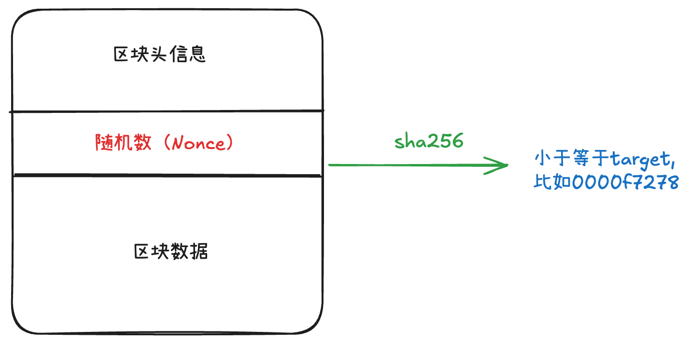

🚀 区块链技术被誉为继互联网之后的又一次技术革命，它不仅仅是一种技术，更是一种全新的信任机制和协作模式。本文将深入浅出地解析区块链技术的核心原理，帮助读者理解这项技术的本质和应用价值。

---


:::tip 💡 什么是区块链？
区块链是一个去中心化的分布式账本，它通过密码学技术确保数据的安全性和不可篡改性，通过**共识机制**实现网络参与者之间的信任。
:::


## 🔍 1. 区块链技术基础：从概念到核心特征

### 1.1 🤔 什么是区块链？

在深入技术细节之前，让我们先理解区块链的基本概念。

:::tip 📚 区块链的定义
区块链是一个去中心化的分布式账本，它通过密码学技术确保数据的安全性和不可篡改性，通过共识机制实现网络参与者之间的信任。
:::

**🔑 区块链的核心特征**：
- **🏛️ 去中心化**：没有中央机构控制，所有节点平等参与
- **🌐 分布式存储**：数据分散存储在网络的各个节点上
- **🔒 不可篡改性**：一旦数据被写入，几乎不可能被修改
- **👁️ 透明性**：所有交易记录对全网公开可见
- **🛡️ 安全性**：通过密码学技术保护数据完整性

### 1.3 🤷‍♂️ 为什么叫"加密货币"？

比特币被称为**加密货币**(crypto-currency)，但这个名称容易让人误解。实际上，比特币的交易内容是完全公开的，任何人都可以在🔗[区块链浏览器](https://etherscan.io/)上查看所有交易记录。

:::danger ⚠️ 重要概念澄清
**🔐 加密**主要体现在**数字签名**和**哈希函数**上，而不是交易内容的加密。交易内容是透明的，但交易的**真实性和完整性**通过密码学技术得到保障。
:::

**🔐 比特币的"加密"体现在哪里？**
1. **✍️ 数字签名**：每笔交易都需要私钥签名，确保只有拥有者才能花费
2. **🔢 哈希函数**：交易数据通过哈希函数生成唯一标识，防止篡改
3. **🔑 公钥加密**：地址生成和验证使用非对称加密技术

---

## 🔐 2. 密码学基础：区块链安全的基石

### 2.1 🔢 哈希函数：数据完整性的保障

#### 什么是哈希函数？

哈希函数是一种数学函数，它可以将任意长度的输入数据转换为固定长度的输出（哈希值）。在区块链中，哈希函数扮演着至关重要的角色。

:::details 🔍 哈希函数的特点
- **🎯 确定性**：相同输入总是产生相同输出
- **⚡ 快速计算**：计算哈希值非常快速
- **🌊 雪崩效应**：输入微小变化导致输出巨大变化
- **➡️ 单向性**：从输出很难反推输入
- **🛡️ 抗碰撞性**：很难找到两个不同输入产生相同输出
:::

#### SHA-256：比特币的哈希算法

比特币使用的是**SHA-256**（Secure Hash Algorithm 256-bit）哈希算法，这是目前最安全、最广泛使用的哈希算法之一。

:::info 🔬 SHA-256 技术细节
**📏 输出长度**：256位（32字节）
**🔢 总组合数**：2^256 ≈ 1.16 × 10^77
**💻 表示方式**：通常以64位十六进制字符串显示
**🛡️ 安全性**：目前没有已知的有效攻击方法
:::

#### 哈希碰撞：理论vs现实

从理论上讲，哈希碰撞是不可避免的，因为：

- **输入空间**：无限大（可以输入任意长度的数据）
- **输出空间**：有限（只有2^256种可能）

但是，2^256这个数字有多大呢？让我们用一些类比来理解：

:::tip 🌌 2^256 到底有多大？
- 🌍 宇宙中估计的原子总数：约10^80
- 🔢 2^256 ≈ 1.16 × 10^77
- ⏰ 即使每秒计算10亿次哈希，也需要约3.7 × 10^60年才能遍历所有可能值
:::

#### 实际演示：雪崩效应

让我们通过实际例子来观察SHA-256的雪崩效应：

| 输入 | SHA-256 输出 |
|------|--------------|
| `01` | `938db8c9f82c8cb58d3f3ef4fd250036a48d26a712753d2fde5abd03a85cabf4` |
| `02` | `a953f09a1b6b6725b81956e9ad0b1eb49e3ad40004c04307ef8af6246a054116` |
| `Hello` | `185f8db32271fe25f561a6fc938b2e264306ec304eda518007d1764826381969` |
| `Hello!` | `ce06092c18bdd94591ae450f7cc4b5b7c4c5c5c5c5c5c5c5c5c5c5c5c5c5c5c` |

:::info 🔍 观察结果
即使输入只改变了1位（从01到02），输出结果却完全不同，这就是**🌊 雪崩效应**的完美体现。同样的，在"Hello"后面加一个感叹号，整个哈希值就完全不同了。
:::

:::tip 🛠️ 实践建议
你可以通过以下工具亲自体验SHA-256的威力：
🔗 [在线SHA-256计算器](https://www.jyshare.com/crypto/sha256/)

💡 尝试输入不同的内容，观察哈希值的变化，这将帮助你更好地理解哈希函数的特性。
:::

#### 哈希函数在区块链中的应用

**🔍 1. 区块标识**：
- 🆔 每个区块都有唯一的哈希值作为"身份证"
- 🔗 哈希值用于区块之间的链接和引用

**✅ 2. 交易验证**：
- 🆔 交易数据通过哈希函数生成交易ID
- 🔒 确保交易数据的完整性和唯一性

**🏠 3. 地址生成**：
- 🔑 公钥通过哈希函数生成比特币地址
- 🕵️ 提供隐私保护和地址压缩

**🌳 4. 默克尔树构建**：
- 🌱 将多个交易哈希组合生成默克尔根
- ⚡ 实现高效的数据完整性验证


### 2.2 ⛏️ 工作证明（PoW）：共识机制的核心

#### 为什么需要工作证明？

由于SHA-256是**不可逆**的，且**固定输入产生固定输出**，要找到特定哈希值的输入，唯一的方法就是进行大量的计算尝试。

:::tip 💡 工作证明的本质
PoW（Proof of Work）不是用来证明你"知道"什么，而是用来证明你"做了"什么。通过消耗计算资源来证明你的参与度和贡献。
:::

#### PoW的工作原理

工作量证明（Proof of Work, PoW）是比特币等区块链系统中用来防止作弊、激励矿工的核心机制。

:::tip 🏆 PoW的核心思想
PoW通过让参与者解决一个数学难题来证明他们投入了计算资源，从而获得记账权和奖励。这就像是一场"算力竞赛"，谁先解出答案，谁就能获得奖励。
:::

**PoW的基本流程**：




1. **📦 矿工收集交易**：矿工会把一段时间内的交易打包成一个区块。
2. **📋 设置区块头**：区块头包含前一区块的哈希、默克尔根、时间戳、难度目标等信息，还有一个特殊的字段——**🎲 Nonce（随机数）**。
3. **🔢 计算哈希**：矿工会不断尝试不同的Nonce值，把区块头整体做SHA-256哈希运算。
4. **判断哈希是否满足难度目标**：只有当算出来的哈希值小于当前网络设定的目标值（即有足够多的前导零），这个区块才算“有效”。
5. **📢 广播新区块**：第一个算出有效哈希的矿工会把新区块广播到全网，获得比特币奖励。

可以去感受一下[https://andersbrownworth.com/blockchain/block]

:::details 形象理解
你可以把PoW想象成“猜数字游戏”：  
- 系统规定一个很小的目标值（比如100），你要不断尝试不同的数字（Nonce），直到某个数字加上区块内容一起哈希后，结果小于100。  
- 这个过程完全靠“蒙”，没有捷径，只能靠算力硬算。
:::

#### ⚖️ 挖矿难度调整

比特币网络会根据全网算力🔗 [查询BTC算力](https://explorer.coinbase.com/btc/statistics/mining/fullnetwork?lang=zh_Hans_CN)自动调整挖矿难度，确保平均每10分钟产生一个新区块。

**🤔 为什么需要难度调整？**
- **⚡ 算力变化**：随着矿工数量的增减，全网算力会发生变化
- **⏰ 出块时间**：算力增加时，出块时间会变短；算力减少时，出块时间会变长
- **💰 经济平衡**：保持稳定的出块时间，维持比特币的经济模型

:::details ⚙️ 难度调整机制详解
- **🎯 目标哈希值**：当前难度下的目标值，决定了哈希值需要多少个前导零
- **📊 难度系数**：表示挖矿难度的数值，数值越大表示越难
- **🔄 调整周期**：每2016个区块（约2周）调整一次，确保稳定性
- **⏱️ 调整目标**：保持10分钟出块时间，维持网络节奏
- **🧮 调整公式**：新难度 = 旧难度 × (实际时间 / 目标时间)
:::

**难度调整的实际效果**：
```
算力增加时：
- 出块时间 < 10分钟
- 难度自动上调
- 需要更多算力才能挖到区块

算力减少时：
- 出块时间 > 10分钟  
- 难度自动下调
- 用较少算力就能挖到区块
```

:::tip 💡 难度调整的意义
难度调整机制是比特币网络自我调节的核心，它确保了无论全网算力如何变化，比特币都能保持稳定的发行节奏和网络性能。
:::

---

## 🏗️ 3. 区块链架构：从区块到链条

### 3.1 🔗 哈希指针链：区块链的核心机制

#### 什么是哈希指针链？

哈希指针链是区块链技术的核心创新，它通过密码学哈希函数将区块连接成一个不可篡改的链条。**每个区块都包含前一个区块的哈希值**，形成一种"数字指纹"的传递机制。

:::tip 🔐 哈希指针链的本质
哈希指针链不是简单的"链接"，而是一种**🔐 密码学保证的不可篡改机制**。每个区块的哈希值都依赖于前一个区块的内容，任何修改都会破坏整个链条的完整性。
:::

#### 工作原理详解

**区块结构组成**：
```
┌─────────────────────────────────────────────────────────┐
│                        区块头                           │
├─────────────────────────────────────────────────────────┤
│ 版本号 │ 前一区块哈希 │ 默克尔根 │ 时间戳 │ 难度目标 │ Nonce │
├─────────────────────────────────────────────────────────┤
│                        交易数据                         │
│  ┌─────────┐ ┌─────────┐ ┌─────────┐ ┌─────────┐      │
│  │ 交易1   │ │ 交易2   │ │ 交易3   │ │ 交易4   │      │
│  └─────────┘ └─────────┘ └─────────┘ └─────────┘      │
└─────────────────────────────────────────────────────────┘
```

**哈希链接过程**：
```
区块0 ──哈希计算──▶ Hash0
  │                    │
  │                    ▼
  │              ┌─────────────┐
  │              │ 前一区块哈希 │
  │              └─────────────┘
  │                    │
  ▼                    │
区块1 ──哈希计算──▶ Hash1
  │                    │
  │                    ▼
  │              ┌─────────────┐
  │              │ 前一区块哈希 │
  │              └─────────────┘
  │                    │
  ▼                    │
区块2 ──哈希计算──▶ Hash2
```

#### 为什么叫"链"？

**链式结构的特征**：
1. **单向链接**：每个区块只能链接到前一个区块，不能链接到后续区块
2. **哈希依赖**：每个区块的哈希值都包含前一个区块的哈希
3. **时间顺序**：区块按照时间顺序依次链接，形成时间线
4. **不可逆性**：无法从当前区块直接访问前一个区块的内容

### 3.2 💰 哈希指针链如何解决双花(Double Spending)问题？

#### 💸 双花问题的本质

双花问题是指**同一笔数字货币被重复使用**的问题。这是数字货币系统面临的核心挑战之一。

**🚨 双花攻击场景**：
```
攻击者拥有100 BTC
├── 🏪 在交易所A购买商品（花费100 BTC）
├── 🏪 在交易所B购买商品（花费100 BTC）
└── 💰 结果：用100 BTC买到了200 BTC的商品
```

#### 哈希指针链的解决方案

**⏰ 1. 时间戳机制**：
- 🕐 每个区块都包含精确的时间戳
- 📈 时间戳按照区块顺序递增
- 🤝 全网节点对时间顺序达成共识

**🔗 2. 最长链原则**：
```
分叉情况：
    区块0
       │
       ▼
   ┌─────┬─────┐
   │区块1│区块1'│ ← 同时产生两个区块
   └─────┴─────┘
       │   │
       ▼   ▼
   ┌─────┐ ┌─────┐
   │区块2│ │区块2'│
   └─────┘ └─────┘
       │   │
       ▼   ▼
   ┌─────┐ ┌─────┐
   │区块3│ │区块3'│
   └─────┘ └─────┘
       │   
       ▼   
   ┌─────┐ 
   │区块4│ 
   └─────┘ 

最终选择：区块4所在的链（最长链）
```

**不可篡改性保证**：
```
攻击者想要修改区块1中的交易：
原始状态：区块0 → 区块1 → 区块2 → 区块3 → 区块4
修改区块1后：
        区块0 → 区块1' → ❌ 区块2' → ❌ 区块3' → ❌ 区块4'

区块1'的哈希值改变 → 区块2'的哈希值改变 → 区块3'的哈希值改变 → 区块4'的哈希值改变
```

攻击者需要重新计算所有后续区块的PoW，这需要51%以上的算力！

**🤝 3. 全网共识机制**：
- **✅ 节点验证**：每个节点独立验证每笔交易
- **🔒 交易确认**：交易需要被多个区块确认才被认为是最终确认
- **🔄 网络同步**：所有节点维护相同的区块链副本

**💎 4. UTXO模型（Unspent Transaction Output Model，未花费交易输出模型）**：

UTXO是比特币区块链的核心概念，它不同于传统银行账户的余额模型。

:::tip 💡 UTXO模型的核心思想
UTXO模型将比特币视为"🪙 硬币"的集合，而不是账户余额。每笔交易都会消费一些UTXO，同时创建新的UTXO。
:::

**UTXO模型的工作原理**：
```
交易前状态：
┌─────────────────┐  ┌─────────────────┐  ┌─────────────────┐
│   UTXO #1       │  │   UTXO #2       │  │   UTXO #3       │
│   地址A         │  │   地址A         │  │   地址B         │
│   50 BTC        │  │   30 BTC        │  │   20 BTC        │
│   未花费        │  │   未花费        │  │   未花费        │
└─────────────────┘  └─────────────────┘  └─────────────────┘

地址A的总余额 = 50 + 30 = 80 BTC
地址B的总余额 = 20 BTC
```

**🔑 UTXO模型的关键特点**：

1. **⚛️ 原子性**：每笔交易要么完全成功，要么完全失败
2. **🔒 不可分割**：UTXO不能被部分花费，必须全部消费
3. **🔗 链式引用**：每个UTXO都来自之前的交易输出
4. **🛡️ 防双花**：每个UTXO只能被花费一次
5. **👁️ 透明性**：所有UTXO的状态都是公开可查的

​​示例​​：

Alice 向 Bob 支付 1 BTC：

∙ 输入：Alice 引用自己之前收到的某笔 UTXO（如 1.2 BTC）。

∙ 输出：

∙ 新 UTXO 1：Bob 获得 1 BTC（可被其未来使用）。

∙ 新 UTXO 2：Alice 获得 0.2 BTC 找零（作为新 UTXO 归属自己）。

:::tip 🛡️ 双花防护总结
哈希指针链通过多重机制防止双花：
1. **⏰ 时间顺序**：时间戳确保交易的先后顺序
2. **🔗 链式结构**：修改历史需要重构整个链条
3. **🤝 共识机制**：全网节点共同维护交易记录
4. **💎 UTXO模型**：每笔钱只能被花费一次
:::

#### 比特币区块链结构

**区块头信息详解**：
```
区块高度：800,000                    ← 区块在链中的位置
前一区块哈希：00000000000000000002a1b7b6d7666e3e3e7c7f8f9f0f1f2f3f4f5f6f7f8f9f
默克尔根：ef1a8e0e0e0e0e0e0e0e0e0e0e0e0e0e0e0e0e0e0e0e0e0e0e0e0e0e0e0e0e0e
时间戳：2024-01-15 10:30:00 UTC    ← 区块产生的时间
难度目标：0x1703fffc               ← 当前挖矿难度
Nonce：1234567890                  ← 随机数，用于满足难度要求
```

**区块大小和交易数量**：
- **区块大小**：通常1-2MB（SegWit后可达4MB）
- **交易数量**：每区块约2000-4000笔交易
- **出块时间**：平均10分钟一个区块
- **交易确认**：6个区块确认后认为最终确认

**节点验证步骤详解**：

1. **接收新区块**：从网络接收区块800,001
2. **验证前一区块哈希**：检查是否与本地区块800,000的哈希值匹配
   - 确保区块链接的连续性
   - 防止分叉和攻击
3. **验证PoW**：检查区块800,001的哈希值是否满足难度要求
   - 验证哈希值的前导零数量
   - 确保矿工投入了足够的算力
4. **验证交易**：通过默克尔树验证交易数据的完整性
   - 检查交易格式是否正确
   - 验证数字签名是否有效
   - 确认UTXO引用是否有效
5. **添加到链上**：如果所有验证通过，将区块添加到本地链上

**验证失败的处理**：
- **拒绝区块**：验证失败的区块会被拒绝
- **网络同步**：节点会继续同步其他有效区块
- **分叉处理**：如果出现分叉，选择最长链

:::tip 验证的重要性
每个节点都会独立验证每个区块，只有通过验证的区块才会被添加到链上。这确保了网络的一致性和安全性。验证过程是区块链去中心化的核心，没有中央机构可以跳过验证。
:::

**验证的经济意义**：
- **防止欺诈**：确保只有有效的交易被记录
- **维护价值**：保证比特币网络的可信度
- **激励诚实**：诚实节点获得网络信任，恶意节点被排除

---

## 🌳 4. 默克尔树：轻节点验证的核心技术

### 4.1 🌳 默克尔树：轻节点验证的核心技术

#### 轻节点验证机制

轻节点（如手机钱包）若怀疑某笔交易被篡改，可向全节点请求该交易的**Merkle Proof**（路径哈希值），通过本地计算验证其一致性。

:::tip 🔍 什么是Merkle Proof？
Merkle Proof是证明某个交易存在于区块中的路径证据，包含从交易到默克尔根路径上的所有必要哈希值。
:::

#### 验证示例：验证交易TX3是否被篡改

**📊 全节点提供的数据**：
- 📝 TX3（交易数据）
- 🔢 H4（TX4的哈希值）
- 🔢 H12（H1与H2合并后的哈希值）

**✅ 轻节点验证步骤**：

```
轻节点接收数据
        ↓
    计算H3 = Hash(TX3)
        ↓
    计算H34 = Hash(H3 + H4)
        ↓
    计算Root_Calc = Hash(H12 + H34)
        ↓
    比较Root_Calc与区块头默克尔根
        ↓
    ┌─────────────────┬─────────────────┐
    │    是否相等?    │                 │
    ├─────────────────┼─────────────────┤
    │       是        │       否        │
    │        ↓        │        ↓        │
    │   交易未被篡改   │  交易或路径数据  │
    │                 │     被篡改      │
    └─────────────────┴─────────────────┘
```

**🚀 轻节点优势**：
- 💾 仅需**512字节数据** + 几次哈希计算
- 📱 无需下载整个区块或后续链
- ⚡ 秒级完成验证

---

## 🎯 5. 区块链与默克尔树：解决的核心痛点与创新方案

### 5.1 ⚠️ 传统中心化系统的痛点分析
在区块链技术出现之前，传统的中心化系统存在以下关键问题：

:::warning 🚨 传统系统的致命缺陷
- **💥 单点故障风险**：中心化服务器一旦被攻击或故障，整个系统瘫痪
- **🔓 数据篡改风险**：管理员可以随意修改数据，缺乏透明性
- **💰 信任成本高昂**：需要信任第三方机构，增加了交易成本
- **🏝️ 数据孤岛问题**：不同系统间数据难以共享和验证
- **📋 审计困难**：无法提供不可篡改的审计轨迹
:::

### 5.2 🔗 区块链哈希链：解决全局一致性问题

#### 🤔 核心痛点：如何在没有中心化机构的情况下达成共识？

**📋 问题描述**：
- 🌐 分布式网络中，节点可能恶意或故障
- 📚 需要确保所有节点看到相同的历史记录
- 💰 防止双重支付和交易回滚

**解决方案：哈希指针链**

```
区块结构：
┌─────────┐    ┌─────────┐    ┌─────────┐    ┌─────────┐
│ 区块0   │───▶│ 区块1   │───▶│ 区块2   │───▶│ 区块3   │
│ Hash0   │    │ Hash1   │    │ Hash2   │    │ Hash3   │
└─────────┘    └─────────┘    └─────────┘    └─────────┘
     │              │              │              │
     ▼              ▼              ▼              ▼
┌─────────┐    ┌─────────┐    ┌─────────┐    ┌─────────┘
│ Hash0   │───▶│ Hash1   │───▶│ Hash2   │───▶│ Hash3   │
└─────────┘    └─────────┘    └─────────┘    └─────────┘

每个区块包含前一个区块的哈希值，形成不可篡改的链式结构
```

**工作原理**：
1. **链式结构**：每个区块包含前一个区块的哈希值
2. **不可篡改性**：修改任何区块都会破坏后续所有区块的哈希
3. **共识机制**：通过PoW/PoS等机制确保网络一致性

**✅ 解决的问题**：
- ✅ **💰 双重支付**：通过时间戳和链式结构防止同一笔钱被花两次
- ✅ **🔒 历史篡改**：攻击者需要重构从修改点到最新区块的整个链
- ✅ **🔗 网络分叉**：最长链原则自动解决分叉问题

### 5.3 🌳 默克尔树：解决数据完整性和验证效率问题

#### 🔍 核心痛点：如何高效验证大量数据的完整性？

**📋 问题描述**：
- 📦 区块包含数千笔交易，如何快速验证某笔交易是否被篡改？
- 📱 轻节点（如手机钱包）无法下载整个区块，如何验证交易？
- 🤝 如何在不信任第三方的情况下证明数据完整性？

**解决方案：默克尔树结构**

```
默克尔树结构：
                    ┌─────────────┐
                    │  默克尔根   │
                    │   (Root)    │
                    └─────┬───────┘
                          │
            ┌─────────────┴─────────────┐
            │                           │
        ┌───▼───┐                   ┌───▼───┐
        │ H12   │                   │ H34   │
        └───┬───┘                   └───┬───┘
            │                           │
        ┌───┴───┐                   ┌───┴───┐
        │       │                   │       │
    ┌───▼───┐ ┌─▼───┐           ┌───▼───┐ ┌─▼───┐
    │  H1   │ │ H2  │           │  H3   │ │ H4  │
    └───┬───┘ └─┬───┘           └───┬───┘ └─┬───┘
        │       │                   │       │
    ┌───▼───┐ ┌─▼───┐           ┌───▼───┐ ┌─▼───┐
    │ TX1   │ │ TX2 │           │ TX3   │ │ TX4 │
    └───────┘ └─────┘           └───────┘ └─────┘

H1 = Hash(TX1), H2 = Hash(TX2)
H12 = Hash(H1 + H2)
H3 = Hash(TX3), H4 = Hash(TX4)  
H34 = Hash(H3 + H4)
Root = Hash(H12 + H34)
```

**工作原理**：
1. **分层哈希**：将交易数据分层计算哈希值
2. **路径证明**：提供从交易到根节点的完整路径
3. **高效验证**：只需计算路径上的哈希值即可验证

**✅ 解决的问题**：
- ✅ **🔒 数据完整性**：任何数据修改都会导致根哈希变化
- ✅ **⚡ 验证效率**：从O(n)复杂度降至O(log n)
- ✅ **📱 轻节点支持**：手机钱包可以验证交易而无需下载整个区块

### 5.4 🤝 两种机制的协同效应

#### 🤔 为什么需要两种机制结合？

:::tip 💡 协同设计的智慧
区块链哈希链和默克尔树不是简单的叠加，而是精心设计的协同防御体系，各自解决不同层面的问题。
:::

**🛡️ 分层防御架构**：

```
攻击流程与防御机制：
┌─────────┐
│ 🦹‍♂️ 攻击者  │
└────┬────┘
     │
     ▼
┌─────────┐
│ 🚨 尝试篡改 │
└────┬────┘
     │
     ▼
┌─────────┐
│🔓 修改交易数据│
└────┬────┘
     │
     ▼
┌─────────┐
│🌳 默克尔树检测│ ←── 🛡️ 第一道防线
└────┬────┘
     │
     ▼
┌─────────────────┐
│  🔍 根哈希不匹配?  │
└─────────┬───────┘
          │
    ┌─────┴─────┐
    │           │
    ▼           ▼
┌───────┐   ┌───────┐
│❌ 立即拒绝│   │📢 继续传播│
│ 成功  │   │        │
└───────┘   └────┬──┘
                  │
                  ▼
          ┌─────────┐
          │🔗 区块链哈希│ ←── 🛡️ 终极防线
          │  链检测  │
          └────┬────┘
               │
               ▼
        ┌─────────────────┐
        │ 🔍 后续区块哈希匹配?│
        └─────────┬───────┘
                  │
            ┌─────┴─────┐
            │           │
            ▼           ▼
        ┌───────┐   ┌───────┐
        │🚨 全网警报│   │✅ 攻击成功│
        │ 失败  │   │  成功  │
        └───────┘   └───────┘

🌳 默克尔树：快速检测数据篡改（⚡ 秒级）
🔗 区块链链：确保历史一致性（⏰ 分钟级）
```

**🚀 协同优势**：
1. **🛡️ 双重检测**：默克尔树检测数据完整性，哈希链检测历史一致性
2. **⚡ 分层响应**：数据篡改在传播阶段被拦截，历史篡改在共识阶段被发现
3. **🎯 效率优化**：日常验证使用默克尔树，异常检测使用哈希链

### 5.5 📊 机制对比表

| 场景 | 仅靠区块链哈希指针链 | 结合默克尔树 |
|------|---------------------|--------------|

| **检测篡改位置** | 只能发现"区块A被篡改"，无法定位具体交易 | 精准定位到被篡改的单笔交易（如TX3） |

只能发现“区块A被篡改”，无法定位具体交易

精准定位到被篡改的单笔交易（如TX3）

| **验证成本（全节点）** | 需重构从A到最新区块的整个链（O(n)计算） | 只需计算该区块的默克尔根（O(1)） |

| **轻节点能否验证** | ❌ 需下载完整区块并验证全链（不可能） | ✅ 通过Merkle Proof秒级验证 |

| **攻击难度** | 篡改需51%算力重构后续链 | 篡改单笔交易也需51%算力（默克尔树不降低安全） |

:::warning ⚠️ 重要说明
默克尔树没有降低篡改的算力要求（仍需51%攻击），但让日常的篡改检测成本接近于零。
:::

### 5.6 📝 实际案例说明

假设攻击者想秘密修改区块A中的交易（如将Satoshi的50 BTC转给自己）：

#### ❌ 无默克尔树时：
- 🦹‍♂️ 攻击者修改交易后需重构区块A及其后所有区块的PoW
- 🚨 其他全节点在收到新区块A时会立即发现：其后续区块B的前驱哈希不匹配，触发全网警报

#### ✅ 有默克尔树时：
- ⚡ 全节点在接收区块A时即可通过根哈希不一致秒级拒绝
- **🔍 更重要**：轻节点用户若持有该笔UTXO，可通过Merkle Proof主动验证其是否被篡改，无需依赖全节点告警

---

## 🎯 6. 核心结论：默克尔树的不可替代性
### 6.1 🔍 功能定位不同

- **🔗 区块链哈希链** → 确保**全局顺序和链式完整性**（解决双花和51%攻击）
- **🌳 默克尔树** → 确保**区块内部数据完整性和高效验证**（解决局部篡改和轻节点信任问题）

### 6.2 🛡️ 协同增强安全性

∙
默克尔树是区块链防篡改的“第一道防线”，在区块传播阶段即过滤无效数据；

∙
哈希指针链是“终极防线”，确保攻击者无法低成本重构历史。

### 6.3 ⚡ 效率革命

​​默克尔树将“验证单笔交易是否被篡改”的成本，从“下载并验证整条链（TB级）”降至“传输数百字节+几次哈希计算”​​，这是比特币支持移动端钱包和去中心化的关键基石。

​​正是这种分层设计，让比特币在保证安全的同时，实现普通用户可参与的实用性​​。若删除默克尔树，系统要么退化为全节点专用网络，要么被迫依赖中心化机构提供证明——而这正是比特币诞生所要颠覆的！

---


**Q3: 🔍 默克尔树和区块链哈希链有什么区别？**
A: 🔗 区块链哈希链解决全局一致性和双花问题，🌳 默克尔树解决区块内部数据完整性和验证效率问题。两者协同工作，缺一不可。


🚀 区块链不仅仅是一种技术，更是一种全新的信任机制和协作模式。它通过数学和密码学原理，在不需要中心化机构的情况下，实现了价值的可靠转移和数据的不可篡改存储。

🌍 随着技术的不断发展和应用场景的扩展，区块链将在金融、供应链、医疗、政务等领域发挥越来越重要的作用，推动数字经济的进一步发展。

