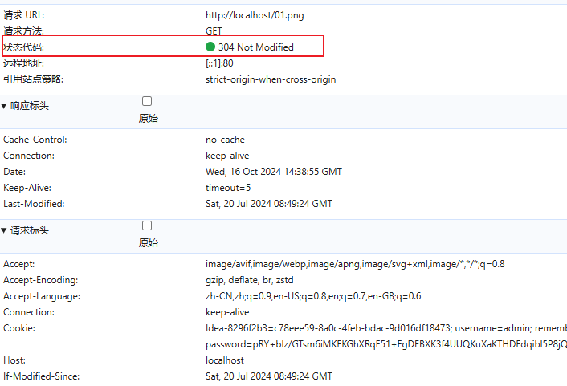

在当今互联网时代，网站性能优化已经成为前端开发中不可或缺的一部分。其中，浏览器缓存是提升网站性能最有效的方式之一。本文将深入浅出地讲解浏览器缓存机制，帮助你更好地理解和使用缓存策略。

---

## 什么是浏览器缓存？
网页中的代码和资源都是从服务器下载的，如果服务器和用户的浏览器离得比较远，那下载过程会比较耗时，网页打开也就比较慢。下次再访问这个网页的时候，又要重新再下载一次，如果资源没有啥变动的话，那这样的重新下载就很没必要。所以，HTTP 设计了缓存的功能，可以把下载的资源保存起来，再打开网页的时候直接读缓存，速度自然会快很多。

## 为什么需要浏览器缓存？

在实际应用中，浏览器缓存具有以下几个重要优势：

1. **提升访问速度**
   - 直接从本地读取资源，省去了网络请求时间
   - 减少了页面白屏时间，提升用户体验

2. **节省网络资源**
   - 减少重复的网络请求
   - 降低服务器压力
   - 节省用户流量

3. **提高网站性能**
   - 减少服务器的负载
   - 提升网站的响应速度
   - 优化整体用户体验

## 浏览器缓存机制详解

浏览器缓存机制主要分为两大类：**强制缓存和协商缓存**。就像我们购物时，有的商品有固定保质期（强制缓存），有的则需要打开检查后才知道是否还能使用（协商缓存）。

### 1. 强制缓存（Force Cache）

强制缓存，就是向浏览器缓存查找该请求结果，并根据该结果的缓存规则来决定是否使用该缓存结果的过程。
但是也不能一直缓存，否则，当资源变化时，用户看到的还是旧的资源。 所以需要设置一个缓存过期时间。
`Expires` 和 `Cache-Control` 就是用来设置缓存过期时间的。

**控制字段：Cache-Control与Expires**


1. **Expires（HTTP/1.0）**

`Expires` 是 HTTP/1.0 中的一个头部，表示资源的**过期时间**。

```http
Expires: Wed, 21 Oct 2025 07:28:00 GMT
```
#### 举例说明
```javascript
const data = fs.readFileSync('./01.png');
res.writeHead(200,{
   expires:new Date("2024-10-15 22:39:00").toUTCString()
 })
 res.end(data)
```

我们设置的过期时间是 2024-10-15 22:39:00  
第一次请求的时候，服务器会返回 200 状态码，并返回资源，浏览器会缓存这个资源。


如果在 39 分之前刷新，是直接显示从磁盘缓存中获取


如果在 39 分之后刷新，是重新请求资源，并显示从服务器获取


这个缺点很明显，就是他是依赖于一个固定时间(*格林尼治时间，不存在时区问题*)，如果客户端本地与服务器的时间不一致呢，比如我可以直接修改电脑时间为2023年或者2025年，那么缓存就失效了。


2. **Cache-Control（HTTP/1.1）**

为了解决客户端与服务端时间不一致的问题，引入了 `Cache-control`，它使用了相对时间来解决此问题，让浏览器自己计算是否过期。

```http
Cache-Control: max-age=2000
```
上面就代表资源缓存 2000 秒，也就是 33 分钟。


- no-cache 表示需要使用协商缓存来验证是否过期
- no-store 表示禁止浏览器缓存,每次都去服务端进行请求
- public 表示可以被任何中间人缓存
- private 表示只能被用户浏览器缓存

`cache-control:public,max-age=2000` 表示可以被任何中间人缓存，并且缓存2000s

`cache-control:private,max-age=2000` 表示只能被用户浏览器缓存，并且缓存2000s

`cache-control:no-cache,max-age=2000` 表示需要使用协商缓存来验证是否过期，并且缓存2000s

`cache-control:no-store` 表示禁止浏览器缓存,每次都去服务端进行请求


:::tip
以前的形式都是 `key:value` 的形式，但是 HTTP 1.1 中的缓存控制头 `Cache-Control` 可以设置多个参数，把缓存相关的 header 都集中到一起，使用逗号分隔。

- Expires: xxx 这种叫做消息头（header）
- Cache-Control: max-age=xxx 里面的 max-age 叫做指令（directive）。
:::

#### 举例说明

```javascript
const data = fs.readFileSync('./01.png');
res.writeHead(200,{
   "Cache-Control":"max-age=60"
 })
 res.end(data)
```

 max-age=60 意思是在这60s 内可以使用强制缓存，如果过了60s 则需要重新拉取


浏览器会记录Date 时间， 在一分钟之内，再次拉取直接走缓存


如果超过60s 则重新拉取


:::tip
Cache-Control 相比 Expires 的优势：
- 使用相对时间，避免了客户端时间与服务器时间不同步的问题
- 提供了更多的控制选项
:::

但是就算到了过期时间,资源也不一定就失效了, 或者说比如我修改了资源,但是没有修改资源的名字, 那么浏览器还是会使用缓存, 所以需要使用协商缓存来解决这个问题。

### 2. 协商缓存（Negotiation Cache）

协商缓存，就是**强制缓存失效**后，浏览器携带缓存标识向服务器发起请求，由服务器根据缓存标识决定是否使用缓存的过程。

**控制字段：Last-Modified 与 ETag**


1. **基于时间的协商缓存**

Last-Modified 是 HTTP/1.0 中的一个头部，表示资源的**最后修改时间**。

```http
// 服务器响应头
Last-Modified: Wed, 21 Oct 2023 07:28:00 GMT

// 客户端请求头
If-Modified-Since: Wed, 21 Oct 2023 07:28:00 GMT
```
服务端判断下如果资源有变化，那就返回 200，并在响应体带上新的内容，浏览器就用这份新下载的资源。
如果没有变化，那就返回 304，响应体是空的，浏览器会直接读缓存。

#### 举例说明

```javascript
const data = fs.readFileSync('./01.png');
 const {mtime} =  fs.statSync("./01.png")
 res.setHeader("Last-Modified", mtime.toUTCString())
 res.end(data)
```


再次刷新


可以看到是从磁盘中缓存中读取，也就是说没有和服务器交互，相当于强制缓存


可以看到，在第二次使用协商缓存的时候，在请求标头中会加入 `if-modifed-since` ，即上一次的 `last-modified` 的值，如果服务器发现请求头的 `if-modifed-since` 和这个文件的修改时间是一致的，即让浏览器使用缓存，否则使用新文件

```javascript
  const data = fs.readFileSync('./01.png');
    const { mtime } = fs.statSync("./01.png")
    res.setHeader("Last-Modified", mtime.toUTCString())
    res.setHeader("cache-control", "no-cache")

    const ifModifiedSince = req.headers["if-modified-since"];
    //  判断浏览器last-modified是否等于文件的修改时间
    if (mtime.toUTCString() == ifModifiedSince) {
      res.statusCode = 304;
      res.end()
      return
    }

    res.end(data)
```



可以看到，如果浏览器 `last-modified` 和上次请求的文件的修改时间一致，则返回304，否则返回200，并返回新的资源

但是，如果文件修改时间很短，但是内容却发生了变化，此时，Last-Modified 就无法准确判断资源是否发生了变化，此时，需要使用 **ETag** 来解决这个问题

2. **基于内容的协商缓存**

ETag 是 HTTP/1.1 中的一个头部，表示资源的**唯一标识**。

主要作用是为不同资源进行哈希运算，只要文件不同，对应的hash运算结果就不同

```http
// 服务器响应头
ETag: "33a64df551425fcc55e4d42a148795d9f25f89d4"

// 客户端请求头
If-None-Match: "33a64df551425fcc55e4d42a148795d9f25f89d4"
```

#### 举例说明

```javascript{3,4}
const etag =  require("etag");
if (pathname == "/02.png") {
    const data = fs.readFileSync('./02.png');
    const etagContent = etag(data);
    res.setHeader("etag", etagContent);
    res.setHeader("cache-control", "no-cache")
    res.end(data)
}
```

对 02.png 对文件进行 hash 运算，第一次请求，会在响应头上带上 etag


第二次请求，会在请求头上添加 if-none-match


如果 etag 和文件的 hash 运算结果一致，则返回304，否则返回200，并返回新的资源

```javascript
   const data = fs.readFileSync('./02.png');
    const etagContent = etag(data);
    const ifNoneMatch = req.headers["if-none-match"];
    if (ifNoneMatch == etagContent) {
      res.statusCode = 304;
      res.end()
      return
    }
```    


## 代理服务器的缓存

浏览器里的缓存都是用户自己的，叫做私有缓存，而代理服务器上的缓存大家都可以访问，叫做公有缓存。
如果这个资源只想浏览器里缓存，不想代理服务器上缓存，那就设置 private，否则设置 public：

比如这样设置就是资源可以在代理服务器缓存，缓存时间一年（代理服务器的 max-age 用 s-maxage 设置），浏览器里缓存时间 10 分钟：
```http
Cache-control:public, max-age=600,s-maxage:31536000
```
这样设置就是只有浏览器可以缓存
```http
Cache-control:private, max-age=600
```
而且，缓存过期了就**完全不能用了么？**
不是的，其实也想用过期的资源也是可以的，有这样的指令：

```http
Cache-control: max-stale=600
```
stale 是不新鲜的意思。请求里带上 max-stale 设置 600s，也就是说过期 10 分钟的话还是可以用的，但是再长就不行了

```http
Cache-control: stale-while-revalidate=600
```
也可以设置 stale-while-revalidate，也就是说在和浏览器协商还没结束的时候，就先用着过期的缓存吧

```http
Cache-control: stale-if-error=600
```
或者设置 stale-if-error，也就是说协商失败了的话，也先用着过期的缓存吧。

所以说，max-age 的过期时间也不是完全强制的，是可以允许过期后用一段时间的。


## 不同场景的缓存策略示例

### 1. HTML 文件缓存

HTML文件通常需要保持最新状态，所以建议使用协商缓存：

```javascript
// Node.js 服务端配置
app.get('/*.html', (req, res) => {
  res.setHeader('Cache-Control', 'no-cache');
  res.setHeader('Last-Modified', new Date().toUTCString());
  // ... 返回HTML内容
});

// Nginx 配置
location ~ \.html$ {
  add_header Cache-Control "no-cache";
  etag on;
  if_modified_since exact;
}
```

### 2. 静态资源缓存

#### 2.1 JavaScript文件

```javascript
// webpack配置
module.exports = {
  output: {
    filename: '[name].[contenthash].js'  // 生成带hash的文件名
  }
}

// Node.js服务端配置
app.get('/*.js', (req, res) => {
  res.setHeader('Cache-Control', 'public, max-age=31536000');  // 缓存一年
  // ... 返回JS内容
});
```

#### 2.2 图片资源

```javascript
// Node.js服务端配置
// Logo等固定图片
app.get('/static/images/logo.png', (req, res) => {
  res.setHeader('Cache-Control', 'public, max-age=31536000');
  // ... 返回图片内容
});

// 用户头像等可能变化的图片
app.get('/avatars/*', (req, res) => {
  res.setHeader('Cache-Control', 'public, max-age=3600'); // 缓存1小时
  res.setHeader('ETag', generateETag(imageContent));
  // ... 返回图片内容
});

// 验证码图片等不可缓存的图片
app.get('/captcha', (req, res) => {
  res.setHeader('Cache-Control', 'no-store');
  // ... 返回验证码图片
});
```

### 3. API接口缓存

#### 3.1 实时数据接口

```javascript
// 股票价格等实时数据
app.get('/api/stock-price', (req, res) => {
  res.setHeader('Cache-Control', 'no-store');
  // ... 返回实时数据
});
```

#### 3.2 短期缓存接口

```javascript
// 商品列表等短期缓存数据
app.get('/api/products', (req, res) => {
  res.setHeader('Cache-Control', 'public, max-age=300'); // 缓存5分钟
  // ... 返回商品列表
});
```

### 4. CDN缓存配置

```nginx
# Nginx CDN节点配置
proxy_cache_path /tmp/cache levels=1:2 keys_zone=my_cache:10m max_size=10g inactive=60m use_temp_path=off;

server {
    location / {
        proxy_cache my_cache;
        proxy_cache_use_stale error timeout http_500 http_502 http_503 http_504;
        proxy_cache_valid 200 302 1d;    # 成功响应缓存1天
        proxy_cache_valid 404 1m;        # 404响应缓存1分钟
        proxy_cache_key $scheme$proxy_host$request_uri;
        
        # 添加缓存状态头
        add_header X-Cache-Status $upstream_cache_status;
    }
}
```

## 缓存效果验证

 Chrome开发者工具验证

1. 打开Chrome开发者工具 (F12)
2. 切换到Network面板
3. 观察Size列：
   - `(memory cache)`: 表示从内存缓存加载
   - `(disk cache)`: 表示从磁盘缓存加载
   - `304`: 表示协商缓存生效

## 缓存策略最佳实践

1. **HTML文件**
   - 使用协商缓存
   - 确保内容实时性

2. **静态资源（JS/CSS/图片）**
   - 使用强制缓存
   - 文件名带上内容hash
   - 设置较长的过期时间

3. **API请求**
   - 一般不缓存
   - 特殊场景可使用协商缓存

## 总结

缓存能加快也面的打开速度，也能减轻服务器压力，所以 HTTP 设计了缓存机制。

HTTP 1.0 的时候是使用 Expires 的 header 来控制的，指定一个 GMT 的过期时间，但是当浏览器时间不准的时候就有问题了。

HTTP 1.1 的时候改为了 max-age 的方式来设置过期时间，让浏览器自己计算。并且把所有的缓存相关的控制都放到了 Cache-control 的 header 里，像 max-age 等叫做指令。

缓存过期后，HTTP 1.1 还设计了个协商阶段，会分别通过 If-None-Match 和 If-Modified-Since 的 header 带资源的 Etag 和 Last-Modied 到服务端问下是否过期了，过期了的话就返回 200 带上新的内容，否则返回 304，让浏览器拿缓存。

除了 max-age 的指令外，我们还学了这些指令：

- public：允许代理服务器缓存资源
- s-maxage：代理服务器的资源过期时间
- private：不允许代理服务器缓存资源，只有浏览器可以缓存
- immutable：就算过期了也不用协商，资源就是不变的
- max-stale：过期了一段时间的话，资源也能用
- stale-while-revalidate：在验证（协商）期间，返回过期的资源
- stale-if-error：验证（协商）出错的话，返回过期的资源7
- must-revalidate：不允许过期了还用过期资源，必须等协商结束
- no-store：禁止缓存和协商
- no-cache：允许缓存，但每次都要协商


---

参考资料：
1. [MDN Web Docs - HTTP缓存](https://developer.mozilla.org/zh-CN/docs/Web/HTTP/Caching)
2. [RFC 7234 - HTTP/1.1 Caching](https://tools.ietf.org/html/rfc7234)
3. [Google Web Fundamentals - HTTP缓存](https://developers.google.com/web/fundamentals/performance/optimizing-content-efficiency/http-caching)