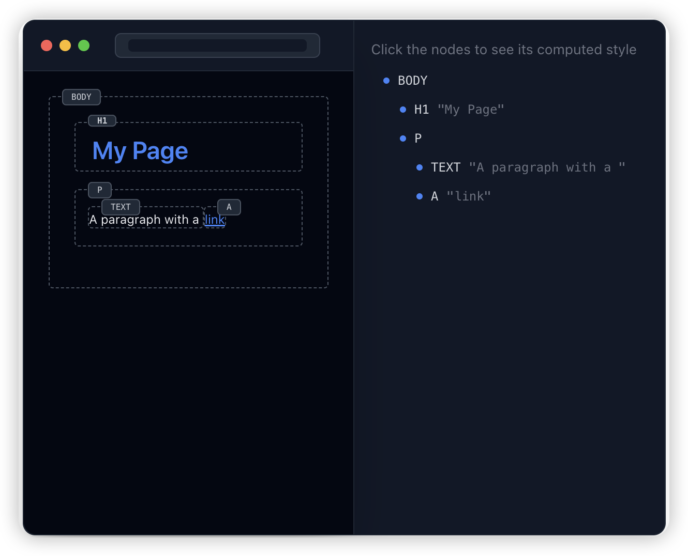

浏览器中键入 URL 和显示网页之间会发生什么情况？我们以交互的方式探讨一下浏览器的复杂渲染过程 

---

[原文链接](https://abhisaha.com/blog/exploring-browser-rendering-process)


浏览器的渲染过程是多个线程、进程和阶段的复杂编排，可将原始 HTML、CSS 和 JavaScript 转换为我们屏幕上的交互式像素。因此，从本质上讲，我们的目标是了解输入 URL 和显示网页之间发生了什么。

## Navigation and Network 导航和网络

假设我们正在尝试加载 https://example.com。浏览器不知道从哪里获取此网站的内容。这只是我们人类可以理解的名字。浏览器需要将此名称转换为 IP 地址。这就是 DNS 查找发挥作用的地方

::: info
  DNS stands for **Domain Name System**. 
  DNS 代表域名系统。该系统使用指定的权威名称服务器将域名映射到数字 IP 地址。
:::

<video src="../assets/videos/browser-rendering/navigationNetwork.mov" controls />


上面的演示可视化了 DNS 查找过程，也称为查询历程。查询历程涉及将您输入的域名转换为 IP 地址所需的每个步骤。查询的第一站是递归服务器，然后它联系一系列权威名称服务器，将域名转换为 IP 地址。最终，将返回所请求域的 IP 地址。

所以现在我们有了 IP 地址，浏览器现在可以与托管网站的服务器建立连接。这是使用 TCP 握手过程完成的。


## TCP/TLS Handshake   TCP/TLS 握手

TCP （Transmission Control Protocol） 握手是一个三步过程，用于在客户端和服务器之间建立连接。它由客户端和服务器之间交换的一组数据包组成，以确保可靠的连接。这三个步骤是：

1. SYN：客户端向服务器发送同步 （SYN） 数据包以启动连接。
2. SYN-ACK：服务器使用确认 （SYN-ACK） 数据包向客户端进行响应。
3. ACK：客户端向服务器发送确认 （ACK） 以完成握手。


此时，我们只与服务器建立了连接。下一步是保护此连接。还记得 URL 旁边的 https 锁图标吗？这定义了一个安全连接，并使用另一种称为 TLS 握手的握手来完成。

::: info
密码 - 密码是一种用于加密和解密数据的算法。它用于保护 Internet 上的数据传输。

证书 – 证书是包含有关网站身份和公钥信息的文件。它用作数字签名来验证网站的真实性。

证书颁发机构 （CA） - 证书颁发机构是向网站颁发数字证书的受信任实体。它验证网站的身份并确保证书的真实性。

公钥 - 公钥用于在通过 Internet 发送数据之前对其进行加密。它与客户端共享以建立安全连接。

私钥 - 私钥用于解密从客户端接收的数据。它是保密的，不会与任何人共享。
:::

TLS 握手过程有多个步骤。我将它们分为 4 大类：

::: info

您好消息： 客户端发送 *ClientHello* 消息以启动握手，服务器使用 *ServerHello* 消息及其数字证书进行响应。

密钥交换： 服务器可以发送密钥交换信息，而 Client 端使用自己的密钥交换消息（如果需要，则使用证书）进行响应。

密码规格： 客户端发送 *CipherSpec* 消息以切换到协商加密，并在其后发送 *Finished* 消息。

服务器完成： 服务器使用自己的 *CipherSpec* 和 *Finished* 消息进行回复，完成握手并建立安全连接。
:::

::: tip
SSL 或安全套接字层是为 HTTP 开发的原始安全协议。SSL 在一段时间前被 TLS（即传输层安全）取代。SSL 握手现在称为 TLS 握手，尽管“SSL”名称仍被广泛使用。
:::

<video src="../assets/videos/browser-rendering/tlsHandshake.mov" controls />


在流程的这一步，尚未传输任何实际内容或应用程序数据。服务器仅确认连接并建立了安全通道。浏览器 （客户端） 在后台处理所有这些协商过程。只有在 TLS 握手完成并且双方交换了 Finished 消息后，他们才能开始安全地发送和接收加密内容。


## HTTP Request/Response Cycle HTTP 请求/响应周期

所以现在浏览器请求网站的内容。服务器处理此请求并发回响应。这就是 HTTP 请求/响应周期发挥作用的地方。后端开发人员负责处理请求，而前端开发人员对此周期的响应部分更感兴趣。观看下面的演示以可视化此循环。

<video src="../assets/videos/browser-rendering/requestFlow.mov" controls />

我们在上面的演示中看到了一个名为 TTFB 的东西。TTFB 代表 Time To First Byte。它是服务器响应 Client 端请求发送第一个字节数据所花费的时间。它是衡量服务器响应时间和网站性能的重要指标。较低的 TTFB 表示更快的服务器响应时间。


正如您在演示中看到的，在收到第一个字节后，响应将继续加载。服务器仍在处理请求并将剩余数据发送回客户端。从这时起，浏览器开始处理响应

### Tokenization  分词化

浏览器将开始解析此 HTML 响应。它读取 HTML 的原始字节，并根据指定的文件编码（如 UTF-8）将它们转换为单个字符。以下是字节可能的外观示例

```bash
 01001000 01010100 01001101 01001100
```

::: tip
  每组 8 位代表一个字节，每个字节都可以根据编码标准转换为字符、符号或指令。例如：
  例如，在 UTF-8 编码中，字母 A 的二进制序列为 01000001。字母 B 为 01000010
:::

浏览器将字符串转换为不同的标记并对其进行分组，例如 **`<html>`、`<body>`** — 以及尖括号内的其他字符串。每个标记都是一个有意义的单元，表示一个 HTML 组件。

### DOM Tree Creation  DOM 树创建

DOM（文档对象模型）树是 HTML 文档结构的分层表示形式。它将元素表示为节点树。每个节点表示文档中的一个元素、属性或文本内容。像这样：

```html
<html lang="en-US">
  <head>
    <style>
        .heading {
            color:#0099ff; 
            font-size: 14px
        }
        p {
            margin: 0.5em 0;
        }
        a {
            color: #0099ff; 
            text-decoration: underline;
        }
    </style>
  </head>
  <body>
    <h1 class="heading">My Page</h1>
    <p>A paragraph with a <a href="https://example.com/about">link</a></p>
  </body>
</html>

```

作为参考，这是我们收到的回复。它主要具有 H1（标题）标签、P（段落）标签、A（锚点）标签和 CSS 样式

DOM 是一个树状结构，因此可以轻松显示父子关系。

<video src="../assets/videos/browser-rendering/domTreeCreation.mov" controls />

每次浏览器呈现网页时，它都会经历这个多步骤的过程：将 HTML 字节解析为字符、识别标记、将它们转换为节点，最后构建 DOM 树。虽然 DOM 树定义了 HTML 元素的结构和关系，但它并不决定它们的视觉外观。这是 CSSOM 的作用。

### CSSOM Tree Creation  CSSOM 树创建

CSS 对象模型 （CSSOM） 是应用于 HTML 文档的 CSS 样式的表示形式。它类似于 DOM 树，但表示 CSS 样式而不是 HTML 结构。CSSOM 用于计算文档中每个元素的最终样式。查看此演示，了解如何创建 CSSOM 树。

<video src="../assets/videos/browser-rendering/CSSOMTreeCreation.mov" controls />

浏览器将这些样式解析为简化、节省内存且优化的数据结构。此结构旨在有效地组织样式规则，从而允许根据匹配的选择器快速检索和应用样式。

构建 DOM 和 CSSOM 后，浏览器就可以开始创建渲染树了。

### Render Tree Creation  渲染树创建

渲染树是 DOM 和 CSSOM 树的组合。它表示页面的视觉结构，包括布局和样式信息。Render Tree 用于计算布局并在屏幕上绘制元素。

<video src="../assets/videos/browser-rendering/RenderTreeCreation.mov" controls />

正如您在演示中看到的，渲染树是 DOM 和 CSSOM 树的组合。它仅包含将在屏幕上显示的元素。它为每个元素计算了样式和布局信息，使浏览器能够准确地呈现页面。这就把我们带到了渲染过程的最后阶段 - 布局。

### Layouting  布局

你可能听说过 CSS 上下文中的术语 布局。这是计算页面上每个元素的确切位置和大小的过程。布局过程包括根据 Render Tree 确定每个元素的尺寸、边距、填充、边框和位置。您可能已经看到彼此重叠的元素，例如，模态窗口、下拉列表等。这就是布局过程发挥作用的地方。

元素的流向受其显示类型的影响：块元素垂直堆叠，而内联元素水平流。static、relative、absolute、fixed 和 sticky 等定位属性进一步决定了元素彼此之间的排列方式。例如，相对定位会使元素从其正常位置偏移，而不会影响周围的布局，而绝对定位会从文档流中完全删除元素。

布局步骤的结果是显示每个元素的精确计划，然后是绘制步骤，其中视觉表示在屏幕上呈现。

### Painting  绘制

在绘制阶段，浏览器获取结构化布局信息并将每个元素绘制到屏幕上。此过程将填充颜色并应用图像、边框、阴影和其他视觉样式。绘制顺序基于堆叠上下文，确保根据 z-index 和其他属性正确分层元素。



绘制过程经过优化，以最大限度地减少需要重绘的像素数。浏览器使用分层、合成和缓存等技术来有效地呈现页面。

### Browser Rendering Engines
浏览器渲染引擎

浏览器渲染引擎是浏览器中负责呈现网页的软件组件。它将 HTML、CSS 和 JavaScript 转换为可视化内容，并处理用户交互。

不同的浏览器使用不同的渲染引擎，例如 Blink （Chrome）、WebKit （Safari） 和 Gecko （Firefox）。这些引擎可以具有不同的性能特征和兼容性级别。某些 CSS 功能或 JavaScript 方法可能在一个引擎中受支持，而在其他引擎中不受支持，或者它们的行为可能不一致。此外，不同的引擎会将其默认样式应用于 HTML 元素。

### 总结

有很多行动正在发生，所以让我总结一下这些步骤。

1. DNS 查找： 输入 URL 后，浏览器会执行 DNS 查找以将域名转换为 IP 地址，从而找到网站的服务器。
2. TCP/TLS 握手：浏览器启动 TCP 握手以与服务器建立连接。如果站点是安全的 （HTTPS），则还会执行 TLS 握手以加密数据传输。
3. HTTP 请求/响应周期：建立连接后，浏览器发送对网站内容的 HTTP 请求，服务器使用必要的 HTML、CSS、JavaScript 和其他资产进行响应。
4. 标记化：浏览器将 HTML 响应作为原始数据读取，将其转换为单个字符，然后转换为标记（例如，、\<html\>、\<body\>），这有助于浏览器理解文档的结构。
5. DOM 树创建：浏览器构建 DOM（文档对象模型）树，这是 HTML 文档结构的分层表示，每个节点代表一个元素或文本内容。
6. CSSOM 树创建：浏览器解析 CSS 以创建 CSSOM（CSS 对象模型）树，该树表示与 HTML 文档元素关联的样式。
7. 渲染树创建：DOM 和 CSSOM 树组合形成渲染树，这是页面布局的可视化表示形式，仅包含可见元素及其计算样式。
8. 布局：浏览器根据 CSS 属性（如边距、填充和位置（例如，静态、绝对））计算屏幕上每个元素的确切大小和位置。
9. 绘制：使用“渲染树”，浏览器在屏幕上绘制像素，填充 CSS 样式定义的颜色、图像、边框和阴影。


