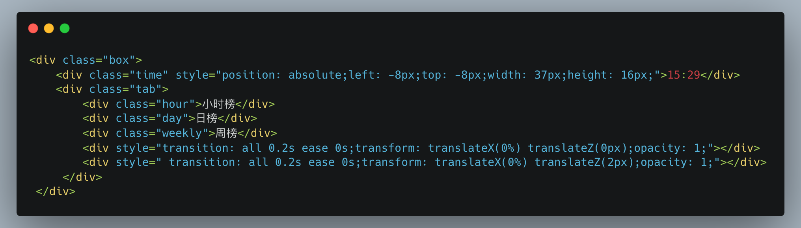
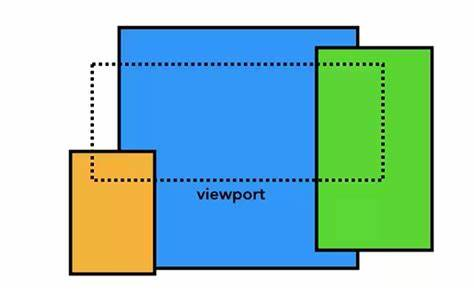
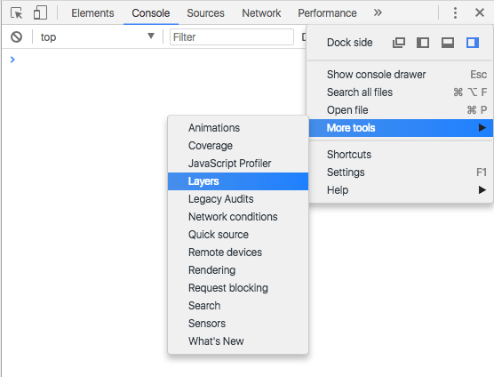
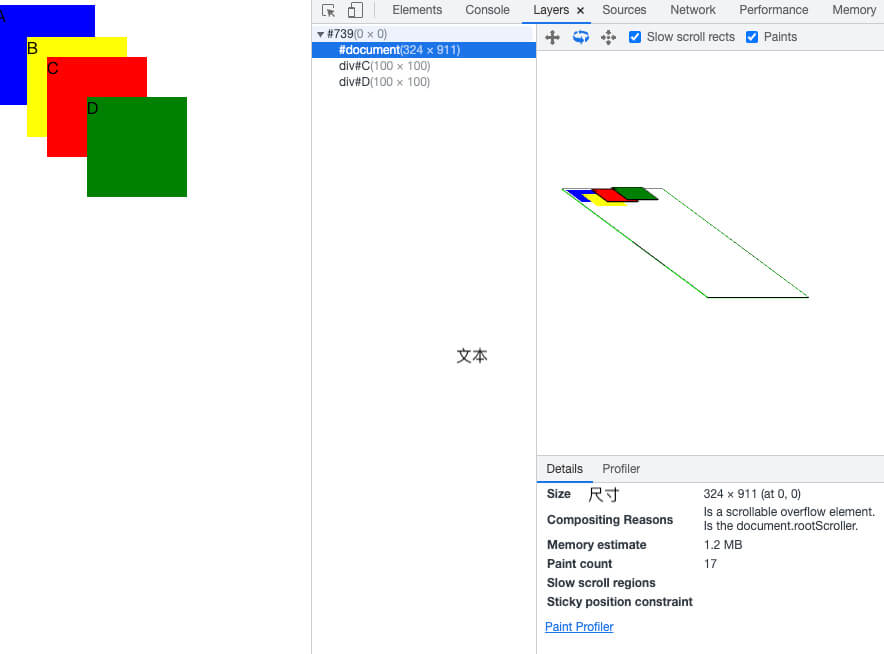
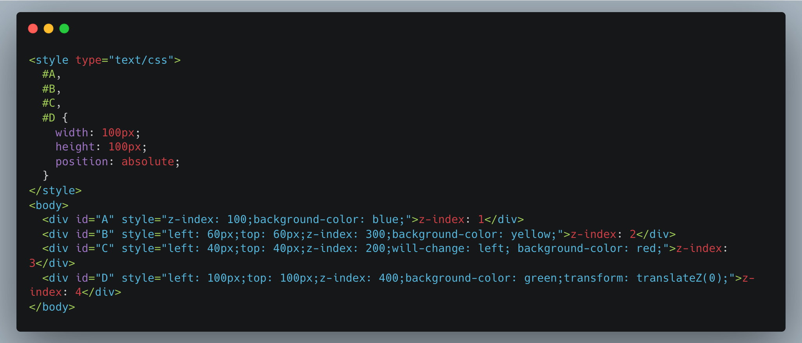
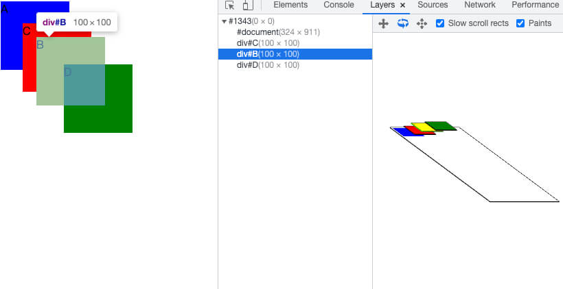
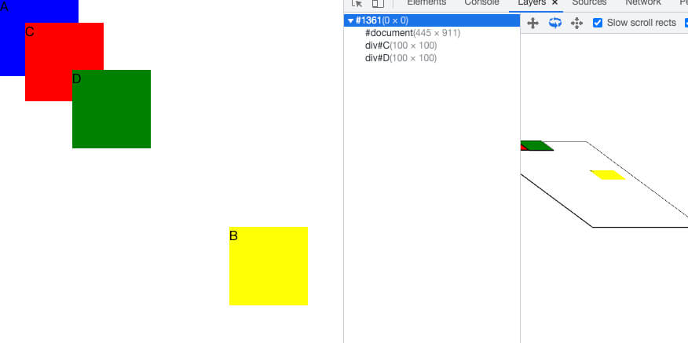

浏览器与前端开发的关系不言而喻，而了解浏览器的渲染原理，可以帮助我们提升页面性能，解决一些渲染上的问题。本文将深入探讨浏览器渲染中的合成层机制，以及如何正确使用GPU加速来优化网页性能。

---

## 问题描述

最近在开发一个移动端 H5 页面的时候，就遇到一个奇怪的问题，有一个榜单页面在最新版本 IOS 手机上切换 tab 的时候，左上角的倒计时出现闪烁，我们来看一些效果。


大概的代码结构



通过插件查看了一下 DOM 结构正常，样式也和其他手机上一致，那问题出在哪里呢？我想大概率是最新版本 IOS 浏览器渲染的问题。说到这种渲染问题，我第一时间想到的就是用 GPU 渲染提升为合成层试试，于是我给倒计时的 DOM 加上了简短的一行代码 `will-change: transform`，问题顺利解决，倒计时模块的渲染不再受其他内容的影响。为啥加了这段代码就是用 GPU 渲染，并且提升为合成层呢？以及合成层是什么？让我们一起来看看吧。

## 浏览器渲染流程

在讨论合成层之前，我们需要先了解浏览器的基本渲染流程：

1. **解析 HTML**：将 HTML 解析成 DOM 树
2. **解析 CSS**：将 CSS 解析成 CSSOM 树
3. **构建渲染树**：将 DOM 和 CSSOM 合并成渲染树（Render Tree）
4. **布局（Layout）**：计算每个节点在屏幕上的确切位置和大小
5. **绘制（Paint）**：将渲染树中的各个节点绘制成实际的像素
6. **合成（Composite）**：将各个图层合成为最终的页面


其中，最后的合成阶段就是本文要重点讨论的内容。

## 什么是合成层？

合成层（Composite Layers）是浏览器渲染引擎中的一个概念，它将页面分成多个图层，并且可以单独地对这些图层进行绘制和合成，从而形成最终的页面。

简单来说，浏览器会将页面中某些特定的元素提升为单独的图层，这些图层会被单独绘制，然后再按照正确的顺序合成到一起，形成最终的页面图像。



如何去观察页面的图层结构呢，您需要在 Chrome 开发工具中打开自定义菜单，然后在 More tools 中选择 Layers 选项。



这样你就可以观察页面的图层结构了



一般来说，拥有一些特定属性的渲染层，会被浏览器自动提升为合成层。合成层拥有单独的图层（GraphicsLayer），和其他图层之间互不影响。而其它不是合成层的渲染层，则和第一个拥有图层的父层共用一个，也就是普通文档流中的内容。

## 合成层的工作原理

让我们深入了解一下合成层是如何工作的。这对于理解为什么某些动画比其他动画更流畅至关重要。

### GPU是一个独立的计算单元

首先，需要理解的是，**GPU实际上是一个独立的计算单元**。它有自己的处理器和内存，与CPU是分开的。当浏览器使用GPU进行渲染时，它需要将数据从CPU传输到GPU，这个过程类似于AJAX请求：需要准备数据，发送请求，然后等待响应。

这意味着，每次我们创建一个新的合成层，浏览器都需要：

1. 为每个合成层绘制单独的图像
2. 准备图层数据（大小、位置、透明度等）
3. 准备动画的着色器（如果适用）
4. 将数据发送到GPU

这个过程是有成本的，尤其是当页面上有大量合成层或者合成层很大时。

### 合成层的优势

尽管创建合成层有成本，但它们提供了显著的性能优势：

1. **硬件加速**：合成层使用GPU进行渲染，这对于图形处理任务来说非常高效。
2. **独立处理**：对一个合成层的修改不会影响其他层，减少了重绘的范围。
3. **亚像素精度**：GPU可以提供亚像素级别的精确渲染，使动画更加平滑。
4. **CPU解放**：动画在GPU上运行，即使CPU在执行密集任务，动画也能保持流畅。

### 哪些CSS属性会触发合成层？

不是所有的CSS属性都能有效利用GPU加速。要使动画能够在合成层上高效运行，CSS属性必须：

1. 不影响文档流
2. 不依赖文档流
3. 不导致重绘

实际上，只有少数CSS属性满足这些条件：

- **transform**：特别是3D变换如`translateZ()`或`translate3d()`
- **opacity**：改变元素的透明度
- **filter**：某些滤镜效果
- **will-change**：当值为`transform`或`opacity`时

其他常见的动画属性如`left`、`top`、`width`、`height`等都会触发布局（reflow）和重绘（repaint），无法有效利用GPU加速。

## 常见的提升为合成层的条件

以下是一些常见的会导致元素形成合成层的条件：

- 设置 `transform: translateZ(0)` 或 `transform: translate3d(0,0,0)`
- 使用 `will-change: transform` 或 `will-change: opacity`
- `<video>`、`<canvas>`、`<iframe>` 等元素
- 设置 `position: fixed`
- 设置 `backface-visibility: hidden`
- 元素的 `opacity` 值小于1
- 使用CSS滤镜（filter）

## 隐式合成的陷阱

除了显式地创建合成层，浏览器有时会"隐式"地将元素提升为合成层。这通常发生在以下情况：

### 堆叠顺序导致的隐式合成

当一个或多个非合成元素应出现在堆叠顺序上的合成元素之上时，这些元素会被隐式地提升为合成层。




在上图中，只是因为z-index的变化，元素B被隐式地提升为合成层。但如果我们调整B的位置，确保B与C、D没有重叠，那么B就不会被提升为合成层：



这种隐式合成可能导致"层爆炸"（Layer Explosion）问题，即页面上出现大量不必要的合成层，消耗大量内存并降低性能。

## 合成层的性能考量

使用合成层并不总是能提高性能，有时甚至会适得其反。以下是一些需要考虑的因素：

### 1. 内存消耗

每个合成层都需要在GPU内存中存储一个位图。对于大型元素或大量元素，这可能导致显著的内存消耗。

例如，一个500×500像素的元素作为合成层需要约977KB的内存（500×500×4字节）。在高分辨率屏幕上，这个数字会更大。

### 2. CPU到GPU的数据传输

每次创建或更新合成层时，数据都需要从CPU传输到GPU。这个过程有开销，尤其是对于频繁变化的大型合成层。

### 3. 层爆炸问题

如前所述，隐式合成可能导致层爆炸，创建大量不必要的合成层。

## 实际优化案例

让我们看一个实际的优化案例，展示如何正确使用合成层来提高性能。

假设我们有一个旋转的太阳光芒效果，初始实现是将整个太阳作为一个大图像，然后使用CSS动画旋转它：

```css
.sun {
  width: 500px;
  height: 500px;
  background: url('sun.png');
  animation: rotate 10s linear infinite;
}

@keyframes rotate {
  from { transform: rotate(0deg); }
  to { transform: rotate(360deg); }
}
```

这种实现有两个问题：
1. 太阳图像很大，网络传输成本高
2. 整个太阳作为一个合成层，包含了大量空白区域，浪费GPU内存

更好的实现是只使用单个光芒图像，然后通过CSS创建多个光芒并分别旋转它们：

```css
.sun {
  position: relative;
  width: 500px;
  height: 500px;
}

.ray {
  position: absolute;
  top: 50%;
  left: 50%;
  width: 250px;
  height: 40px;
  background: url('ray.png');
  transform-origin: 0 50%;
}

.ray:nth-child(1) { transform: rotate(0deg); }
.ray:nth-child(2) { transform: rotate(30deg); }
/* ... 其他光芒 ... */

@keyframes rotate {
  from { transform: rotate(0deg); }
  to { transform: rotate(360deg); }
}
```

这种实现的优势：
1. 网络传输的数据量大大减少
2. GPU内存使用更高效，只存储实际的光芒图像，而不是整个区域
3. 动画性能更好，因为每个光芒都是一个小的合成层

## 合成层的最佳实践

基于以上讨论，以下是使用合成层的一些最佳实践：

### 1. 谨慎使用合成层

不要盲目地为元素添加`transform: translateZ(0)`或`will-change: transform`。只在真正需要GPU加速的元素上使用这些属性。

### 2. 控制合成层的大小和数量

尽量减小合成层的尺寸，并控制页面上合成层的数量。对于大型元素，考虑是否真的需要将整个元素提升为合成层，或者可以只提升需要动画的部分。

### 3. 使用DevTools监控合成层

使用Chrome DevTools的Layers面板监控页面上的合成层，检查是否有不必要的合成层或过大的合成层。

### 4. 避免隐式合成

注意元素的堆叠顺序，避免因为z-index和重叠导致的隐式合成。如果必须使用z-index，尝试调整元素位置避免不必要的重叠。

### 5. 提前规划动画和交互

在设计阶段就考虑哪些元素需要动画，如何组织DOM结构以最小化合成层的数量和大小。与设计师和客户沟通，确保动画效果既美观又高效。

## 总结

合成层是现代浏览器渲染过程中的重要机制，它通过将页面分层并利用GPU加速来提高渲染性能。正确使用合成层可以显著提升动画和交互的流畅度，但过度使用或不当使用也会带来性能问题。

理解合成层的工作原理、触发条件以及性能影响，可以帮助我们做出更明智的决策，在视觉效果和性能之间找到平衡点。记住，`transform: translateZ(0)`和`will-change: transform`不是万能的性能优化魔法，而是需要谨慎使用的工具。

## 参考资料

1. [CSS GPU Animation: Doing It Right](https://www.smashingmagazine.com/2016/12/gpu-animation-doing-it-right/)
2. [浏览器层合成与页面渲染优化](https://juejin.cn/post/7047006440623439880)
3. [Compositor and Rendering Pipeline - Chrome Developers](https://www.chromium.org/developers/design-documents/compositor-thread-architecture/)
4. [Layers - MDN Web Docs](https://developer.mozilla.org/en-US/docs/Tools/Performance/Scenarios/Animating_CSS_properties)
5. [CSS will-change - MDN Web Docs](https://developer.mozilla.org/en-US/docs/Web/CSS/will-change)
