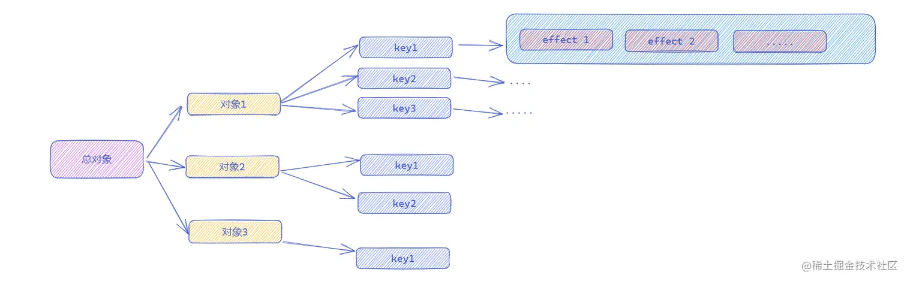
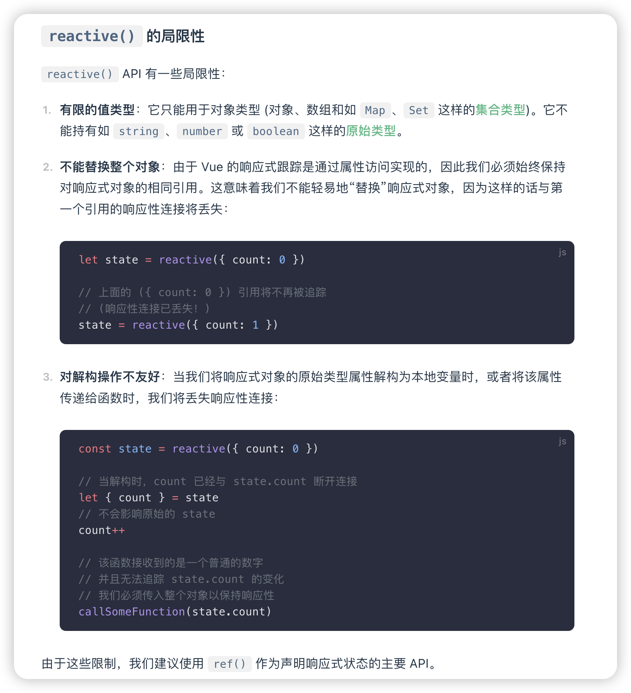

本文将介绍 Vue 3 的响应式系统,从发布订阅到响应式系统的实现,帮助你深入理解 Vue 3 的响应式系统。

---

## 发布订阅

发布订阅是一种设计模式，它定义了对象间的一种一对多的依赖关系，当一个对象的状态发生改变时，所有依赖于它的对象都将得到通知并自动更新。

先从最基本的发布订阅开始。

```js
class EventBus {
  constructor() {
    this.events = {}
  }

  on(event, callback) {
    if (!this.events[event]) {
      this.events[event] = []
    }
    // 收集依赖
    this.events[event].push(callback)
  }

  emit(event, ...args) {
    if (this.events[event]) {
      // 触发依赖
      this.events[event].forEach((callback) => callback(...args))
    }
  }
}
```

上述代码中，在 `on` 方法中，将回调函数收集到 `this.events[event]` 数组中。在 `emit` 方法中，遍历 `this.events[event]` 数组，执行回调函数。

```js
const eventBus = new EventBus()

// 收集依赖
eventBus.on('test', () => {
  console.log('test')
})

// 触发依赖
eventBus.emit('test')
```

在 `Vue3` 中，也利用了一个类似的机制，来实现响应式系统。

## Vue3 的响应式系统

在 Vue3 中，当数据发生变化时，会触发响应式系统的更新。这个过程分为两个阶段：

1. 依赖收集
2. 触发更新

我们来看一个简单的例子：

```html
<div id="app"></div>

<script>
  const app = document.getElementById('app')
  const data = {
    message: 'Hello, World!'
  }

  // 渲染数据
  app.innerHTML = data.message

  // 改变数据
  setTimeout(() => {
    data.message = 'Hello, Vue3!'
  }, 1000)
</script>
```

在上述代码中，虽然数据发生了变化，但是由于执行 `setTimeout` 时，`app.innerHTML` 已经执行，所以不会触发更新。

如果想要实现数据变化时，自动触发更新视图，就需要使用发布订阅模式。当数据变化时，触发依赖，更新视图。

```js
// 创建响应式对象
const data = reactive({
  message: 'Hello, World!'
})

// 收集依赖
effect(() => {
  app.innerHTML = data.message
})

setTimeout(() => {
  // 改变数据,触发依赖
  data.message = 'Hello, Vue3!'
}, 1000)
```

使用 `reactive` 函数来创建响应式对象，使用 `effect` 函数来收集 `reactive` 的依赖项。

当 `data.message` 发生变化时，会再次触发 `effect` 中的回调函数，从而更新视图。

要实现上述功能，我们需要实现 `reactive` 函数和 `effect` 函数。

### reactive

`reactive` 函数用于创建响应式对象。

:::info
[Proxy](https://developer.mozilla.org/zh-CN/docs/Web/JavaScript/Reference/Global_Objects/Proxy) 对象用于创建一个对象的代理，从而实现基本操作的拦截和自定义（如属性查找、赋值、枚举、函数调用等）。
:::

```js
let activeEffect = null // 当前正在执行的副作用函数
const targetMap = {} // 记录依赖关系
const data = reactive({
  message: 'Hello, World!'
})

function reactive(target) {
  const proxy = new Proxy(target, {
    get(target, key, receiver) {
      // ---
      // 依赖收集
      let depsMap = targetMap[key]
      if (!depsMap) {
        depsMap = []
        targetMap[key] = depsMap
      }
      depsMap.push(activeEffect)
      // ---
      return Reflect.get(target, key, receiver)
    },

    set(target, key, value, receiver) {
      let res = Reflect.set(target, key, value, receiver)
      // ---
      let depsMap = targetMap[key]
      // 触发依赖
      depsMap.forEach((effect) => {
        effect()
      })
      // ---

      return res
    }
  })
  return proxy
}

function effect(fn) {
  // 设置当前正在执行的副作用函数
  activeEffect = fn
  fn()
}

// 收集依赖
effect(() => {
  app.innerHTML = data.message
})

setTimeout(() => {
  // 改变数据,触发依赖
  data.message = 'Hello, Vue3!'
}, 2000)
```

当创建响应式对象时,会创建一个代理对象

- 当访问代理对象的属性时,触发 `get` 方法,会把当前的副作用函数收集到 `targetMap` 中。
- 当属性发生变化时,触发 `set` 方法 , 把 `targetMap` 中对应的副作用函数执行。

最后的 `targetMap` 如下所示

```js
const targetMap = {
  message: [effect]
}
```


### reactive 问题修复

现在我们实现了一个最基本的 响应式系统，但是还存在一些问题。

#### 问题1 内存泄漏

```js
const state = reactive({ count: 0 })
effect(() => {
  console.log(state.count)
  console.log(state.count)
  console.log(state.count)
}) 
```

每次访问 state.count 都会重复收集同一个 effect
导致同一个 effect 被存储多次，且永远不会被清理

#### 问题2 重复触发问题

```js
const state = reactive({ count: 0 })
effect(() => {
  console.log('effect run:', state.count)
})

state.count++ // 输出多次 'effect run: 1'
```

由于依赖被收集多次，同一个更新会触发多次

#### 问题3 交叉污染

```js
// 错误实现中使用 key 作为索引
targetMap[key] = depsMap

const obj1 = reactive({ name: 'obj1' })
const obj2 = reactive({ name: 'obj2' })
```
不同对象的相同属性名会共享依赖,修改 obj1.name 会触发 obj2.name 的依赖


#### 问题4 对象被垃圾回收时的问题

```js
// 错误实现无法让对象被正确垃圾回收
let obj = reactive({ temp: 1 })
obj = null
```
对象的依赖关系仍然存在于 targetMap 中,导致对象无法被正确垃圾回收。


#### 解决办法
- 使用 [`WeakMap`](https://developer.mozilla.org/zh-CN/docs/Web/JavaScript/Reference/Global_Objects/WeakMap) 来存储对象, 因为使用对象本身作为 key 值,可以做到唯一, 而且当对象被垃圾回收时, WeakMap 也会被垃圾回收。

- 使用 [`Set`](https://developer.mozilla.org/zh-CN/docs/Web/JavaScript/Reference/Global_Objects/Set) 来存储依赖函数, Set 有自动去重,当遇到相同的依赖函数时,会自动去重,所以不会出现重复收集依赖的问题。

```js
const targetMap = new WeakMap()

function reactive(target) {
  const proxy = new Proxy(target, {
    get(target, key, receiver) {
      // 依赖收集
      track(target, key)
      return Reflect.get(target, key, receiver)
    },
    set(target, key, value, receiver) {
      const oldValue = target[key]
      const result = Reflect.set(target, key, value, receiver)
      // 值变化时才触发更新
      if (oldValue !== value) {  
        trigger(target, key)
      }
      return result
    }
  })
  return proxy
}
```

```js
function track(target, key) {
  // 如果当前没有正在执行的副作用函数,则不进行依赖收集
  if (!activeEffect) return

  // 使用当前对象作为 key 值, 获取对应的依赖
  let depsMap = targetMap.get(target)
  if (!depsMap) {
    targetMap.set(target, (depsMap = new Map()))
  }
  let dep = depsMap.get(key)
  // 如果当前没有依赖,则创建一个依赖
  if (!dep) {
    depsMap.set(key, (dep = new Set()))
  }
  // 添加当前正在执行的副作用函数
  dep.add(activeEffect)
}

function trigger(target, key) {
  const depsMap = targetMap.get(target)
  if (!depsMap) return
  const dep = depsMap.get(key)
  if (dep) {
    dep.forEach(effect => effect())
  }
}
```

targetMap 的结构如下所示




### 局限性

**但是 `proxy` 的 `get` 方法和 `set` 方法只能代理对象的属性,会有一定的局限性**

[所以 Vue3 建议使用 `ref` 来创建响应式对象](https://cn.vuejs.org/guide/essentials/reactivity-fundamentals.html#limitations-of-reactive)。



那么 `ref` 是如何实现的呢？

### ref

`ref` 可以代理基本数据类型和对象。

```js
const data = ref('Hello, World!')
app.innerHTML = data.value

setTimeout(() => {
  data.value = 'Hello, Vue3!'
}, 1000)
```

只不过 `ref` 需要使用 `value` 属性来访问和修改值。

其中利用了**getter**和**setter**来实现。原理和 `proxy` 的 `get` 方法和 `set` 方法类似。

```js
class RefImpl {
  constructor(value) {
    this._value = value
    // ref 专属的依赖收集器
    this.dep = new Set()
  }

  get value() {
    // 依赖收集
    if (activeEffect) {
      this.dep.add(activeEffect)
    }
    return this._value
  }

  set value(newValue) {
     // 如果值没有变化，不触发更新
    if (Object.is(newValue, this._value)) return
    this._value = newValue
    // 触发依赖
    this.dep.forEach(effect => effect())
  }
}

function toReactive(value) {
  // 如果是对象，则返回一个响应式对象
  return typeof value === 'object' ? reactive(value) : value
}

function ref(value) {
  return new RefImpl(toReactive(value))
}
```
由于改变时，只改变了 `value`的值，那么一定会触发 `set` 方法，从而触发依赖。


所以 `ref` 可以代理基本数据类型和对象。这也是 `Vue3` 建议使用 `ref` 来创建响应式对象的原因。

## 总结

Vue3 的响应式系统，利用了 `proxy` 的 `get` 方法和 `set` 方法来实现响应式系统。
其中 `proxy` 的 `get` 方法和 `set` 方法可以代理对象的属性，但是不能代理基本数据类型。

所以 `Vue3` 建议使用 `ref` 来创建响应式对象。

`ref` 利用了 `getter` 和 `setter` 来实现响应式系统。


