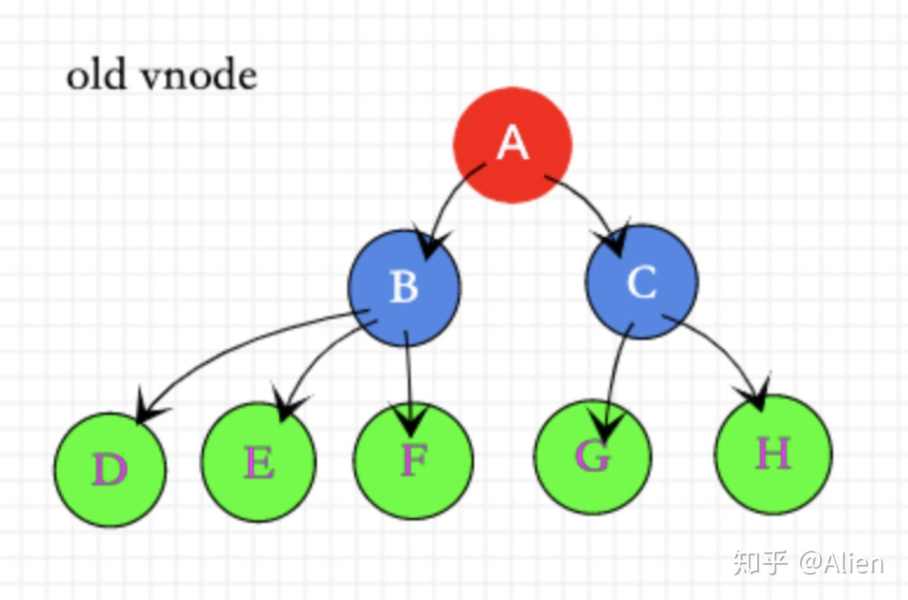
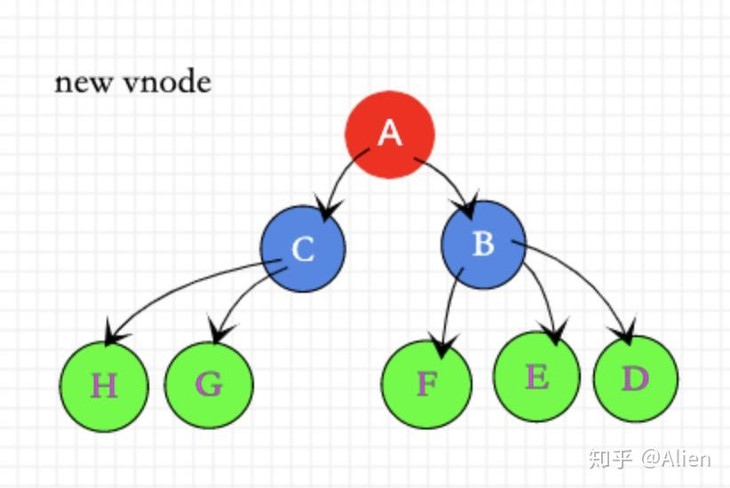
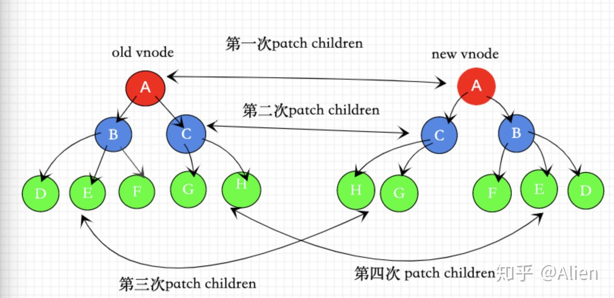
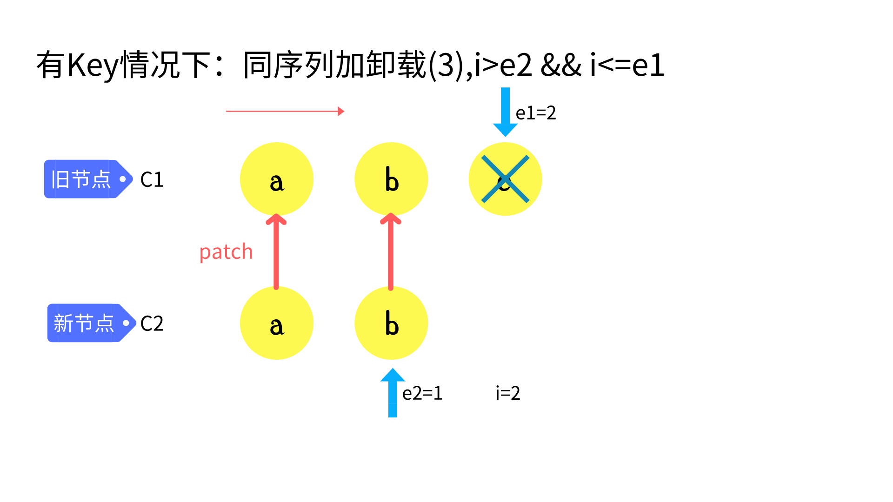

Diff算法是现代前端框架（如Vue、React）中的核心技术，它用于比较两棵虚拟DOM树的差异，并以最小的DOM操作代价来更新真实DOM。这个过程对于前端应用的性能至关重要。

---


## Diff算法的重要性

想象一下，当用户在应用中进行操作时，数据发生变化，视图需要更新。如果每次都完全重建整个DOM树，即使只有一个小小的文本变化，也会造成巨大的性能浪费。这就是为什么我们需要Diff算法 - 它能够精确找出变化的部分，只更新必要的DOM节点。





上面两张图展示了一次更新中新旧虚拟DOM树的变化情况。

## 为什么需要Diff算法？

如果没有Diff算法，而是简单地依次替换所有节点，会发生什么？



如上图所示，当我们仅仅是**调整了DOM节点的顺序**，没有Diff算法的情况下，系统会认为所有节点都发生了变化。这将导致：

1. 所有旧节点被销毁
2. 所有新节点被重新创建
3. 所有DOM元素被重新渲染

这显然是极其低效的！特别是在大型应用中，这种低效会直接影响用户体验。

**Diff算法的核心价值在于：识别出可以复用的DOM节点，最大限度减少DOM操作，从而提升性能。**

## Vue3的Diff算法实现：双端比较

Vue3采用了一种高效的"双端比较"算法，它通过同时比较新旧虚拟DOM的头部和尾部节点，快速找出可复用的节点，减少不必要的DOM操作。

### 基本流程

1. 比较新旧节点的头部和尾部
2. 复用可复用的节点
3. 处理剩余的特殊情况（新增、删除或位置变化的节点）

让我们详细了解这个过程：

### 1. 头头比较

首先，算法从两棵树的头部开始比较，寻找相同的节点：


```js
// c1是旧虚拟DOM树的子节点数组，c2是新虚拟DOM树的子节点数组
let i = 0                    // 当前比较的索引位置
const l2 = c2.length         // 新节点数组的长度
let e1 = c1.length - 1       // 旧节点数组的最后一个索引
let e2 = l2 - 1              // 新节点数组的最后一个索引

// 从头部开始比较
while (i <= e1 && i <= e2) {
  const n1 = c1[i]           // 旧节点
  const n2 = c2[i]           // 新节点
  
  // 如果节点的key和类型都相同，说明可以复用
  if (n1.key === n2.key && n1.type === n2.type) {
    // 递归地patch节点内部（子节点等）
    patch(n1, n2, container)
  } else {
    // 如果不匹配，退出头部比较
    break
  }
  i++  // 移动到下一个索引
}
```

### 2. 尾尾比较

接下来，算法从两棵树的尾部开始比较：


```js
// 从尾部开始比较
while (i <= e1 && i <= e2) {
  const n1 = c1[e1]          // 旧节点数组的当前尾部节点
  const n2 = c2[e2]          // 新节点数组的当前尾部节点
  
  if (n1.key === n2.key && n1.type === n2.type) {
    patch(n1, n2, container)
  } else {
    break
  }
  e1--  // 向前移动旧节点的尾部索引
  e2--  // 向前移动新节点的尾部索引
}
```

**经过头头和尾尾比较后，`i`表示新旧节点从头部开始的公共部分之后的第一个索引，而`e1`和`e2`表示从尾部开始的公共部分之前的最后一个索引。也就是说，`i`到`e1`之间的节点是旧DOM中需要特殊处理的部分，`i`到`e2`之间的节点是新DOM中需要特殊处理的部分。**

### 3. 处理新增节点

当头尾比较完成后，可能会出现新DOM比旧DOM多出一些节点的情况：


```js
// 如果i > e1，说明旧节点已经全部处理完，但新节点还有剩余
if (i > e1) {
  // 说明有新增节点
  if (i <= e2) {
    // 遍历剩余的新节点，将它们挂载到DOM中
    while (i <= e2) {
      // 创建并插入新节点
      patch(null, c2[i], container, anchor)
      i++
    }
  }
}
```

### 4. 处理需要删除的节点

相反，如果旧DOM比新DOM多出一些节点，这些多余的节点需要被删除：




```js
// 如果i > e2，说明新节点已经全部处理完，但旧节点还有剩余
else if (i > e2) {
  // 遍历剩余的旧节点，将它们从DOM中移除
  while (i <= e1) {
    unmount(c1[i])
    i++
  }
}
```

### 5. 处理未知序列

最复杂的情况是，在头尾比较后，中间部分的节点顺序发生了变化：


这种情况需要更复杂的处理：

```js
// 处理中间部分的未知序列
// a b [c d e] f g  (旧DOM)
// a b [e c d h] f g  (新DOM)
// i = 2, e1 = 4, e2 = 5

// 记录起始索引
const s1 = i  // 旧DOM中未知序列的起始索引
const s2 = i  // 新DOM中未知序列的起始索引

// 1. 创建新节点key到索引的映射
const keyToNewIndexMap = new Map()
for (let i = s2; i <= e2; i++) {
  const nextChild = c2[i]
  keyToNewIndexMap.set(nextChild.key, i)
}
```

这一步创建了一个映射，记录新DOM中每个节点key对应的索引位置：

```js
// keyToNewIndexMap的内容
{
  e: 2,  // 新DOM中e的索引是2
  c: 3,  // 新DOM中c的索引是3
  d: 4,  // 新DOM中d的索引是4
  h: 5   // 新DOM中h的索引是5
}
```

接下来，我们处理旧DOM中的节点，看它们在新DOM中的位置：

```js
// 计算需要处理的节点总数
const toBePatched = e2 - s2 + 1
// 创建一个数组，记录新DOM中的节点在旧DOM中的位置
// 初始值为0，表示该节点在旧DOM中不存在（需要新建）
const newIndexToOldMapIndex = new Array(toBePatched).fill(0)

// 遍历旧DOM中的未知序列
for (let i = s1; i <= e1; i++) {
  const prevChild = c1[i]
  // 查找当前旧节点在新DOM中的位置
  let newIndex = keyToNewIndexMap.get(prevChild.key)
  
  // 如果在新DOM中找不到，说明该节点被删除了
  if (newIndex === undefined) {
    unmount(prevChild)
  } else {
    // 记录该节点在旧DOM中的位置（加1是为了避开初始值0）
    newIndexToOldMapIndex[newIndex - s2] = i + 1
    // 复用节点，更新内容
    patch(prevChild, c2[newIndex], container)
  }
}
```


最后，我们需要移动节点位置，确保它们的顺序与新DOM一致：

```js
// 从后向前遍历，确保插入位置的正确性
for (let i = toBePatched - 1; i >= 0; i--) {
  // 计算当前节点在新DOM中的实际索引
  const nextIndex = s2 + i  // 例如，处理[e c d h]中的h
  const nextChild = c2[nextIndex]  // 获取对应的节点
  
  // 确定插入位置的参考节点
  // 如果当前节点是最后一个，则插入到null前（即容器末尾）
  // 否则插入到下一个节点之前
  const anchor = nextIndex + 1 < c2.length ? c2[nextIndex + 1].el : null
  
  // 如果是新节点（在旧DOM中不存在），则创建并插入
  if (newIndexToOldMapIndex[i] === 0) {
    patch(null, nextChild, container, anchor)
  } else {
    // 如果节点已存在，只需移动位置
    hostInsert(nextChild.el, container, anchor)
  }
}
```

**为什么从后向前遍历？** 这是一个巧妙的设计：从后向前处理确保了每次处理节点时，它后面的节点已经位于正确位置，这样当前节点就可以直接插入到正确的位置。这种方式避免了复杂的位置计算，使DOM操作更加高效。


## for 循环中 key 的作用

`key`本质上是虚拟DOM节点的唯一标识符，它帮助Vue在更新过程中准确识别节点。这就像人类社会中的身份证号码 - 即使两个人长相相似、名字相同，通过身份证号也能准确区分。

### 没有key时的更新过程

当没有提供`key`时，Vue会采用"就地更新"策略：

```html
<!-- 没有key的列表 -->
<div v-for="item in items">{{ item.text }}</div>
```

如果列表顺序改变，Vue会简单地按照索引位置更新节点内容，而不是移动DOM元素。这导致：

1. 所有节点的内容都被重新渲染
2. DOM元素本身不会移动，只是内容更新
3. 如果节点包含状态（如输入框的值、滚动位置等），这些状态会丢失

从技术角度看，这种方式在某些场景下效率较低，特别是当列表项包含复杂内容或有状态时。

### 使用key的更新过程

提供`key`后，Vue能够跟踪每个节点的身份：

```html
<!-- 使用key的列表 -->
<div v-for="item in items" :key="item.id">{{ item.text }}</div>
```

当列表顺序变化时：

1. Vue通过key快速找到对应的旧节点
2. 复用已有DOM元素，只移动它们的位置
3. 节点内部状态得以保留
4. 只有真正新增的节点才会被创建，真正删除的节点才会被移除

### 性能对比

从算法复杂度角度分析：
- **没有key**：需要O(n²)的比较操作，因为每个新节点都需要与所有旧节点比较
- **有key**：只需O(n)的操作，因为可以通过哈希表直接查找对应节点

在大型列表或频繁更新的场景中，这种差异会显著影响性能。

## 使用最长递增子序列优化

Vue3的Diff算法中引入了一个重要优化 - 最长递增子序列算法(Longest Increasing Subsequence, LIS)。

### 什么是最长递增子序列？

最长递增子序列是指在一个数组中找出最长的递增子序列（不一定连续）。在Vue3的上下文中，它用于找出在新列表中位置不需要变动的节点序列。

### 实际应用示例

假设我们有两个列表：

```js
// 原始列表
const oldList = ['A', 'B', 'C', 'D', 'E'];
// 新列表（B和C位置互换）
const newList = ['A', 'C', 'B', 'D', 'E'];
```

传统方法可能会移动多个节点，但使用最长递增子序列算法，Vue3能够识别出：

1. 节点'A'位置不变（索引0）
2. 节点'C'从索引2移到索引1
3. 节点'B'从索引1移到索引2
4. 节点'D'位置不变（索引3）
5. 节点'E'位置不变（索引4）

分析后发现，'A'、'D'、'E'形成了一个递增序列（它们在新列表中的索引是递增的），因此只需要移动'B'和'C'，而不是全部重新排列。

### 技术实现

Vue3中的实现大致如下：

1. 为新列表中的每个节点创建一个映射到旧列表位置的数组
2. 计算这个数组的最长递增子序列
3. 只移动不在最长递增子序列中的节点

```js
// 在实际Vue3代码中的简化版本
function updateChildren(oldChildren, newChildren) {
  // ... 前面的头尾比较代码 ...
  
  // 创建位置映射
  const newIndexToOldIndexMap = new Array(toBePatched).fill(0);
  
  // 填充映射关系
  for (let i = 0; i < oldChildren.length; i++) {
    const oldKey = oldChildren[i].key;
    const newIndex = keyToNewIndexMap.get(oldKey);
    if (newIndex !== undefined) {
      newIndexToOldIndexMap[newIndex - s2] = i + 1;
    }
  }
  
  // 计算最长递增子序列
  const increasingNewIndexSequence = getSequence(newIndexToOldIndexMap);
  
  // 从后向前遍历，移动节点
  for (let i = toBePatched - 1; i >= 0; i--) {
    if (increasingNewIndexSequence.indexOf(i) === -1) {
      // 不在最长递增子序列中的节点需要移动
      // 移动节点的代码...
    }
  }
}
```

:::details 最长递增子序列算法   

```js 
function getSequence(arr) { // 最终的结果是索引 
    const len = arr.length;
    const result = [0]; // 索引  递增的序列 用二分查找性能高
    const p = arr.slice(0); // 里面内容无所谓 和 原本的数组相同 用来存放索引
    let start;
    let end;
    let middle;
    for (let i = 0; i < len; i++) { // O(n)
        const arrI = arr[i];
        if (arrI !== 0) {
            let resultLastIndex = result[result.length - 1];
            // 取到索引对应的值
            if (arr[resultLastIndex] < arrI) {
                p[i] = resultLastIndex; // 标记当前前一个对应的索引
                result.push(i);
                // 当前的值 比上一个人大 ，直接push ，并且让这个人得记录他的前一个
                continue
            }
            // 二分查找 找到比当前值大的那一个
            start = 0;
            end = result.length - 1;
            while (start < end) { // 重合就说明找到了 对应的值  // O(logn)
                middle = ((start + end) / 2) | 0; // 找到中间位置的前一个
                if (arr[result[middle]] < arrI) {
                    start = middle + 1
                } else {
                    end = middle
                } // 找到结果集中，比当前这一项大的数
            }
            // start / end 就是找到的位置
            if (arrI < arr[result[start]]) { // 如果相同 或者 比当前的还大就不换了
                if (start > 0) { // 才需要替换
                    p[i] = result[start - 1]; // 要将他替换的前一个记住
                }
                result[start] = i;
            }
        }
    }
    let i = result.length // 总长度
    let last = result[i - 1] // 找到了最后一项
    while (i-- > 0) { // 根据前驱节点一个个向前查找
        result[i] = last // 最后一项肯定是正确的
        last = p[last]
    }
    return result;
}
console.log(getSequence([2, 3, 1, 5, 6, 8, 7, 9, 4]))
```
:::

### 性能提升

这种优化在大型列表中尤其有效：

1. **减少DOM操作**：只有必要的节点才会移动
2. **提高渲染效率**：避免不必要的节点创建和销毁
3. **保持状态**：节点的内部状态（如表单输入、滚动位置）得以保留

在实际应用中，这种优化可以将列表重排的性能提升数倍，特别是在只有少量元素位置变化的情况下。

### 实际应用建议

为了充分利用Vue3的这一优化：

1. 始终为`v-for`列表提供稳定且唯一的`key`
2. 避免使用索引作为`key`，因为这会破坏优化的效果
3. 尽量减少不必要的列表结构变化
4. 对于大型列表，考虑使用虚拟滚动等技术进一步优化

通过这些实践，我们可以充分发挥Vue3 Diff算法的性能优势，打造流畅的用户体验。

## 总结

Vue3的Diff算法通过巧妙的双端比较策略，大大提高了DOM更新的效率：

1. **头头比较和尾尾比较**：快速识别序列两端的相同节点
2. **处理新增和删除**：高效处理节点的增减
3. **未知序列处理**：通过key映射和从后向前的移动策略，最小化DOM操作
4. 如果是for循环，建议使用key来标识节点，可以提高性能。

这种算法在保持高效的同时，也保证了DOM更新的准确性，是Vue3性能优化的重要组成部分。

理解Diff算法不仅有助于我们更好地使用Vue，也能帮助我们在编写组件时做出更有利于性能的决策，例如合理使用key属性，避免不必要的DOM结构变化等。

## 参考资料

1. Vue.js官方文档: [https://vuejs.org/guide/extras/rendering-mechanism.html](https://vuejs.org/guide/extras/rendering-mechanism.html)
2. Vue3源码: [https://github.com/vuejs/core/blob/main/packages/runtime-core/src/renderer.ts](https://github.com/vuejs/core/blob/main/packages/runtime-core/src/renderer.ts)
3. 珠峰架构师课程[http://zhufengpeixun.com/advance/guide/10.diff.htm]
