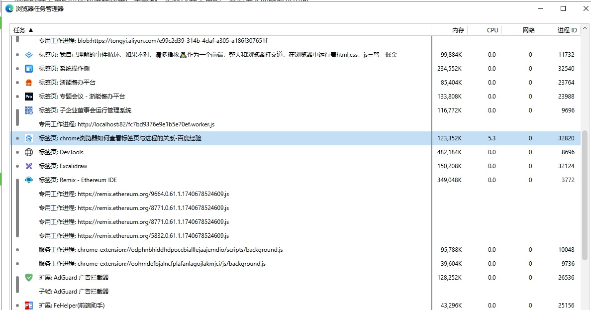

在当今互联网时代，网站性能优化已经成为前端开发中不可或缺的一部分。其中，浏览器缓存是提升网站性能最有效的方式之一。本文将深入浅出地讲解浏览器缓存机制，帮助你更好地理解和使用缓存策略。

---

## 出现事件循环的原因

作为浏览器脚本语言，JavaScript的主要用途是与用户互动，以及操作DOM。这决定了它**只能是单线程**，否则会带来很复杂的同步问题。比如，假定JavaScript同时有两个线程，一个线程在某个DOM节点上添加内容，另一个线程删除了这个节点，这时浏览器应该以哪个线程为准？

所以，为了避免复杂性，从一诞生，JavaScript就是单线程，这已经成了这门语言的核心特征，将来也不会改变。

:::tip
为了利用多核CPU的计算能力，HTML5提出Web Worker标准，允许JavaScript脚本创建多个线程，但是子线程完全受主线程控制，且不得操作DOM。所以，这个新标准并没有改变JavaScript单线程的本质。
:::

:::info 线程与进程

- 进程（Process）：程序的一次执行实例，包含代码、数据、堆栈等资源，是操作系统进行资源分配的基本单位。一个进程可以包含多个线程。
- 线程（Thread）：进程中的一个执行流，共享进程的资源（如内存、文件句柄），是操作系统调度的最小单位。

| 特性 | 进程 | 线程 |
| --- | --- | --- |
| 资源独立性 | 独立的内存空间、文件描述符等 | 共享进程的所有资源 |
| 调度单位 | 操作系统调度进程 | 操作系统调度线程（更细粒度） |
| 通信成本 | 需通过 IPC（管道、消息队列等） | 直接共享内存，通信更高效 |
| 创建开销 | 大（分配独立资源） | 小（复用进程资源） |
| 崩溃影响 | 只影响自身 | 整个进程崩溃 |

- 进程好比是多个独立房间（每个房间有独立设施）。

- 线程好比是同一房间内的多个工作人员（共享房间资源）。

在 windows 中 使用 `shift + esc` 查看 浏览器中的进程

:::

## 同步任务和异步任务
单线程就意味着，所有任务需要排队，前一个任务结束，才会执行后一个任务。如果前一个任务耗时很长，后一个任务就不得不一直等待。

JavaScript开发人员意识到，为了不影响主线程正常运行，就把那些耗时的时间（比如定时器，Ajax操作从网络读取数据等）任务挂起来，依次的放进一个任务队列中，等主线程的任务执行完毕后，再回过来去继续执行队列中的任务；

于是，任务就可以分成两种：

- 同步任务(synchronous)：在主线程上排队执行的任务，只有前一个任务执行完毕，才能执行后一个任务；
- 异步任务(asynchronous)：不进入主线程、而进入"任务队列"（task queue）的任务，只有"任务队列"通知主线程，某个异步任务可以执行了，该任务才会进入主线程执行。

执行机制过程如下：

1. 所有同步任务都在主线程上执行，形成一个执行栈（调用栈）
2. 主线程之外，还存在一个‘任务队列’（task queue），浏览器中的各种 Web API 为异步的代码提供了一个单独的运行空间，当异步的代码运行完毕以后，会将代码中的回调送入到 任务队列中（队列遵循先进先出得原则）
3. 一旦"执行栈"中的所有同步任务执行完毕，系统就会读取"任务队列"，看看里面有哪些事件。那些对应的异步任务，于是结束等待状态，进入执行栈，开始执行。
4. 主线程不断重复上面的第三步。
其实，这一过程就是我们要了解的event loop（事件循环）机制；
下图就是主线程和任务队列的示意图。

主线程从"任务队列"中读取事件，这个过程是循环不断的，所以整个的这种运行机制又称为Event Loop（事件循环）。

上图中，主线程运行的时候，产生堆（heap）和栈（stack），栈中的代码调用各种外部API，它们在"任务队列"中加入各种事件（click，load，done）。只要栈中的代码执行完毕，主线程就会去读取"任务队列"，依次执行那些事件所对应的回调函数。

