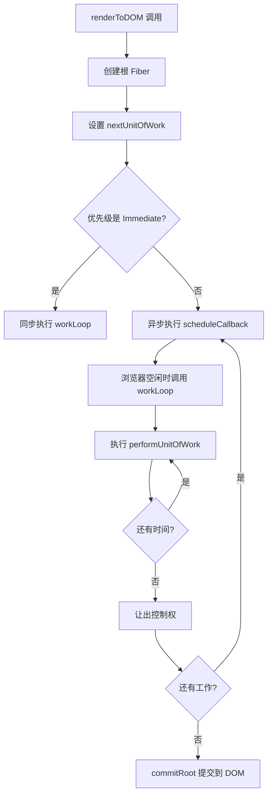

## 引言：为什么需要调度器？

在 React 15 及之前的版本中，渲染过程是**同步且不可中断**的。这意味着：

```jsx
// React 15 的渲染过程（伪代码）
function render(element) {
  // 一次性处理所有组件，无法中断
  while (还有组件要处理) {
    处理组件(); // 如果这里有 1000 个组件，会阻塞主线程很久
  }
  更新DOM();
}
```

**问题场景**：
- 用户点击按钮 → 需要等待所有组件渲染完才能响应
- 页面有大量组件 → 主线程被阻塞，页面卡顿
- 无法区分紧急任务和普通任务 → 所有任务同等对待

**解决方案**：Fiber 调度器
- ✅ 将渲染工作分解成小单元
- ✅ 可以中断和恢复
- ✅ 根据优先级调度任务
- ✅ 在浏览器空闲时执行

---

## 一、调度器的核心概念

### 1.1 什么是调度器？

调度器（Scheduler）就像是 React 的"任务管理器"，它负责：

1. **决定什么时候执行任务**（时机）
2. **决定执行哪个任务**（优先级）
3. **决定执行多久**（时间切片）

用一个生活中的例子来理解：

> 🍕 **披萨店的故事**
> 
> 想象你开了一家披萨店：
> - **普通订单**（低优先级）：可以慢慢做，有空再做
> - **VIP 订单**（高优先级）：必须立即做，不能等
> - **时间切片**：每做一个披萨，就检查一下有没有 VIP 订单
> 
> 调度器就是那个"店长"，决定先做哪个订单，什么时候暂停普通订单去做 VIP 订单。

### 1.2 调度器的三个核心问题

#### 问题 1：什么时候执行？（时机）

```js
// 浏览器告诉我们："现在有空，你可以工作了"
requestIdleCallback((deadline) => {
  // deadline.timeRemaining() 告诉我们还有多少时间
  // 比如还有 5ms，那就工作 5ms
  // 如果时间用完了，就让出控制权
});
```

#### 问题 2：执行哪个任务？（优先级）

```js
// 不同任务有不同的优先级
const Priority = {
  Immediate: 1,      // 立即执行（用户点击）
  UserBlocking: 2,   // 用户阻塞（输入框输入）
  Normal: 3,         // 正常（数据更新）
  Low: 4,            // 低优先级（后台任务）
  Idle: 5,           // 空闲时执行（预加载）
};
```

#### 问题 3：执行多久？（时间切片）

```js
// 每次只执行一小段时间，然后检查是否需要让出控制权
while (还有工作 && 还有时间) {
  执行一个工作单元();
  检查是否应该让出控制权();
}
```

---

## 二、工作循环（Work Loop）：调度器的核心

### 2.1 工作循环的基本结构

工作循环是调度器的核心，它不断地执行工作单元，直到完成所有工作或需要让出控制权。

```js
function workLoop(deadline) {
  let shouldYield = false; // 是否应该让出控制权
  
  // 只要还有工作，且不应该让出控制权，就继续执行
  while (nextUnitOfWork && !shouldYield) {
    // 执行当前工作单元
    nextUnitOfWork = performUnitOfWork(nextUnitOfWork);
    
    // 检查是否应该让出控制权
    shouldYield = deadline.timeRemaining() < 1;
  }
  
  // 如果还有工作未完成，继续调度
  if (nextUnitOfWork) {
    requestIdleCallback(workLoop); // 下次有空再继续
  } else {
    // 所有工作完成，进入 Commit 阶段
    commitRoot();
  }
}
```

### 2.2 工作循环的执行流程

让我们用一个具体的例子来理解：

```jsx
// 假设我们要渲染这个组件树
<div>
  <h1>标题</h1>
  <p>内容1</p>
  <p>内容2</p>
</div>
```

**执行过程**：

```
时间轴：
0ms    → 开始执行 workLoop
1ms    → 处理 <div> 节点
2ms    → 处理 <h1> 节点
3ms    → 处理 "标题" 文本节点
4ms    → 检查时间：还有 1ms，继续
5ms    → 处理 <p> 节点
6ms    → 检查时间：时间用完了！让出控制权
       → 浏览器处理其他任务（用户交互、动画等）
10ms   → 浏览器又有空了，继续执行
11ms   → 处理 "内容1" 文本节点
12ms   → 处理下一个 <p> 节点
...
```

### 2.3 代码实现详解

让我们看看实际的代码实现：

```js:271:302:fiber/react-dom.js
function workLoop(deadline) {
  let shouldYield = false; // 是否应该让出控制权
  
  // 根据优先级决定是否让出控制权
  const timeout = getTimeoutByPriority(currentPriority);
  const timeRemaining = deadline.timeRemaining ? deadline.timeRemaining() : 5;
  const hasTimeRemaining = timeRemaining > 1;
  const shouldTimeout = deadline.didTimeout || (Date.now() - startTime) > timeout;
  
  // 高优先级任务或还有时间，继续执行
  while (nextUnitOfWork && !shouldYield) {
    // 执行当前工作单元
    nextUnitOfWork = performUnitOfWork(nextUnitOfWork);
    
    // 检查是否应该让出控制权
    // 高优先级任务：立即执行，不让出
    // 低优先级任务：时间用完了就让出
    if (currentPriority === Priority.Immediate) {
      shouldYield = false; // 立即优先级，不让出
    } else {
      shouldYield = !hasTimeRemaining || shouldTimeout;
    }
  }
  
  // 如果还有工作未完成，继续调度
  if (nextUnitOfWork) {
    scheduleCallback(workLoop);
  } else {
    // 所有工作完成，进入 Commit 阶段
    commitRoot();
  }
}
```

**关键点解析**：

1. **`deadline.timeRemaining()`**：浏览器告诉我们还有多少空闲时间
   - 通常每次有 5-10ms 的空闲时间
   - 如果返回 0，说明浏览器需要处理其他任务了

2. **`shouldYield`**：决定是否让出控制权
   - `true`：让出控制权，让浏览器处理其他任务
   - `false`：继续执行

3. **`nextUnitOfWork`**：下一个要处理的工作单元（Fiber 节点）
   - 如果为 `null`，说明所有工作都完成了

---

## 三、优先级系统：如何决定任务的重要性

### 3.1 优先级等级

React 定义了 5 个优先级等级：

```js:1:20:fiber/react-dom.js
// ==================== 优先级系统 ====================
// React 根据更新的来源分配不同的优先级
const Priority = {
  Immediate: 1,      // 立即执行（同步）
  UserBlocking: 2,   // 用户阻塞（用户交互，如点击）
  Normal: 3,         // 正常优先级（默认）
  Low: 4,            // 低优先级
  Idle: 5,           // 空闲时执行
};

// 根据优先级获取超时时间（毫秒）
function getTimeoutByPriority(priority) {
  switch (priority) {
    case Priority.Immediate:
      return 0;
    case Priority.UserBlocking:
      return 250;
    case Priority.Normal:
      return 5000;
    case Priority.Low:
      return 10000;
    case Priority.Idle:
      return Infinity;
    default:
      return 5000;
  }
}
```

### 3.2 优先级的使用场景

| 优先级 | 超时时间 | 使用场景 | 示例 |
|--------|---------|---------|------|
| **Immediate** | 0ms | 立即执行，同步阻塞 | 初始化渲染 |
| **UserBlocking** | 250ms | 用户交互 | 点击按钮、输入框输入 |
| **Normal** | 5000ms | 正常更新 | 数据更新、状态变化 |
| **Low** | 10000ms | 低优先级 | 后台数据同步 |
| **Idle** | ∞ | 空闲时执行 | 预加载、懒加载 |

### 3.3 优先级如何影响调度

让我们看一个实际的例子：

```jsx
// 场景：用户正在滚动页面（低优先级任务），突然点击了按钮（高优先级任务）

// 1. 低优先级任务正在执行
renderToDOM(largeList, container, Priority.Low);
// → workLoop 开始执行，每次执行一小段时间

// 2. 用户点击按钮（高优先级）
button.onclick = () => {
  renderToDOM(buttonContent, container, Priority.UserBlocking);
  // → 立即中断低优先级任务
  // → 开始执行高优先级任务
  // → 高优先级任务完成后，再恢复低优先级任务
};
```

**执行流程**：

```
时间轴：
0ms    → 开始执行低优先级任务（渲染列表）
5ms    → 执行了 5ms，让出控制权
       → 浏览器处理其他任务
10ms   → 用户点击按钮！
       → 立即中断低优先级任务
       → 开始执行高优先级任务（渲染按钮）
15ms   → 高优先级任务完成
       → 恢复低优先级任务
20ms   → 继续渲染列表
```

### 3.4 优先级在代码中的实现

```js:274:292:fiber/react-dom.js
  // 根据优先级决定是否让出控制权
  const timeout = getTimeoutByPriority(currentPriority);
  const timeRemaining = deadline.timeRemaining ? deadline.timeRemaining() : 5;
  const hasTimeRemaining = timeRemaining > 1;
  const shouldTimeout = deadline.didTimeout || (Date.now() - startTime) > timeout;
  
  // 高优先级任务或还有时间，继续执行
  while (nextUnitOfWork && !shouldYield) {
    // 执行当前工作单元
    nextUnitOfWork = performUnitOfWork(nextUnitOfWork);
    
    // 检查是否应该让出控制权
    // 高优先级任务：立即执行，不让出
    // 低优先级任务：时间用完了就让出
    if (currentPriority === Priority.Immediate) {
      shouldYield = false; // 立即优先级，不让出
    } else {
      shouldYield = !hasTimeRemaining || shouldTimeout;
    }
  }
```

**关键逻辑**：

1. **立即优先级（Immediate）**：
   - `shouldYield = false`：永远不让出控制权
   - 同步执行，直到完成

2. **其他优先级**：
   - 检查剩余时间：`timeRemaining() < 1` → 让出
   - 检查超时：`(Date.now() - startTime) > timeout` → 让出

---

## 四、时间切片（Time Slicing）：如何避免阻塞

### 4.1 什么是时间切片？

时间切片就是将**大任务分解成小任务**，每次只执行一小段时间，然后让出控制权。

**类比**：
- ❌ **没有时间切片**：一口气跑完 10 公里（累死）
- ✅ **有时间切片**：跑 100 米，休息一下，再跑 100 米（轻松）

### 4.2 时间切片的实现

```js
// 浏览器提供的 API：requestIdleCallback
requestIdleCallback((deadline) => {
  // deadline.timeRemaining() 返回剩余的空闲时间
  // 通常每次有 5-10ms
  
  while (还有工作 && deadline.timeRemaining() > 1) {
    执行一个工作单元();
  }
  
  if (还有工作) {
    // 下次有空再继续
    requestIdleCallback(继续执行);
  }
});
```

### 4.3 实际的时间切片流程

让我们用一个具体的例子：

```jsx
// 假设要渲染 1000 个组件
function render1000Components() {
  for (let i = 0; i < 1000; i++) {
    renderComponent(i); // 每个组件需要 0.1ms
  }
}
// 总时间：1000 × 0.1ms = 100ms（会阻塞主线程 100ms）
```

**使用时间切片后**：

```js
// 每次只渲染 50 个组件，然后让出控制权
function renderWithTimeSlicing() {
  let index = 0;
  
  function work() {
    const deadline = { timeRemaining: () => 5 }; // 假设有 5ms
    
    while (index < 1000 && deadline.timeRemaining() > 1) {
      renderComponent(index);
      index++;
    }
    
    if (index < 1000) {
      // 还有工作，下次继续
      requestIdleCallback(work);
    }
  }
  
  requestIdleCallback(work);
}
```

**执行时间线**：

```
0-5ms    → 渲染组件 0-49（50个）
         → 让出控制权，浏览器处理其他任务
10-15ms  → 渲染组件 50-99（50个）
         → 让出控制权
20-25ms  → 渲染组件 100-149（50个）
         → ...
```

### 4.4 时间切片的优势

1. **不阻塞主线程**：每次只执行一小段时间
2. **响应及时**：可以快速响应用户交互
3. **流畅体验**：动画和交互不会卡顿

---

## 五、调度器的完整工作流程

### 5.1 从渲染到调度的完整流程

让我们追踪一个完整的渲染过程：

```jsx
// 1. 用户调用渲染函数
renderToDOM(<App />, container, Priority.Normal);

// 2. 创建根 Fiber 节点
workInProgressRoot = {
  dom: container,
  props: { children: [<App />] },
  alternate: currentRoot,
};

// 3. 设置第一个工作单元
nextUnitOfWork = workInProgressRoot.child;

// 4. 开始调度
scheduleCallback(workLoop);
```

**调度过程**：



### 5.2 工作单元的执行

每个工作单元（Fiber 节点）的处理过程：

```js:140:175:fiber/react-dom.js
// ==================== 执行单个工作单元 ====================
function performUnitOfWork(workInProgress) {
  // 1. 创建或更新当前节点的真实 DOM（不挂载，在 Commit 阶段统一挂载）
  if (!workInProgress.dom) {
    workInProgress.dom = createDOM(workInProgress);
  }
  
  // 2. 处理子节点（协调算法）
  const elements = workInProgress.props.children || [];
  reconcileChildren(workInProgress, elements);
  
  // 3. 返回下一个工作单元（深度优先遍历）
  if (workInProgress.child) {
    return workInProgress.child;
  }
  
  // 没有子节点，找兄弟节点
  let nextFiber = workInProgress;
  while (nextFiber) {
    if (nextFiber.sibling) {
      return nextFiber.sibling;
    }
    // 没有兄弟节点，返回父节点继续向上查找
    nextFiber = nextFiber.return;
  }
  
  return null;
}
```

**执行顺序**（深度优先遍历）：

```
<div>          ← 1. 处理 div
  <h1>         ← 2. 处理 h1
    "标题"     ← 3. 处理文本节点
  </h1>
  <p>          ← 4. 处理 p（h1 的兄弟）
    "内容"     ← 5. 处理文本节点
  </p>
</div>
```

### 5.3 让出控制权的时机

调度器在以下情况会让出控制权：

1. **时间用完了**：`deadline.timeRemaining() < 1`
2. **超时了**：`(Date.now() - startTime) > timeout`
3. **有更高优先级的任务**：需要中断当前任务

```js
// 让出控制权的判断
if (currentPriority === Priority.Immediate) {
  shouldYield = false; // 立即优先级，不让出
} else {
  // 检查时间
  shouldYield = !hasTimeRemaining || shouldTimeout;
}
```

---

## 六、实际应用场景

### 6.1 场景 1：大量列表渲染

```jsx
// 问题：渲染 10000 个列表项会卡顿
function LargeList({ items }) {
  return (
    <ul>
      {items.map(item => (
        <li key={item.id}>{item.name}</li>
      ))}
    </ul>
  );
}

// 解决方案：使用低优先级，分片渲染
renderToDOM(
  <LargeList items={items} />,
  container,
  Priority.Low // 低优先级，可以中断
);
```

**效果**：
- ✅ 不会阻塞主线程
- ✅ 用户可以随时交互
- ✅ 渲染过程可以被中断和恢复

### 6.2 场景 2：用户交互优先

```jsx
// 场景：用户正在浏览长列表，突然点击了按钮

// 1. 列表渲染（低优先级）
renderToDOM(<LongList />, container, Priority.Low);

// 2. 用户点击按钮（高优先级）
button.onclick = () => {
  // 立即中断列表渲染
  // 优先处理按钮点击
  renderToDOM(<ButtonContent />, container, Priority.UserBlocking);
  
  // 按钮处理完后，继续渲染列表
};
```

### 6.3 场景 3：初始渲染优化

```jsx
// 初始渲染使用正常优先级
renderToDOM(<App />, container, Priority.Normal);

// 如果应用很大，可以拆分成多个阶段
// 1. 先渲染关键内容（高优先级）
renderToDOM(<Header />, headerContainer, Priority.UserBlocking);
renderToDOM(<MainContent />, mainContainer, Priority.Normal);

// 2. 再渲染次要内容（低优先级）
renderToDOM(<Sidebar />, sidebarContainer, Priority.Low);
```

---

## 七、调度器的关键代码解析

### 7.1 scheduleCallback：调度入口

```js:257:269:fiber/react-dom.js
// ==================== 调度器：工作循环 ====================
// 使用 requestIdleCallback 在浏览器空闲时执行，如果不支持则使用 setTimeout 降级
const scheduleCallback = typeof requestIdleCallback !== 'undefined'
  ? requestIdleCallback
  : (callback) => {
      const startTime = Date.now();
      return setTimeout(() => {
        callback({
          timeRemaining: () => Math.max(0, 50 - (Date.now() - startTime)),
          didTimeout: false,
        });
      }, 1);
    };
```

**关键点**：
- 优先使用 `requestIdleCallback`（浏览器原生 API）
- 不支持时降级为 `setTimeout`（兼容性处理）
- 模拟 `deadline` 对象，提供 `timeRemaining()` 方法

### 7.2 renderToDOM：渲染入口

```js:306:344:fiber/react-dom.js
// ==================== 渲染入口函数 ====================
function renderToDOM(element, container, priority = Priority.Normal) {
  // 设置当前任务优先级
  currentPriority = priority;
  startTime = Date.now();
  
  // 创建根 Fiber 节点
  workInProgressRoot = {
    dom: container,
    props: {
      children: [element],
    },
    alternate: currentRoot, // 指向旧的 Fiber 树根节点
    child: null,
    sibling: null,
    return: null,
    effectTag: null,
  };
  
  // 协调根节点的子节点
  reconcileChildren(workInProgressRoot, [element]);
  
  // 设置第一个工作单元（从根节点的第一个子节点开始）
  nextUnitOfWork = workInProgressRoot.child;
  
  // 开始调度
  if (currentPriority === Priority.Immediate) {
    // 立即优先级，同步执行
    while (nextUnitOfWork) {
      nextUnitOfWork = performUnitOfWork(nextUnitOfWork);
    }
    commitRoot();
  } else {
    // 其他优先级，异步执行
    scheduleCallback(workLoop);
  }
  
  return workInProgressRoot;
}
```

**关键逻辑**：
1. 根据优先级决定同步还是异步执行
2. 立即优先级：同步执行，不中断
3. 其他优先级：异步执行，可以中断

---

## 八、总结：调度器的核心思想

### 8.1 三个核心概念

1. **工作单元（Unit of Work）**
   - 每个 Fiber 节点是一个工作单元
   - 可以独立处理，也可以中断和恢复

2. **优先级（Priority）**
   - 不同任务有不同的优先级
   - 高优先级任务可以中断低优先级任务

3. **时间切片（Time Slicing）**
   - 每次只执行一小段时间
   - 时间用完了就让出控制权

### 8.2 调度器的优势

| 特性 | 没有调度器 | 有调度器 |
|------|-----------|---------|
| **可中断** | ❌ 不能中断 | ✅ 可以中断 |
| **优先级** | ❌ 所有任务同等 | ✅ 支持优先级 |
| **响应性** | ❌ 可能卡顿 | ✅ 及时响应 |
| **性能** | ❌ 阻塞主线程 | ✅ 不阻塞 |

### 8.3 理解调度器的关键

1. **调度器不是魔法**：它只是将大任务分解成小任务
2. **优先级是相对的**：高优先级任务可以中断低优先级任务
3. **时间切片是核心**：每次只执行一小段时间，然后让出控制权
4. **可中断是关键**：可以随时中断当前任务，处理更紧急的任务

---

## 九、进一步学习

### 9.1 相关概念

- **Fiber 架构**：调度器的基础
- **协调算法（Reconciliation）**：决定如何更新
- **双缓冲（Double Buffering）**：新旧 Fiber 树切换
- **并发渲染（Concurrent Rendering）**：React 18 的新特性

### 9.2 实践建议

1. **理解优先级的使用场景**：什么时候用高优先级，什么时候用低优先级
2. **观察调度器的行为**：在开发者工具中观察任务执行
3. **优化渲染性能**：合理使用优先级，避免不必要的渲染

---

> 💡 **学习建议**：调度器是 React Fiber 架构的核心，理解调度器的工作原理，有助于理解 React 的整体架构。建议结合代码和实际场景来理解，通过调试和观察来加深理解。

