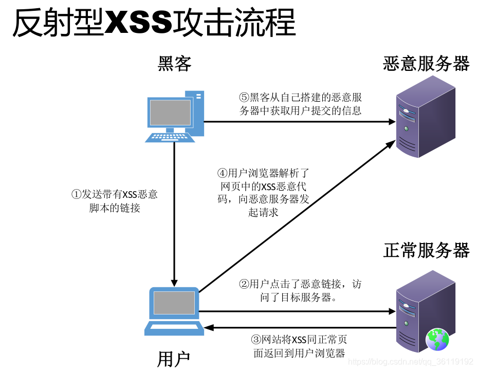

在当今互联网时代，网络已经成为我们日常生活和工作中不可或缺的一部分。无论是浏览网页、发送邮件，还是进行视频会议，这些活动都依赖于网络技术的支持。

---

## 1. 网络基础概念

### 1.1 什么是计算机网络？

计算机网络是指将分布在不同地理位置的计算机及其相关设备通过通信设备和线路连接起来，在网络操作系统、网络管理软件及网络通信协议的管理和协调下，实现资源共享和信息传递的系统。

### 1.2 网络的分类

按照网络覆盖的地理范围，可以将网络分为以下几类：

- **局域网（LAN, Local Area Network）**：覆盖范围小，通常限于一个办公室、一栋建筑或一个校园内。
- **城域网（MAN, Metropolitan Area Network）**：覆盖一个城市或特定区域。
- **广域网（WAN, Wide Area Network）**：覆盖范围大，跨越国家甚至洲际。互联网就是最大的广域网。


按照网络的拓扑结构，可以分为：

- **总线型网络**：所有设备连接到一条主干线上
- **星型网络**：所有设备连接到一个中央节点
- **环形网络**：设备形成一个闭环
- **网状网络**：设备之间有多条连接路径

## 2. OSI七层模型与TCP/IP四层模型

### 2.1 OSI七层模型

OSI（Open Systems Interconnection）模型是国际标准化组织（ISO）制定的一个用于计算机或通信系统间互联的标准框架。它将网络通信过程分为七层：


1. **物理层（Physical Layer）**：负责比特流的传输，如电压、接口规范等。
2. **数据链路层（Data Link Layer）**：负责将比特组合成字节，再将字节组合成帧，用MAC地址访问介质，并进行差错检测。
> 负责​​同一物理网络内（同一个网段）​​ 的设备，通信数据链路层协议（如以太网）只能在同一个广播域内通信
3. **网络层（Network Layer）**：负责对子网间的数据包进行路由选择，如IP协议。
> 负责​​跨越不同物理网络​​的主机间通信。IP协议封装来自上层的数据后，​​路由器读取IP头部中的地址​​，并根据路由规则将其转发到目标网络。​​IP让数据能跨越路由器边界流动​​。
4. **传输层（Transport Layer）**：负责端到端的可靠数据传输，如TCP、UDP协议。
> ​​ 负责​​进程到进程​​的通信（通过端口号区分应用程序）
5. **会话层（Session Layer）**：负责建立、管理和终止会话。
6. **表示层（Presentation Layer）**：负责数据格式转换、加密解密等。
7. **应用层（Application Layer）**：为应用程序提供网络服务，如HTTP、FTP、SMTP等协议。
> 解决具体应用程序如何交换数据和理解信息语义


### 2.2 TCP(Transmission Control Protocol传输控制协议)/IP(Internet Protocol​​网际协议​)四层模型

TCP/IP模型是互联网的基础，它将网络通信过程分为四层：

1. **网络接口层（Network Interface Layer）**：对应OSI的物理层和数据链路层，负责处理物理接口和数据链路的细节。
2. **网络层（Internet Layer）**：对应OSI的网络层，主要是IP协议。
3. **传输层（Transport Layer）**：对应OSI的传输层，主要是TCP和UDP协议。
4. **应用层（Application Layer）**：对应OSI的会话层、表示层和应用层，包括各种应用协议，如HTTP、FTP等。

::: tip 两种模型的对比
虽然OSI模型更为详细和规范，但实际上TCP/IP模型更为流行和广泛应用，因为它是互联网的基础协议栈。
:::


## 3. 重要的网络协议

### 3.1 IP协议（Internet Protocol）

IP协议是网络层的核心协议，负责将数据包从源主机传送到目标主机。IP地址是一个`32`位（IPv4）或`128`位（IPv6）的数字，用于标识网络中的设备。


#### IPv4地址分类

| 类别 | 范围 | 用途 |
| --- | --- | --- |
| A类 | 0.0.0.0 - 127.255.255.255 | 大型网络 |
| B类 | 128.0.0.0 - 191.255.255.255 | 中型网络 |
| C类 | 192.0.0.0 - 223.255.255.255 | 小型网络 |
| D类 | 224.0.0.0 - 239.255.255.255 | 多播地址 |
| E类 | 240.0.0.0 - 255.255.255.255 | 保留地址 |


#### 私有IP地址范围

- A类：10.0.0.0 - 10.255.255.255
- B类：172.16.0.0 - 172.31.255.255
- C类：192.168.0.0 - 192.168.255.255

### 3.2 TCP协议（Transmission Control Protocol）

TCP是一种面向连接的、可靠的、基于字节流的传输层通信协议。它具有以下特点：

- **面向连接**：通信前需要先建立连接（三次握手）
- **可靠传输**：使用确认和重传机制确保数据可靠传输
- **流量控制**：通过滑动窗口机制控制数据流量
- **拥塞控制**：通过拥塞窗口机制避免网络拥塞


#### TCP三次握手过程


```
客户端                                  服务器
   |                                     |
   |----------SYN, seq=x--------------->|
   |                                     |
   |<--------SYN, ACK, seq=y, ack=x+1---|
   |                                     |
   |----------ACK, ack=y+1------------->|
   |                                     |
```

1. 客户端发送SYN包（seq=x）到服务器，进入SYN_SENT状态
2. 服务器收到SYN包，回应一个SYN+ACK包（seq=y, ack=x+1），进入SYN_RECV状态
3. 客户端收到SYN+ACK包，回应一个ACK包（ack=y+1），进入ESTABLISHED状态
4. 服务器收到ACK包后，也进入ESTABLISHED状态，连接建立完成

#### TCP四次挥手过程


```
客户端                                  服务器
   |                                     |
   |----------FIN, seq=u--------------->|
   |                                     |
   |<-----------ACK, ack=u+1------------|
   |                                     |
   |<-----------FIN, seq=v--------------|
   |                                     |
   |------------ACK, ack=v+1----------->|
   |                                     |
```

1. 客户端发送FIN包（seq=u），进入FIN_WAIT_1状态
2. 服务器收到FIN包，回应ACK包（ack=u+1），进入CLOSE_WAIT状态
3. 服务器发送FIN包（seq=v），进入LAST_ACK状态
4. 客户端收到FIN包，回应ACK包（ack=v+1），进入TIME_WAIT状态
5. 服务器收到ACK包后，关闭连接
6. 客户端等待2MSL（Maximum Segment Lifetime）后，关闭连接

> 每发送一次请求，都要走三次握手过程，四次挥手过程。浏览器默认开启了keep-alive，如果请求头或者响应头显式指定Connection:false,否则都会复用TCP链接。
### 3.3 UDP协议（User Datagram Protocol）

UDP是一种无连接的传输层协议，它具有以下特点：

- **无连接**：通信前不需要建立连接
- **不可靠传输**：不保证数据包的可靠传输
- **无流量控制和拥塞控制**：发送方可以随时发送数据
- **开销小、效率高**：适用于对实时性要求较高的应用


### 3.4 HTTP协议（Hypertext Transfer Protocol）

HTTP是应用层协议，用于传输超文本，是Web的基础。


#### HTTP请求方法

- **GET**：请求指定的资源
- **POST**：向指定资源提交数据
- **PUT**：上传指定资源
- **DELETE**：删除指定资源
- **HEAD**：获取资源的元信息
- **OPTIONS**：获取目标资源支持的通信选项


#### HTTP状态码

- **1xx**：信息性状态码，表示请求已接收，继续处理
- **2xx**：成功状态码，表示请求已成功接收、理解、接受
- **3xx**：重定向状态码，表示需要客户端采取进一步的操作才能完成请求
- **4xx**：客户端错误状态码，表示客户端提交的请求有错误
- **5xx**：服务器错误状态码，表示服务器在处理请求时发生了错误

#### HTTP/1.1 vs HTTP/2

HTTP/2 相比 HTTP/1.1 有以下几个关键改进：


##### 1. 二进制分帧层

**HTTP/1.1**：使用文本格式传输数据，可读性好但解析复杂且效率低下。
**HTTP/2**：引入二进制分帧层，将所有传输的信息分割为更小的消息和帧，并对它们采用二进制格式编码。


这种二进制格式虽然对人不可读，但对计算机更友好，解析更高效。在 HTTP/2 中，同一个连接上可以有多个不同方向的数据流在同时交换消息，每个消息又被拆分成多个帧，这些帧可以交错发送，然后根据每个帧头的流标识符重新组装。

##### 2. 多路复用

**HTTP/1.1**：每个连接只能处理一个请求-响应，导致队头阻塞问题。虽然引入了持久连接（Keep-Alive），但仍然是按序处理请求。

**HTTP/2**：一个连接可以并行处理多个请求-响应消息，真正实现了多路复用。

HTTP/1.1 虽然解决了多次连接的问题，但它存在两个致命的效率缺陷：

1. **串行的文件传输**：当请求 a 文件时，b 文件只能等待，等待 a 连接到服务器、服务器处理文件、服务器返回文件，这三个步骤。我们假设这三步用时都是1秒，那么 a 文件用时为3秒，b 文件传输完成用时为6秒，依此类推。（注：此项计算有一个前提条件，就是浏览器和服务器是单通道传输）

2. **连接数过多**：我们假设 Apache 设置了最大并发数为300，因为浏览器限制，浏览器发起的最大请求数为6，也就是服务器能承载的最高并发为50，当第51个人访问时，就需要等待前面某个请求处理完成。

这时候2.0的多路复用就为解决这个问题而出现了。

说多路复用，不得不说一下1.1的持久连接，而这个持久连接，就是我们接下来所说的 Keep-Alive 。


**Keep-Alive**：

Keep-Alive 是使用同一个 TCP 连接来发送和接收多个 HTTP 请求/应答，而不是为每一个新的请求/应答打开新的连接的方法。我们知道 HTTP 协议采用"请求-应答"模式，当使用普通模式，即非 Keep-Alive 模式时，每个请求/应答客户和服务器都要新建一个连接，完成 之后立即断开连接（HTTP 协议为无连接的协议）；当使用 Keep-Alive 模式（又称持久连接）时，Keep-Alive 功能使客户端到服务器端的连接持续有效，当出现对服务器的后继请求时，Keep-Alive 功能避免了建立或者重新建立连接。


HTTP/1.0 中默认是关闭的，需要在 HTTP 头加入"Connection: Keep-Alive"，才能启用 Keep-Alive；HTTP/1.1 中默认启用 Keep-Alive，如果加入"Connection: close"，才关闭。目前大部分浏览器都是用 HTTP/1.1 协议，也就是说默认都会发起 Keep-Alive 的连接请求了，所以是否能完成一个完整的 Keep-Alive 连接就看服务器设置情况。


HTTP 1.1 和 HTTP 2.0 的区别来了，多路复用，什么是多路复用呢？

```txt
从A地到B地
坐公交2块。打车要20块
为什么坐公交便宜呢
这里所讲的就是“多路复用”的原理。
```


这也是 HTTP/2.0 的复用连接，虽然依然遵循请求-响应模式，但客户端发送多个请求和服务端给出多个响应的顺序不受限制，这样既避免了"队头堵塞"，又能更快获取响应。在复用同一个 TCP 连接时，服务器同时(或先后)收到了 A、B 两个请求，先回应 A 请求，但由于处理过程非常耗时，于是就发送 A 请求已经处理好的部分，接着回应 B 请求，完成后，再发送 A 请求剩下的部分。HTTP/2.0 长连接可以理解成全双工的协议。

因为 HTTP/2.0 引入二进制数据帧和流的概念，其中帧对数据进行顺序标识，也就是说，我们传递一个字符串的时候，比如说，我要传递一个，"别说了，我爱你"，HTTP/1.1 是按照一个顺序传输，那么 HTTP/2.0 是怎么传输的，看图：


浏览器收到数据之后，就可以按照序列对数据进行合并，而不会出现合并后数据错乱的情况。同样是因为有了序列，服务器就可以并行的传输数据，这就是流所做的事情。

这也就是解决了问题1，那么怎么解决问题2呢？HTTP 2.0 对同一域名下所有请求都是基于流，也就是说同一域名不管访问多少文件，也只建立一路连接。同样 Apache 的最大连接数为300，因为有了这个新特性，最大的并发就可以提升到300，比原来提升了6倍！

这就是多路复用，是不是很好理解。


##### 3. 头部压缩

**HTTP/1.1**：每次请求都会携带大量冗余头信息，浪费带宽资源。

**HTTP/2**：引入 HPACK 算法进行头部压缩，减少传输的数据量。


HTTP/1.1 的每个请求都会携带大量的头信息，而且这些头部信息在不同请求之间存在大量重复。例如：User-Agent、Accept、Accept-Encoding 等字段在同一用户的不同请求中通常是相同的。

HTTP/2 中，客户端和服务器共同维护和更新一个头部字段表，从而避免了重复传输。HPACK 算法使用以下技术压缩头部：

1. **静态表**：包含常见的头部字段，如 method、path 等
2. **动态表**：存储之前见过的头部字段
3. **Huffman 编码**：对头部字段值进行压缩

实际测试表明，HTTP/2 的头部压缩可以将头部大小减少约 80%，大大节省了带宽。

##### 4. 服务器推送

**HTTP/1.1**：客户端必须先请求资源，然后服务器响应，无法主动推送。

**HTTP/2**：服务器可以主动向客户端推送资源，无需客户端请求。

在 HTTP/1.1 中，浏览器请求一个 HTML 页面，服务器返回这个页面后，浏览器解析页面发现需要其他资源（如 CSS、JavaScript 文件），然后再发起请求获取这些资源。这个过程需要多次往返，增加了延迟。

HTTP/2 的服务器推送允许服务器在客户端请求一个资源时，主动推送其他相关资源。例如，当客户端请求 index.html 时，服务器可以同时推送 style.css 和 script.js，而不需要等待客户端解析 HTML 后再请求这些资源。

服务器推送的工作流程：

1. 客户端发送请求获取 index.html
2. 服务器返回 index.html 的同时，发送 PUSH_PROMISE 帧，告诉客户端它将推送其他资源
3. 客户端接收 PUSH_PROMISE 帧，如果已经缓存了这些资源，可以拒绝推送
4. 服务器推送相关资源
5. 客户端接收推送的资源并缓存

这种机制显著减少了页面加载时间，特别是在高延迟网络环境中。

##### 5. 请求优先级

**HTTP/1.1**：请求按照先进先出的顺序处理，无法设置优先级。

**HTTP/2**：可以为每个流设置优先级，优先处理重要资源。

在 HTTP/2 中，每个流都可以被赋予一个 1-256 的整数权重值，还可以显式依赖于另一个流。这允许客户端构建一个优先级树，指导服务器如何分配资源。

例如，浏览器可以为关键渲染路径上的资源（如 CSS）设置较高的优先级，而为图片等非关键资源设置较低的优先级。这确保了用户体验的关键资源能够更快地加载和处理。


##### 总结

HTTP/2 通过以下核心技术显著提升了 Web 性能：

- **多路复用**：允许同时通过单一的HTTP/2连接发起多重的请求-响应消息
- **二进制分帧**：将HTTP消息分解为独立的帧，交错发送
- **头部压缩**：使用HPACK算法压缩头部，减少数据传输量
- **服务器推送**：服务器可以主动向客户端推送资源

## 4. 网络安全基础

### 4.1 常见的网络攻击

#### 4.1.1 DDoS攻击（分布式拒绝服务攻击）

DDoS攻击通过大量请求使服务器资源耗尽，导致正常用户无法访问服务。


防御措施：
- 使用CDN分散流量
- 配置防火墙过滤恶意流量
- 增加服务器带宽和资源
- 使用专业的DDoS防护服务

#### 4.1.2 SQL注入攻击

SQL注入是通过在用户输入中插入SQL代码，使应用程序执行非预期的SQL语句。


防御措施：
- 使用参数化查询
- 验证和过滤用户输入
- 最小权限原则
- 使用ORM框架

```java
// 不安全的SQL查询
String query = "SELECT * FROM users WHERE username = '" + username + "' AND password = '" + password + "'";

// 安全的参数化查询
String query = "SELECT * FROM users WHERE username = ? AND password = ?";
```

#### 4.1.3 XSS攻击（跨站脚本攻击）

XSS攻击是通过在网页中注入恶意脚本，当用户浏览网页时执行这些脚本。



防御措施：
- 对用户输入进行HTML转义
- 使用Content-Security-Policy头
- 使用HttpOnly标志保护Cookie
- 输入验证和过滤

```javascript
// 不安全的代码
document.getElementById("userContent").innerHTML = userInput;

// 安全的代码
function escapeHTML(str) {
    return str.replace(/[&<>"']/g, function(match) {
        return {
            '&': '&amp;',
            '<': '&lt;',
            '>': '&gt;',
            '"': '&quot;',
            "'": '&#39;'
        }[match];
    });
}
document.getElementById("userContent").innerHTML = escapeHTML(userInput);
```

### 5.2 HTTPS与SSL/TLS

HTTPS是HTTP协议的安全版本，它通过SSL/TLS协议对HTTP通信进行加密。


SSL/TLS握手过程：


1. 客户端发送ClientHello消息，包含支持的加密算法和随机数
2. 服务器回应ServerHello消息，选择加密算法，发送证书和随机数
3. 客户端验证证书，生成预主密钥，用服务器公钥加密后发送
4. 双方根据随机数和预主密钥生成会话密钥
5. 使用会话密钥加密后续通信

HTTPS的优势：
- 加密通信内容，防止数据被窃听
- 验证服务器身份，防止中间人攻击
- 保证数据完整性，防止数据被篡改

## 6. 网络优化技巧

### 6.1 网络延迟优化

网络延迟是指数据从源到目的地所需的时间。优化网络延迟的方法包括：


- **使用CDN（内容分发网络）**：将内容缓存到离用户更近的节点
- **减少HTTP请求数**：合并CSS/JS文件，使用CSS Sprites
- **启用HTTP/2**：利用多路复用减少连接开销
- **使用DNS预解析**：提前解析域名

```html
<!-- DNS预解析示例 -->
<link rel="dns-prefetch" href="//example.com">
```

### 6.2 带宽优化

带宽是指单位时间内能传输的数据量。优化带宽使用的方法包括：


- **压缩资源**：使用Gzip/Brotli压缩文本资源
- **图片优化**：使用WebP格式，适当压缩图片
- **延迟加载**：非关键资源延迟加载
- **使用浏览器缓存**：设置适当的缓存头

```nginx
# Nginx配置Gzip压缩
gzip on;
gzip_comp_level 5;
gzip_min_length 256;
gzip_proxied any;
gzip_types
  application/javascript
  application/json
  application/xml
  text/css
  text/html
  text/javascript
  text/plain
  text/xml;
```

## 总结

本文深入浅出地介绍了网络基础知识，包括网络概念、协议模型、重要协议、网络编程、网络安全、优化技巧以及常见问题的解决方案。


