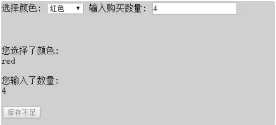

主要是记录日常用到的一些编程技巧。

---


## 重复利用对象生成链表

由于等号赋值时从右到左，通过倒序遍历，可以利用curNode旧值作为变量

```js
function createLinkList(arr){
  let length = arr.length;

  let curNode = {
    value:arr[length-1]
  }

  if(length == 1)return curNode
  // 因为先执行对象里面
  // next 先被赋值，后 curNode 再被赋值
  for(let i = length-2;i>=0;i--){
    curNode = {
      value:arr[i],
      next:curNode
    }
  }
  return curNode
}

let res =  createLinkList([1,2,3,4,5])
console.log(res)
```

## 科里化/管道

### 科里化

科里化（Currying）是一种将接受多个参数的函数转换成一系列只接受 单个参数 的函数的技术

如果是 多个参数，叫 **偏函数**, 先固定部分参数，之后再传入其他参数

- sum( 1, 2 )( 3 )这种叫偏函数

- sum( 1 )( 2 )( 3 ) 这种叫科里化


:::info 科里化/偏函数的优点
1. 参数复用
2. 延迟执行
3. 提高代码可扩展性
:::

```js
function add(a,b,c){
	return a+b+c
}

function curry(fn){
	let length = fn.length;
	return function c(...args){
		if(args.length < length){
			return (...rest)=> c(...rest,...args)
		}
		return  fn(...args)
	}
}

let c = curry(add)
console.log("🚀 ~ file: index.js ~ line 78 ~ c(1,2,3)", c(1,2,3));
console.log("🚀 ~ file: index.js ~ line 79 ~ c(1)(2,3)", c(1)(2,3));
console.log("🚀 ~ file: index.js ~ line 80 ~ c()(1,2,3)", c()(1,2,3));
```

### 管道

> fns 如果只有一项的话，是会原路返回，不会执行 reduce方法

```js
function add1(a) {
  return a + 1
}
function add2(a) {
  return a + 2
}
function add3(a) {
  return a + 3
}


function pipe(...fns){
  // 从右到左执行
  // 1. a 是 add1,b 是 add2, 返回一个 (...args)=> add1(add2(...args))
  // 2. a 是 (...args)=> add1(add2(...args)), b 是 add3, (...args)=> add1(add2(add3(args)))  

  let res = fns.reduceRight((a,b)=>{
    return (...args) => a(b(...args))
  });
  return res
}
let fn =  pipe(add1,add2,add3)
let res = fn("abcd")
``` 

## 策略模式

```js
// 策略类
var strategies = { 
	"S": function( salary ){ 
		return salary * 4; 
	}, 
	"A": function( salary ){ 
		return salary * 3; 
	}, 
	"B": function( salary ){ 
		return salary * 2; 
	} 
}; 

// 环境类 Context, 把请求委托给某一个策略类
// 每个策略对象负责的算法已被各自封装在对象内部
var calculateBonus = function( level, salary ){ 
	return strategies[ level ]( salary ); 
}; 

console.log( calculateBonus( 'S', 20000 ) ); // 输出：80000 
console.log( calculateBonus( 'A', 10000 ) ); // 输出：30000 
```

这样的话，就是封装 这个 `strategies` 方法。易于替换，新增，不会影响其他代码

## 职责链模式
参数说明
- orderType: 订单类型（1=500元定金预购、2=200元定金预购、3=普通购买）
- pay: 是否已支付定金（true/false）
- stock: 手机库存数量


处理逻辑
1. 500元定金预购模式（orderType=1）:
- 如果已支付定金：输出"500元定金预购, 得到100优惠券"
- 如果未支付定金：降级到普通购买模式
    - 有库存：输出"普通购买, 无优惠券"
    - 无库存：输出"手机库存不足"
2. 200元定金预购模式（orderType=2）:
- 如果已支付定金：输出"200元定金预购, 得到50优惠券"
- 如果未支付定金：降级到普通购买模式
    - 有库存：输出"普通购买, 无优惠券"
    - 无库存：输出"手机库存不足"
3. 普通购买模式（orderType=3）:
- 有库存：输出"普通购买, 无优惠券"
- 无库存：输出"手机库存不足"

### 普通模式

```js
var order = function( orderType, pay, stock ){ 
	if ( orderType === 1 ){ // 500 元定金购买模式
		if ( pay === true ){ // 已支付定金
			console.log( '500 元定金预购, 得到 100 优惠券' ); 
		}else{ // 未支付定金，降级到普通购买模式
			if ( stock > 0 ){ // 用于普通购买的手机还有库存
				console.log( '普通购买, 无优惠券' ); 
			}else{ 
				console.log( '手机库存不足' ); 
			} 
		} 
	} 
	else if ( orderType === 2 ){ // 200 元定金购买模式
		if ( pay === true ){ 
			console.log( '200 元定金预购, 得到 50 优惠券' ); 
		}else{ 
			if ( stock > 0 ){ 
				console.log( '普通购买, 无优惠券' ); 
			}else{ 
				console.log( '手机库存不足' ); 
			} 
		} 
	} 
	else if ( orderType === 3 ){ 
		if ( stock > 0 ){ 
			console.log( '普通购买, 无优惠券' ); 
		}else{ 
			console.log( '手机库存不足' ); 
		} 
	} 
}; 
order( 1 , true, 500); // 输出： 500 元定金预购, 得到 100 优惠券
```

### 职责链重构

职责链重构的目的是将普通模式中的 ifelse 判断，转换为职责链模式

```js
var order500 = function( orderType, pay, stock ){ 
  if ( orderType === 1 && pay === true ){ 
    console.log( '500 元定金预购, 得到 100 优惠券' ); 
  }else{ 
    order200( orderType, pay, stock ); // 将请求传递给 200 元订单
  } 
}; 

// 200 元订单
var order200 = function( orderType, pay, stock ){ 
  if ( orderType === 2 && pay === true ){ 
    console.log( '200 元定金预购, 得到 50 优惠券' ); 
  }else{ 
    orderNormal( orderType, pay, stock ); // 将请求传递给普通订单
  } 
}; 

// 普通购买订单
var orderNormal = function( orderType, pay, stock ){ 
  if ( stock > 0 ){ 
    console.log( '普通购买, 无优惠券' ); 
  }else{ 
    console.log( '手机库存不足' ); 
  } 
}; 

order500( 1 , true, 500); // 输出：500 元定金预购, 得到 100 优惠券
order500( 1, false, 500 ); // 输出：普通购买, 无优惠券
order500( 2, true, 500 ); // 输出：200 元定金预购, 得到 50 优惠券
order500( 3, false, 500 ); // 输出：普通购买, 无优惠券
order500( 3, false, 0 ); // 输出：手机库存不足
```

## 中介者模式

假设我们正在编写一个手机购买的页面，在购买流程中，可以选择手机的颜色以及输入购买 数量

同时页面中有两个展示区域，分别向用户展示刚刚选择好的颜色和数量。

还有一个按钮动 态显示下一步的操作



我们需要查询该颜色手机对应的库存，如果库存数量少于这次的购买数量， 按钮将被禁用并且显示库存不足，反之按钮可以点击并且显示放入购物车

1. 下拉选择框 colorSelect
2. 文本输入框 numberInput
3. 展示颜色信息 colorInfo
4. 展示购买数量信息 numberInfo
5. 决定下一步操作的按钮 nextBtn

### 普通模式
```html
<body> 
  选择颜色: <select id="colorSelect"> 
    <option value="">请选择</option> 
    <option value="red">红色</option> 
    <option value="blue">蓝色</option> 
  </select> 
  输入购买数量: <input type="text" id="numberInput"/> 
  您选择了颜色: <div id="colorInfo"></div><br/> 
  您输入了数量: <div id="numberInfo"></div><br/> 

  <button id="nextBtn" disabled="true">请选择手机颜色和购买数量</button> 
  <!--  监听 colorSelect 的 onchange 事件函数和 numberInput 的 oninput 事件函数 -->
  <script> 

    var colorSelect = document.getElementById( 'colorSelect' ), 
      numberInput = document.getElementById( 'numberInput' ), 
      colorInfo = document.getElementById( 'colorInfo' ), 
      numberInfo = document.getElementById( 'numberInfo' ), 
      nextBtn = document.getElementById( 'nextBtn' );

    var goods = { // 手机库存
      "red": 3, 
      "blue": 6 
    }; 
    // 监听 colorSelect 的 onchange 事件函数
    colorSelect.onchange = function(){
      var color = this.value, // 颜色
        number = numberInput.value, // 数量
        stock = goods[ color ]; // 该颜色手机对应的当前库存
      colorInfo.innerHTML = color;

      if ( !color ){ 
        nextBtn.disabled = true; 
        nextBtn.innerHTML = '请选择手机颜色'; 
        return; 
      }

      if ( Number.isInteger ( number - 0 ) && number > 0 ){
        // 用户输入的购买数量是否为正整数
        nextBtn.disabled = true; 
        nextBtn.innerHTML = '请输入正确的购买数量'; 
        return; 
      }

      if ( number > stock ){ // 当前选择数量超过库存量
        nextBtn.disabled = true; 
        nextBtn.innerHTML = '库存不足'; 
        return ; 
      } 

      nextBtn.disabled = false; 
      nextBtn.innerHTML = '放入购物车'; 
    }; 

    // numberInput 的 oninput 事件函数
    numberInput.oninput = function(){ 
      var color = colorSelect.value, // 颜色
        number = this.value, // 数量
        stock = goods[ color ]; // 该颜色手机对应的当前库存
      numberInfo.innerHTML = number; 

      if ( !color ){ 
        nextBtn.disabled = true; 
        nextBtn.innerHTML = '请选择手机颜色'; 
        return; 
      } 

      if ((( number - 0 ) | 0 ) !== number - 0 ){ // 输入购买数量是否为正整数
        nextBtn.disabled = true; 
        nextBtn.innerHTML = '请输入正确的购买数量'; 
        return; 
      } 
      if ( number > stock ){ // 当前选择数量没有超过库存量
        nextBtn.disabled = true; 
        nextBtn.innerHTML = '库存不足'; 
        return ; 
      } 
      nextBtn.disabled = false; 
      nextBtn.innerHTML = '放入购物车'; 
    }; 

  </script>
</body> 
```
这样的缺点是，如果需要增加新的颜色，需要修改 `colorSelect` 的 `onchange` 事件函数，如果需要增加新的数量，需要修改 `numberInput` 的 `oninput` 事件函数

### 中介者重构

```js
var goods = { // 手机库存
  "red|32G": 3, 
  "red|16G": 0, 
  "blue|32G": 1, 
  "blue|16G": 6 
};

// 自执行函数保证数据没有污染
var mediator = (function(){ 
  var colorSelect = document.getElementById( 'colorSelect' ), 
    memorySelect = document.getElementById( 'memorySelect' ), 
    numberInput = document.getElementById( 'numberInput' ), 
    colorInfo = document.getElementById( 'colorInfo' ), 
    memoryInfo = document.getElementById( 'memoryInfo' ), 
    numberInfo = document.getElementById( 'numberInfo' ), 
    nextBtn = document.getElementById( 'nextBtn' ); 
  
  return { 
    changed: function( obj ){ 
      var color = colorSelect.value, // 颜色
        memory = memorySelect.value,// 内存
        number = numberInput.value, // 数量
        stock = goods[ color + '|' + memory ]; // 颜色和内存对应的手机库存数量
      
      if ( obj === colorSelect ){ // 如果改变的是选择颜色下拉框
        colorInfo.innerHTML = color; 
      } else if ( obj === memorySelect ){ 
        memoryInfo.innerHTML = memory; 
      } else if ( obj === numberInput ){ 
        numberInfo.innerHTML = number; 
      }
      
      if (!color ){ 
        nextBtn.disabled = true; 
        nextBtn.innerHTML = '请选择手机颜色'; 
        return; 
      } 
      if (!memory ){ 
        nextBtn.disabled = true; 
        nextBtn.innerHTML = '请选择内存大小'; 
        return; 
      } 

      if ( Number.isInteger ( number - 0 ) && number > 0 ){ // 输入购买数量是否为正整数
        nextBtn.disabled = true; 
        nextBtn.innerHTML = '请输入正确的购买数量'; 
        return; 
      } 
      nextBtn.disabled = false; 
      nextBtn.innerHTML = '放入购物车'; 
    } 
  } 
})(); 

// 事件函数：
colorSelect.onchange = function(){ 
  mediator.changed( this ); 
}; 
memorySelect.onchange = function(){ 
  mediator.changed( this ); 
}; 
numberInput.oninput = function(){ 
  mediator.changed( this ); 
}; 
```

中介者模式是迎合迪米特法则的一种实现。而在中介者模式里，对象之间几乎不知道彼此的存在，它们只能通过中介者对象来互相影响对方

:::info 迪米特法则
一个对象应该尽可能少地了解另外的对象,如果对象之间的耦合性太高，一个对象 发生改变之后，难免会影响到其他的对象
:::

## 多态

```js   
var makeSound = function( animal ){ 
	if ( animal instanceof Duck ){ 
		console.log( '嘎嘎嘎' ); 
	} else if ( animal instanceof Chicken ){ 
		console.log( '咯咯咯' ); 
	} 
}; 

var Duck = function(){}; 
var Chicken = function(){}; 
makeSound( new Duck() ); // 嘎嘎嘎
makeSound( new Chicken() ); 
```

多态背后的思想是将 **“做什么”** 和 **“谁去做以及怎样去做”** 分离开来，也就是将 **“不变的事物”** 与  **“可能改变的事物”** 分离开来。

在这个故事中，动物都会叫，这是不变的，但是不同类型的动物具体怎么叫是可变的。把不变的部分隔离出来，把可变的部分封装起来

```js
var makeSound = function( animal ){ 
 animal.sound(); 
}; 


var Duck = function(){} 
Duck.prototype.sound = function(){ 
  console.log( '嘎嘎嘎' ); 
}; 

var Chicken = function(){} 
Chicken.prototype.sound = function(){ 
  console.log( '咯咯咯' ); 
}; 

makeSound( new Duck() ); // 嘎嘎嘎
makeSound( new Chicken() ); // 咯咯咯
```

多态最根本的作用就是通过把过程化的条件分支语句转化为对象的多态性，从而 消除这些条件分支语句

条件语句就是上文说的ifelse判断是不是animal instanceof Duck,对象的多态性就是声明不同的对象,在对象身上绑定方法

将行为分布在各个对象中，并让这些对象各自负责自己的行为

## outer

使用 continue 可以终止 while 遍历

```js
outer: while (++index < length) {
    var value = array[index];
      // 对原数组每一个元素进行迭代操作
       computed = iteratee == null ? value : iteratee(value);


    // 不使用比较器
    if (isCommon && computed === computed) {
      var valuesIndex = valuesLength;
      while (valuesIndex--) {

        if (values[valuesIndex] === computed) {
          continue outer;
        }
      }

      result.push(value);
    } else if (!includes(values, value,comparator)) {
      result.push(value);
    }
  }
```

## vue 使用computed实现子父组件双向绑定

```vue
<template>
	<r-input v-model="inputValue" />
</template>
<script>
// 父组件 r-input
export default {
props: {
  value: {
     type: [Number, String]
   }
},
computed: {
 inputValue: {
   get() {
      return this.value;
    }, 
    set(newValue){
	 let { max, min, inputValue } = this;
       // *****
     this.$emit("input", _value.toFixed(this.precision));
    }
  }
}
}
</script>
```

