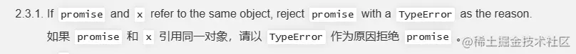
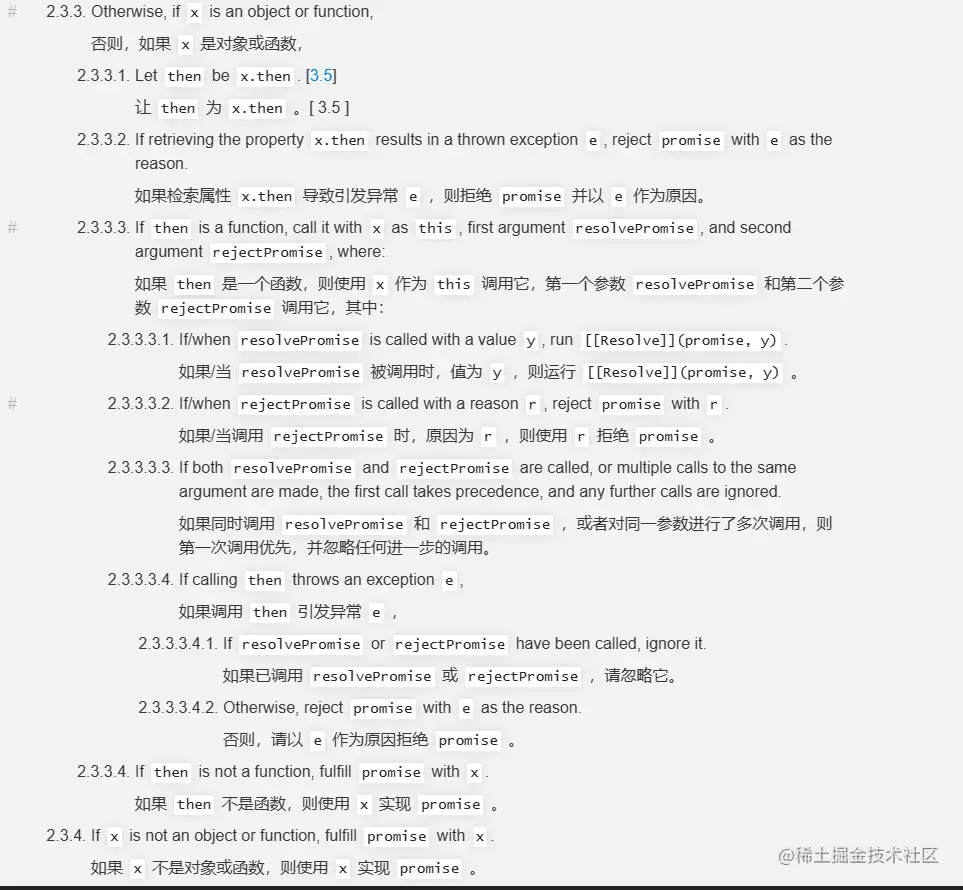
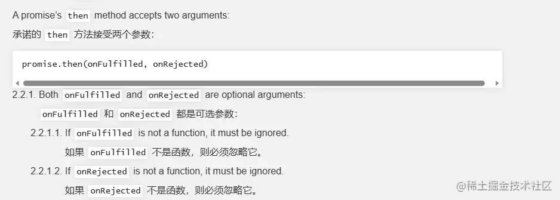

通过循序渐进的方式,从零开始实现一个符合Promise/A+规范的Promise,帮助你深入理解Promise的工作原理。

---

# Promise深入解析:从零实现Promise


## 从回调地狱说起

在Promise出现之前,我们是这样处理异步操作的:

```js
// 回调地狱示例
fs.readFile('config.json', (err, data) => {
  if (err) throw err
  const config = JSON.parse(data)
  fs.readFile(config.filename, (err, data) => {
    if (err) throw err
    // 处理文件内容
    processData(data, (err, processedData) => {
      if (err) throw err
      // 保存处理后的数据
      fs.writeFile('output.txt', processedData, (err) => {
        if (err) throw err
        console.log('Done!')
      })
    })
  })
})
```

这种嵌套的回调方式有几个明显的问题：
1. 代码嵌套层级深,可读性差
2. 错误处理繁琐
3. 控制流程复杂


## 第一步：基础结构

### 举例说明

```javascript
const p = new Promise((resolve, reject) => {
   resolve('成功')
})

p.then(value => console.log(value)) // 输出'成功'
```

Promise 接收一个回调，回调函数中接收两个函数 `resolve` 和 `reject`，并且返回一个含有 `then` 属性的对象 `p1`，同样的 `then` 接收两个函数作为回调

Promise 的两个回调和 `then` 中的回调是有对应关系的
- 当 `resolve` 执行的时候，会把 `resolve` 中的实参会传递给 `then` 第一个回调函数
- 当 `reject` 执行的时候，会把 `reject` 中的实参会传递给 `then` 第二个回调函数


让我们从最基础的结构开始：

```js
const PENDING = "pending";
const FULFILLED = "fulfilled";
const REJECTED = "rejected";

class Promise {
  constructor(executor) {
    // 保存 resolve 中的参数
    this.value = undefined;
    
    // 保存 reject 中的参数
    this.reason = undefined;
    this.status = PENDING;

    const onFulfilled =  (val)=> {
     // 防止重复执行
      if (this.status == PENGING) {
        this.value = val;
        this.status = FULFILLED;
      }
    };
    const onRejected =  (reason)=> {
       // 防止重复执行
      if (this.status == PENDING) {
        this.reason = reason;
        this.status = REJECTED;
      }
    };

    // 默认执行一次
    executor(onFulfilled, onRejected);
  }
  then(onFulfilled,onRejected) {
    if(this.status == FULFILLED){
      onFulfilled(this.value)
    }
    if(this.status == REJECTED){
      onRejected(this.reason)
    }
  }
}
```

这个基础结构包含了Promise的核心特征：
1. 状态(state)：pending、fulfilled、rejected
2. 值(value)：Promise的结果
3. 状态的不可逆性：一旦状态改变就不能再变

但是异步情况下，then 不会获得**最新**的状态

```js
const p = new Promise((resolve, reject) => {
  setTimeout(() => resolve('成功'), 1000)
})

p.then(value => console.log(value)) // 1秒后输出'成功'
```

因为 then 的回调函数在注册的时候，状态就已经确定了，所以异步情况下，then 不会获得**最新**的状态

## 第二步：使用发布订阅处理异步

用**发布订阅**来解决当前问题，在执行 then 的时候，并且 **状态** 为 **`pending`** 时，进行「订阅」相应的事件，当异步结束之后，「触发」订阅事件

```js {4}
class Promise {
  constructor() {
    // ...

    this.onFulfilledAry = [];
    this.onRejectedAry = [];
    // ....

    const onFulfilled = val => {
      if (this.status == PENGING) {
        this.value = val;
        this.status = FULFILLED;
        // 发布成功事件
        this.onFulfilledAry.forEach(fn => fn()); // [!code focus]
      }
    };
    const onRejected = reason => {
      if (this.status == PENGING) {
        this.reason = reason;
        this.status = REJECTED;
        // 发布失败事件
        this.onRejectedAry.forEach(fn => fn()); // [!code highlight]
      }
    };
    // 默认执行一次
    executor(onFulfilled, onRejected);
  }

  then(onFulfilled, onRejected) {
     // ....
     
     // 只有 当 status 为 pending的时候，进行订阅
    if (this.status == PENDING) {
    // 订阅成功事件
      this.onFulfilledAry.push(() => { // [!code highlight]
        onFulfilled(this.value); // [!code highlight]
      }); // [!code highlight]
      // 订阅失败事件
      this.onRejectedAry.push(() => { // [!code highlight]
        onRejected(this.reason); // [!code highlight]
      }); // [!code highlight]
    }
  }
}
```


在异步方法中执行 `then` 方法时，发现此时的状态仍然是 `pending`，由于无法判断以后会调用 `resolve` 或者是 `reject`， 所以使用 `onFulfilledAry` 和 `onRejectedAry` 同时收集成功回调和失败回调
 - 当状态为 `fulfilled` 时，依次执行 `onFulfilledAry` 中的回调
 - 当状态为 `rejected` 时，依次执行 `onRejectedAry` 中的回调


:::info
`value/reason` 开始是 `undefined`，但是我们 `push` 的是一个函数，并不会立马执行，执行的时机是调用 `resolve/reject`，此时 `value/reason` 已经有值了

```js
let arr = [];
let x = 1;

arr.push(()=>{
  console.log(x) // 2
})

setTimeout(()=>{
  x = 2;
  arr.forEach(fn=>fn())
})

```
:::

## 第三步：then 链式调用
### 举例说明
```js
let p1 =  new Promise((resolve,reject)=>{
  resolve(100)
})

let p2 = p1.then(res=>{
  console.log(res)  // 100
  return 123
},err=>{
  console.log(err)
  return 10
})

p2.then(res=>{
  console.log(res,"success") // 123，success
},err=>{
  console.log(err,"fail")
})
```


then 链有三种返回情况
1. 返回一个普通值
会执行下一个 then 链的 第一个 resolve 回调中， 如上述代码所示

2. 返回一个 promise
使用 返回的 promise 的 状态 作为下一个 then 链的状态

```javascript
let p1 =  new Promise((resolve,reject)=>{
  resolve(100)
})

let p2 = p1.then(res=>{
// 返回一个 reject 状态
  return new Promise((resolve,reject)=>{
    reject(100)
  })
},err=>{
  console.log(err)
  return 10
})

p2.then(res=>{
  console.log(res,"success")
},err=>{
  console.log(err,"fail") // 100 fail
})
```


3. throw
会执行下一个 then 链的 reject 中

```javascript
let p1 =  new Promise((resolve,reject)=>{
  resolve(100)
})

let p2 = p1.then(res=>{
  throw 456 
},err=>{
  console.log(err)
  return 10
})

p2.then(res=>{
  console.log(res,"success")
},err=>{
  console.log(err,"fail")  // 456 fail
})

```
**我们需要在 then 执行完毕之后再次返回一个新的 promise 才可以保证无限调用 then 链**

在 `PromiseA+` 规范中，规定了 `resolvePromise` 函数，用于处理 `then` 链的返回值



```javascript
let p1 = new Promise((resolve, reject) => {
  resolve()
}).then(()=>{
  // 返回当前的 promise
  return p1
});

p1.then(res => {
   console.log(res, "res");
  },
  err => {
    console.log(err, "fail");
    // [TypeError: Chaining cycle detected for promise #<Promise>] fail
  }
);
```
所以我们不仅要获取 then 中的返回值，也要 判断 `返回值`是否和 当前的 `promise` 是否是同一个值，否则会陷入递归中

由于代码是从右往左执行，在 `右侧的表达式` 是无法获得 `左侧变量的值`

为了解决这个问题，不得不使用一个异步任务 `setTimeout`  *（在源码中，是使用 其他方式 来实现的）*

```javascript
then(onFulfilled, onRejected) {
    let promise2 = new Promise((resolve, reject) => {
      if (this.status == FULFILLED) {
        try {
          // ⭐️ 获取 then 中的返回值
          let x = onFulfilled(this.value);
          // 使用 setTimeout 来保证异步执行，判断 promise2 和 x 是否是同一个值
          setTimeout(() => {
            resolvePromise(promise2, x, resolve, reject);
          });
        } catch (err) {
          reject(err);
        }
      }
      if (this.status == REJECTED) {
        try {
          let x = onRejected(this.reason);
          resolvePromise(promise2, x, resolve, reject);
        } catch (err) {
          reject(err);
        }
      }
      if (this.status == PENGING) {
        this.onFulfilledAry.push(() => {
          try {
           let x = onFulfilled(this.value);
            resolvePromise(promise2, x, resolve, reject);
          } catch (err) {
            reject(err);
          }
        });
        this.onRejectedAry.push(() => {
          let x = onRejected(this.reason);
          try {
            resolvePromise(promise2, x, resolve, reject);
          } catch (err) {
            reject(err);
          }
        });
      }
    });
    return promise2;
  }

```
使用方法resolvePromise 来判断返回值类型 在 [promiseA+](https://promisesaplus.com/#point-53) 中，是这样规定的





```javascript
function resolvePromise(promise2, x, resolve, reject) {
  if (x == promise2) return new TypeError('循环引用');
  let then, called;
   //  2.3.3 x 是函数或者对象
  if (x != null && ((typeof x == 'object' || typeof x == 'function'))) {
  // 2.3.3.2 异常直接reject
    try {
    // 2.3.3.1 then 为 x.then
      then = x.then;
      
      // 2.3.3.3 判断函数
      if (typeof then == 'function') {
      // 2.3.3.3 x 作为 this
      // 相当于 x.then(function(y){},function(r){})
        then.call(x, function (y) {
         // 2.3.3.3.4.1 已经调用过，直接忽略掉
          if (called) return;
          called = true;
          // 2.3.3.3.1 如果是 resolve，则继续往下判断是否是 promise
          resolvePromise(promise2, y, resolve, reject);
        }, function (r) {
           // 2.3.3.3.4.1 已经调用过，直接忽略掉
          if (called) return;
          called = true;
          // 2.3.3.3.2 如果是 reject ，直接停止判断
          reject(r);
        });
      } else {
      // 不是函数，只是一个普通对象
        resolve(x);
      }
    } catch (e) {
    // 2.3.3.2 异常直接reject
      if (called) return;
      called = true;
      reject(e);
    }
  } else {
  // 普通值直接返回
    resolve(x);
  }
}
```

## [参数穿透](https://promisesaplus.com/#point-23)



1 .忽略 resolve

```js
let p1 = new Promise((resolve, reject) => {
  resolve(1)
});

p1.then().then().then(res=>{
  console.log(res) // 1
})
```

2. 忽略 reject

```js
let p1 = new Promise((resolve, reject) => {
  reject(1)
});

p1.then().then().then(res=>{
  console.log(res) 
},err=>{
  console.log(err) // 1
})
```
这个参数缺省，会自动传递 `v=>v` 和 `v => { throw v }` 作为回调函数
```js
then(onFulfilled, onRejected){
    onFulfilled = typeof onFulfilled == "function" ? onFulfilled : v=>v
    onRejected = typeof onRejected == "function" ? onRejected : v => { throw v };
    //...
}
```

## 其他方法

### resolve

```js
Promise.resolve(10).then(res=>{
  console.log(res) // 10
})
```
本质是返回一个状态为 `fulfilled` 的 promise
```js
class Promise {
  constructor(executor) {
     // ...
    executor(onFulfilled);
  }

  static resolve(val) {
    return new Promise((resolve, rejcet) => {
      resolve(val);
    });
  }
}
```

### reject

```js
Promise.reject(10).then(res=>{
  console.log(res) // 10
})
```
本质是返回一个状态为 `rejected` 的 promise

```js
class Promise {
  constructor(executor) {
    // ...
    executor(onRejected);
  }
  
  static reject(val) {
    return new Promise((resolve, reject) => {
      reject(val);
    });
  }

}
```
### all

```js
Promise.all([p1,p2,p3]).then(res=>{
  console.log(res) // [1,2,3]
})
```

all 方法可以接受普通值，也可以接收一个 promise 类型，并且返回一个按照传入顺序的结果数组

由于 all 也可以调用 then 链，所以也需要返回一个 新的 promise

```js
class Promise {
  constructor(executor) {
    // ...
  }

  static all(arr) {

   if(arr.length == 0){
      return Promise.resolve([])
   }

    return new Promise((resolve, rejcet) => {
      let len = arr.length,
        ret = [];
      arr.forEach((val, idx) => {
        Promise.resolve(val).then(res => {
          ret[idx] = res;
          if (--len == 0) {
            resolve(ret);
          }
        }, rejcet);
      });
    });
  }
}
```

### race

```js
Promise.race([p1,p2,p3]).then(res=>{
  console.log(res) // 1
})
```
比较两个 promise 的速度，哪个先快执行哪个,剩下的那个 promise 会自动忽略

```js
class Promise {
  constructor(executor) {
    // ...
  }
  static race(arr) {
    return new Promise((resolve, reject) => {
      arr.forEach(val => {
        Promise.resolve(val).then(resolve, reject);
      });
    });
  }
}
```
### catch

```js
Promise.reject(10).catch(err=>{
  console.log(err) // 10
})
```

```js
class Promise {
  constructor(executor) {
    // ...
  }
  catch(onRejected) {
    return this.then(null, onRejected);
  }
}
```

### finally

```js
Promise.resolve(10).finally(()=>{
  console.log('finally')
})
```

```js
class Promise {
  constructor(executor) {
    // ...
  }
  finally(onFinally) {
    return this.then(onFinally, onFinally);
  }
}
```

# 完整代码


```js
const PENGING = "pending"; // [!code highlight]
const FULFILLED = "fulfilled";
const REJECTED = "rejected";

function resolvePromise(promise2, x, resolve, reject) {
  if (x == promise2) return new TypeError('循环引用');
  let then, called;
   //  2.3.3 x 是函数或者对象
  if (x != null && ((typeof x == 'object' || typeof x == 'function'))) {
  // 2.3.3.2 异常直接reject
    try {
    // 2.3.3.1 then 为 x.then
      then = x.then;
      
      // 2.3.3.3 判断函数
      if (typeof then == 'function') {
      // 2.3.3.3 x 作为 this
      // 相当于 x.then(function(y){},function(r){})
        then.call(x, function (y) {
         // 2.3.3.3.4.1 已经调用过，直接忽略掉
          if (called) return;
          called = true;
          // 2.3.3.3.1 如果是 resolve，则继续往下判断是否是 promise
          resolvePromise(promise2, y, resolve, reject);
        }, function (r) {
           // 2.3.3.3.4.1 已经调用过，直接忽略掉
          if (called) return;
          called = true;
          // 2.3.3.3.2 如果是 reject ，直接停止判断
          reject(r);
        });
      } else {
      // 不是函数，只是一个普通对象
        resolve(x);
      }
    } catch (e) {
    // 2.3.3.2 异常直接reject
      if (called) return;
      called = true;
      reject(e);
    }
  } else {
  // 普通值直接返回
    resolve(x);
  }
}

class Promise {
  constructor(executor) {
    //
    this.value = undefined;
    this.reason = undefined;
    this.status = PENGING;

    this.onFulfilledAry = [];
    this.onRejectedAry = [];

    const onFulfilled = val => {
      if (this.status == PENGING) {
        this.value = val;
        this.status = FULFILLED;
        this.onFulfilledAry.forEach(fn => fn());
      }
    };
    const onRejected = reason => {
      if (this.status == PENGING) {
        this.reason = reason;
        this.status = REJECTED;
        this.onRejectedAry.forEach(fn => fn());
      }
    };

    // 默认执行一次
    executor(onFulfilled, onRejected);
  }
  then(onFulfilled, onRejected) {
    let promise2 = new Promise((resolve, reject) => {
      if (this.status == FULFILLED) {
        try {
          let x = onFulfilled(this.value);
          setTimeout(() => {
            resolvePromise(promise2, x, resolve, reject);
          });
        } catch (err) {
          reject(err);
        }
      }
      if (this.status == REJECTED) {
        try {
         let x = onRejected(this.reason);
          resolvePromise(promise2, x, resolve, reject);
        } catch (err) {
          reject(err);
        }
      }
      if (this.status == PENGING) {
        this.onFulfilledAry.push(() => {
          try {
           let x = onFulfilled(this.value);
            resolvePromise(promise2, x, resolve, reject);
          } catch (err) {
            reject(err);
          }
        });
        this.onRejectedAry.push(() => {
          try {
           let x = onRejected(this.reason);
            resolvePromise(promise2, x, resolve, reject);
          } catch (err) {
            reject(err);
          }
        });
      }
    });
    return promise2;
  }
}

module.exports = Promise;
```
