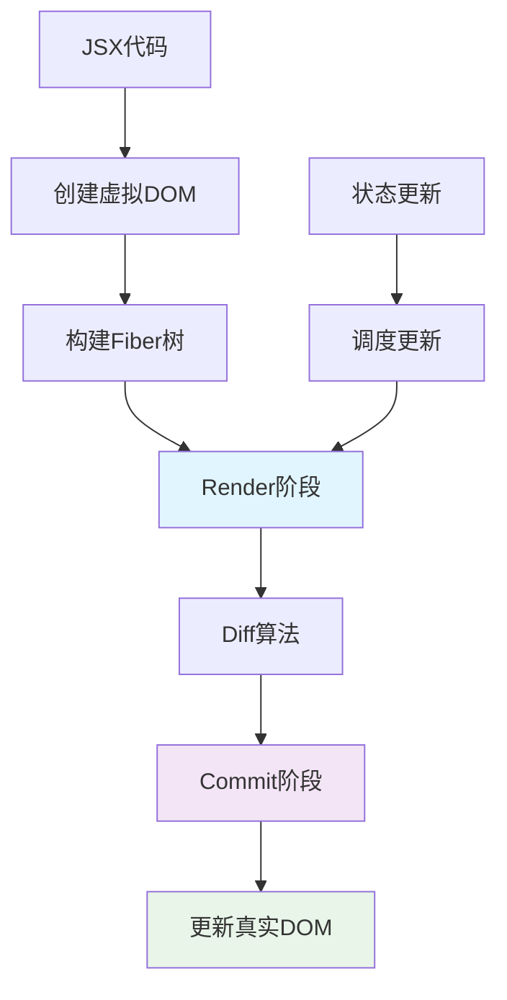
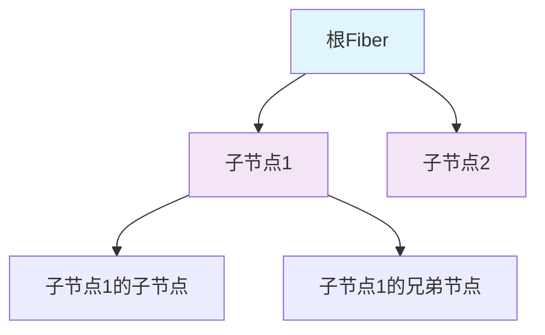
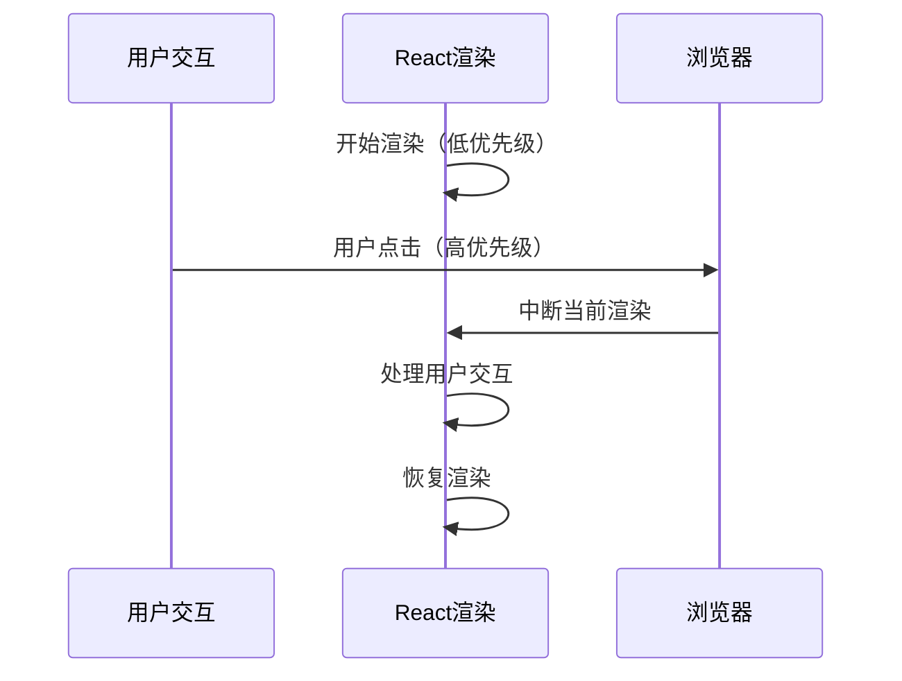
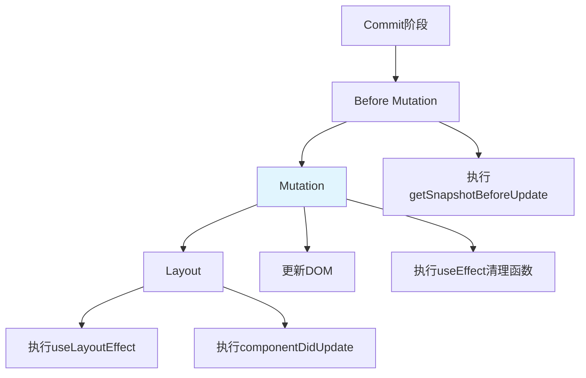
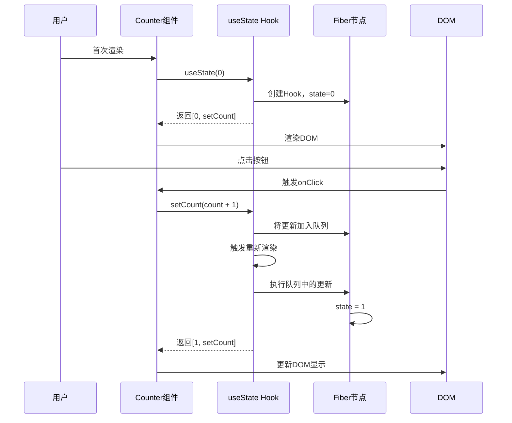

React 作为最流行的前端框架之一，其核心实现原理一直是全栈开发者深入学习的重点。本文将基于 mini-react 项目，从零开始解析 React 的核心实现机制，包括 Fiber 架构、虚拟 DOM、Diff 算法、类组件、函数组件和 Hooks 等核心概念。

---

## 引言：React 的"魔法"背后

当我们使用 React 编写组件时，只需要声明式地描述 UI，React 就会自动处理 DOM 的更新。这种"魔法"般的体验背后，隐藏着精妙的架构设计。

```jsx
function Counter() {
  const [count, setCount] = useState(0);
  return <div onClick={() => setCount(count + 1)}>{count}</div>;
}
```

这简单的几行代码背后，React 需要：
1. 将 JSX 转换为虚拟 DOM
2. 构建 Fiber 树进行协调
3. 执行 Diff 算法找出变化
4. 高效地更新真实 DOM
5. 管理组件状态和生命周期

本文将带你深入这些核心机制，理解 React 是如何工作的。

## 一、React 核心架构概览

### 1.1 整体架构流程

React 的工作流程可以概括为两个主要阶段：



### 1.2 核心概念

**虚拟 DOM (Virtual DOM)**
- 用 JavaScript 对象描述 DOM 结构
- 轻量级，便于比较和操作
- 示例：`{ type: 'div', props: { className: 'container' }, children: [...] }`

**Fiber 架构**
- React 16 引入的新的协调算法
- 将工作分解成小的单元，可以中断和恢复
- 支持优先级调度，提升用户体验

**Render 阶段**
- 构建 Fiber 树
- 执行 Diff 算法
- 标记需要更新的节点

**Commit 阶段**
- 将 Render 阶段的变更应用到真实 DOM
- 执行副作用（如生命周期钩子）

## 二、从虚拟 DOM 到 Fiber 树

### 2.1 虚拟 DOM 的数据结构

首先，我们需要将 JSX 转换为虚拟 DOM 对象：

```js
// JSX: <div className="container">Hello</div>
// 转换为虚拟DOM对象
{
  type: 'div',
  props: {
    className: 'container',
    children: 'Hello'
  }
}
```

### 2.2 Fiber 节点的结构

Fiber 是 React 的最小工作单元，每个 Fiber 节点对应一个组件或 DOM 元素：

```js
// Fiber 节点的基本结构
const fiber = {
  type: 'div',              // 节点类型（DOM元素、函数组件、类组件）
  props: { ... },           // 属性
  child: null,              // 第一个子节点
  sibling: null,            // 下一个兄弟节点
  return: null,             // 父节点
  alternate: null,          // 对应的旧Fiber节点（用于Diff）
  stateNode: null,          // 对应的真实DOM节点或组件实例
  effectTag: null,          // 标记需要执行的操作（增删改）
}
```

### 2.3 构建 Fiber 树的过程

React 通过深度优先遍历的方式构建 Fiber 树：



**示例代码：**

```js
// 创建 Fiber 节点的函数
function createFiber(element) {
  return {
    type: element.type,
    props: element.props,
    child: null,        // 指向第一个子节点
    sibling: null,      // 指向下一个兄弟节点
    return: null,       // 指向父节点
    alternate: null,    // 对应的旧Fiber节点（用于Diff）
    stateNode: null,    // 对应的真实DOM节点或组件实例
    effectTag: null,    // 标记需要执行的操作（增删改）
  };
}

// 构建 Fiber 树的核心函数
// 注意：Fiber 树实际上是一个链表结构，通过 child 和 sibling 指针连接
function reconcileChildren(workInProgress, elements) {
  let index = 0;
  let prevSibling = null;  // 记录上一个兄弟节点
  
  // 遍历所有子元素，创建对应的 Fiber 节点
  while (index < elements.length) {
    const element = elements[index];
    let newFiber = null;
    
    // 判断节点类型，决定如何创建 Fiber
    const sameType = 
      element && 
      workInProgress.element && 
      element.type === workInProgress.element.type;
    
    if (sameType) {
      // 类型相同，可以复用
      newFiber = {
        ...workInProgress,
        element: element,
        alternate: workInProgress,
        effectTag: 'UPDATE',
      };
    } else if (element) {
      // 新节点，需要创建
      newFiber = {
        type: element.type,
        props: element.props,
        element: element,
        alternate: null,
        effectTag: 'PLACEMENT',
      };
    } else if (workInProgress.element) {
      // 旧节点被删除
      workInProgress.alternate.effectTag = 'DELETION';
    }
    
    // 构建链表结构：将新创建的 Fiber 节点连接到链表中
    // 
    // Fiber 链表的连接规则：
    // - 第一个子节点（index === 0）：通过父节点的 child 指针连接
    // - 后续子节点（index > 0）：通过前一个节点的 sibling 指针连接
    //
    // 示例：假设父节点有 3 个子节点 [A, B, C]
    // 连接结果：
    //   父节点.child = A
    //   A.sibling = B
    //   B.sibling = C
    //   C.sibling = null
    if (index === 0) {
      // 第一个子节点：连接到父节点的 child 指针
      workInProgress.child = newFiber;
    } else {
      // 后续子节点：连接到前一个兄弟节点的 sibling 指针
      prevSibling.sibling = newFiber;
    }
    
    // 更新 prevSibling，为下一个节点做准备
    prevSibling = newFiber;
    index++;
  }
}
```

**链表结构示例：**

假设我们有这样的 JSX 结构：
```jsx
<div>
  <span>A</span>
  <span>B</span>
  <span>C</span>
</div>
```

构建后的 Fiber 链表结构如下：
```
div (workInProgress)
  ├─ child ──> span A
  │              ├─ sibling ──> span B
  │              │                ├─ sibling ──> span C
  │              │                │                └─ sibling ──> null
  │              │                └─ return ──> div
  │              └─ return ──> div
  └─ ...
```

这样设计的好处是：
1. **便于遍历**：可以通过 `child` 和 `sibling` 指针快速遍历所有节点
2. **支持中断恢复**：链表结构便于在任意位置暂停和恢复遍历
3. **内存高效**：不需要维护复杂的树结构，只需要简单的指针

## 三、Render 阶段：协调算法

### 3.1 工作单元（Unit of Work）

React 将整个渲染过程分解成多个工作单元，每个工作单元处理一个 Fiber 节点：

```js
// 全局变量
let nextUnitOfWork = null;        // 下一个要处理的工作单元
let workInProgressRoot = null;    // 正在构建的新 Fiber 树根节点
let currentRoot = null;           // 当前的 Fiber 树根节点

// 执行单个工作单元
function performUnitOfWork(workInProgress) {
  // 1. 创建当前节点的真实 DOM（如果是 DOM 节点）
  if (!workInProgress.stateNode) {
    workInProgress.stateNode = createDOM(workInProgress);
  }
  
  // 2. 处理子节点
  const elements = workInProgress.element?.props?.children || [];
  reconcileChildren(workInProgress, elements);
  
  // 3. 返回下一个工作单元
  if (workInProgress.child) {
    return workInProgress.child;
  }
  
  let nextFiber = workInProgress;
  while (nextFiber) {
    if (nextFiber.sibling) {
      return nextFiber.sibling;
    }
    nextFiber = nextFiber.return;
  }
  
  return null;
}
```

### 3.2 工作循环（Work Loop）

React 使用循环来处理所有工作单元，这个过程可以被中断和恢复：

```js
// 工作循环
function workLoop(deadline) {
  let shouldYield = false;
  
  while (nextUnitOfWork && !shouldYield) {
    // 执行当前工作单元
    nextUnitOfWork = performUnitOfWork(nextUnitOfWork);
    
    // 检查是否还有时间继续执行
    shouldYield = deadline.timeRemaining() < 1;
  }
  
  // 如果还有工作未完成，继续调度
  if (nextUnitOfWork) {
    requestIdleCallback(workLoop);
  } else {
    // 所有工作完成，进入 Commit 阶段
    commitRoot();
  }
}

// 开始渲染
function render(element, container) {
  workInProgressRoot = {
    stateNode: container,
    element: {
      type: 'div',
      props: {
        children: [element],
      },
    },
    alternate: currentRoot,
  };
  
  nextUnitOfWork = workInProgressRoot;
  requestIdleCallback(workLoop);
}
```

### 3.3 可中断渲染的优势

Fiber 架构的核心优势是可以中断渲染过程：



这种机制确保了用户交互的响应性，即使在渲染大量组件时也能保持流畅。

## 四、Diff 算法：高效找出变化

### 4.1 Diff 算法的核心思想

React 的 Diff 算法遵循三个基本原则：

1. **只比较同层节点**：不会跨层级比较
2. **不同类型的节点会重建**：如果节点类型不同，直接替换
3. **相同类型的节点会复用**：通过 key 和 type 判断是否可以复用

### 4.2 Diff 算法的实现

```js
function reconcileChildren(workInProgress, elements) {
  let index = 0;
  let prevSibling = null;
  let oldFiber = workInProgress.alternate?.child;
  
  // 遍历新元素
  while (index < elements.length || oldFiber) {
    const element = elements[index];
    let newFiber = null;
    
    // 比较新旧节点
    const sameType = 
      oldFiber && 
      element && 
      element.type === oldFiber.element?.type;
    
    if (sameType) {
      // 类型相同，更新属性
      newFiber = {
        type: oldFiber.type,
        element: element,
        stateNode: oldFiber.stateNode,
        return: workInProgress,
        alternate: oldFiber,
        effectTag: 'UPDATE',
      };
    } else {
      if (element) {
        // 新节点，需要创建
        newFiber = {
          type: element.type,
          element: element,
          stateNode: null,
          return: workInProgress,
          alternate: null,
          effectTag: 'PLACEMENT',
        };
      }
      
      if (oldFiber) {
        // 旧节点需要删除
        oldFiber.effectTag = 'DELETION';
        deletions.push(oldFiber);
      }
    }
    
    // 移动到下一个节点
    if (oldFiber) {
      oldFiber = oldFiber.sibling;
    }
    
    // 构建链表
    if (index === 0) {
      workInProgress.child = newFiber;
    } else {
      prevSibling.sibling = newFiber;
    }
    
    prevSibling = newFiber;
    index++;
  }
}
```

### 4.3 Key 的作用

Key 帮助 React 识别哪些元素改变了，从而更高效地复用节点：

```jsx
// 没有 key 的情况
<ul>
  <li>Item 1</li>
  <li>Item 2</li>
</ul>

// 插入新项后，React 可能认为所有项都变了
<ul>
  <li>New Item</li>
  <li>Item 1</li>
  <li>Item 2</li>
</ul>

// 有 key 的情况
<ul>
  <li key="1">Item 1</li>
  <li key="2">Item 2</li>
</ul>

// React 可以精确识别哪些是新项，哪些可以复用
<ul>
  <li key="0">New Item</li>
  <li key="1">Item 1</li>
  <li key="2">Item 2</li>
</ul>
```

## 五、Commit 阶段：应用变更到 DOM

### 5.1 Commit 阶段的流程

Commit 阶段分为三个子阶段：



### 5.2 提交变更的实现

```js
// 收集需要删除的节点
let deletions = [];

// Commit 阶段：应用变更到真实 DOM
function commitRoot() {
  deletions.forEach(commitWork);
  commitWork(workInProgressRoot.child);
  currentRoot = workInProgressRoot;
  workInProgressRoot = null;
}

// 递归提交每个节点的变更
function commitWork(fiber) {
  if (!fiber) return;
  
  let domParentFiber = fiber.return;
  // 找到最近的 DOM 父节点
  while (domParentFiber && !domParentFiber.stateNode) {
    domParentFiber = domParentFiber.return;
  }
  const domParent = domParentFiber.stateNode;
  
  // 根据 effectTag 执行相应操作
  if (fiber.effectTag === 'PLACEMENT' && fiber.stateNode) {
    // 新增节点
    domParent.appendChild(fiber.stateNode);
  } else if (fiber.effectTag === 'UPDATE' && fiber.stateNode) {
    // 更新节点
    updateDOM(fiber.stateNode, fiber.alternate.element.props, fiber.element.props);
  } else if (fiber.effectTag === 'DELETION') {
    // 删除节点
    commitDeletion(fiber, domParent);
  }
  
  // 递归处理子节点和兄弟节点
  commitWork(fiber.child);
  commitWork(fiber.sibling);
}

// 更新 DOM 属性
function updateDOM(dom, prevProps, nextProps) {
  // 移除旧的属性
  Object.keys(prevProps)
    .filter(key => key !== 'children')
    .forEach(name => {
      if (name.startsWith('on')) {
        // 事件处理函数
        const eventType = name.toLowerCase().substring(2);
        dom.removeEventListener(eventType, prevProps[name]);
      } else if (name === 'style') {
        // 样式对象
        Object.keys(prevProps[name]).forEach(styleName => {
          dom.style[styleName] = '';
        });
      } else {
        dom[name] = '';
      }
    });
  
  // 添加新的属性
  Object.keys(nextProps)
    .filter(key => key !== 'children')
    .forEach(name => {
      if (name.startsWith('on')) {
        const eventType = name.toLowerCase().substring(2);
        dom.addEventListener(eventType, nextProps[name]);
      } else if (name === 'style') {
        Object.keys(nextProps[name]).forEach(styleName => {
          dom.style[styleName] = nextProps[name][styleName];
        });
      } else {
        dom[name] = nextProps[name];
      }
    });
}
```

## 六、类组件的实现

### 6.1 类组件的基本结构

类组件需要继承 `React.Component`，并实现 `render` 方法：

```js
// React.Component 基类
class Component {
  constructor(props) {
    this.props = props;
    this.state = {};
  }
  
  setState(partialState) {
    // 更新状态
    this.state = {
      ...this.state,
      ...(typeof partialState === 'function' 
        ? partialState(this.state, this.props) 
        : partialState)
    };
    // 触发重新渲染
    commitRender();
  }
  
  render() {
    throw new Error('子类必须实现 render 方法');
  }
}

// 标记为 React 组件
Component.prototype.isReactComponent = true;
```

### 6.2 处理类组件的 Fiber

```js
function updateClassComponent(fiber) {
  const { type: Component, props } = fiber.element;
  
  // 获取或创建组件实例
  let instance = fiber.stateNode;
  if (!instance) {
    instance = new Component(props);
    fiber.stateNode = instance;
  }
  
  // 更新 props
  instance.props = props;
  
  // 调用 render 方法获取 JSX
  const children = [instance.render()];
  reconcileChildren(fiber, children);
}
```

### 6.3 类组件的生命周期

```js
// 在 Commit 阶段执行生命周期钩子
function commitWork(fiber) {
  // ... 其他代码 ...
  
  if (fiber.effectTag === 'PLACEMENT') {
    // 组件挂载
    if (fiber.stateNode instanceof Component) {
      fiber.stateNode.componentDidMount?.();
    }
  } else if (fiber.effectTag === 'UPDATE') {
    // 组件更新
    if (fiber.stateNode instanceof Component) {
      fiber.stateNode.componentDidUpdate?.();
    }
  }
}
```

## 七、函数组件与 Hooks 的实现

### 7.1 函数组件的处理

函数组件本质上就是一个返回 JSX 的函数：

```js
function updateFunctionComponent(fiber) {
  // 设置当前正在处理的函数组件
  currentFunctionFiber = fiber;
  currentFunctionFiber.hooks = [];
  hookIndex = 0;
  
  const { type: FunctionComponent, props } = fiber.element;
  
  // 调用函数组件，获取 JSX
  const children = [FunctionComponent(props)];
  reconcileChildren(fiber, children);
}
```

### 7.2 Hooks 的实现原理

Hooks 的核心思想是：**将状态存储在 Fiber 节点上，而不是组件实例中**。

```js
// 全局变量
let currentFunctionFiber = null;  // 当前正在执行的函数组件对应的 Fiber
let hookIndex = 0;                // 当前 Hook 的索引

// 获取当前函数组件的 Fiber
function getCurrentFunctionFiber() {
  return currentFunctionFiber;
}

// 获取当前 Hook 的索引（并递增）
function getHookIndex() {
  return hookIndex++;
}
```

### 7.3 useState 的实现

`useState` 是 React 最常用的 Hook，它的实现展示了 Hooks 的核心机制：

```js
function useState(initial) {
  const currentFunctionFiber = getCurrentFunctionFiber();
  const hookIndex = getHookIndex();
  
  // 获取旧的 Hook（用于在更新时恢复状态）
  const oldHook = 
    currentFunctionFiber?.alternate?.hooks?.[hookIndex];
  
  // 创建新的 Hook
  const hook = {
    state: oldHook ? oldHook.state : initial,  // 使用旧状态或初始值
    queue: [],  // 存储状态更新操作的队列
  };
  
  // 执行队列中的所有更新
  const actions = oldHook ? oldHook.queue : [];
  actions.forEach(action => {
    hook.state = typeof action === 'function' 
      ? action(hook.state) 
      : action;
  });
  
  // setState 函数
  const setState = (action) => {
    // 将更新操作加入队列
    hook.queue.push(typeof action === 'function' ? action : () => action);
    
    // 触发重新渲染
    workInProgressRoot = {
      stateNode: currentRoot.stateNode,
      element: currentRoot.element,
      alternate: currentRoot,
    };
    nextUnitOfWork = workInProgressRoot;
    requestIdleCallback(workLoop);
  };
  
  // 将 Hook 存储到 Fiber 节点上
  currentFunctionFiber.hooks.push(hook);
  
  return [hook.state, setState];
}
```

### 7.4 Hooks 的规则

Hooks 必须遵循两个重要规则：

1. **只在函数组件的顶层调用 Hooks**
   - 不要在循环、条件语句或嵌套函数中调用
   - 这确保了 Hooks 的调用顺序一致

2. **只在 React 函数中调用 Hooks**
   - 在函数组件中调用
   - 在自定义 Hook 中调用

**为什么需要这些规则？**

```js
// ❌ 错误示例：在条件语句中使用 Hook
function Component() {
  if (condition) {
    const [state, setState] = useState(0);  // 错误！
  }
  return <div>...</div>;
}

// ✅ 正确示例：始终在顶层调用
function Component() {
  const [state, setState] = useState(0);  // 正确
  if (condition) {
    // 使用 state
  }
  return <div>...</div>;
}
```

原因：React 通过 Hook 的调用顺序来识别和存储状态。如果顺序改变，React 就无法正确匹配每个 Hook 的状态。

## 八、完整示例：计数器组件

让我们通过一个完整的例子来理解整个流程：

```jsx
function Counter() {
  const [count, setCount] = useState(0);
  
  return (
    <div>
      <p>Count: {count}</p>
      <button onClick={() => setCount(count + 1)}>Increment</button>
    </div>
  );
}
```

**执行流程：**



## 九、性能优化：时间切片与优先级

### 9.1 时间切片（Time Slicing）

React 使用时间切片将渲染工作分解成小块，避免阻塞主线程：

```js
function workLoop(deadline) {
  let shouldYield = false;
  
  while (nextUnitOfWork && !shouldYield) {
    nextUnitOfWork = performUnitOfWork(nextUnitOfWork);
    
    // 检查剩余时间
    shouldYield = deadline.timeRemaining() < 1;
  }
  
  if (nextUnitOfWork) {
    // 还有工作，让出控制权
    requestIdleCallback(workLoop);
  } else {
    commitRoot();
  }
}
```

### 9.2 优先级调度

React 根据更新的来源分配不同的优先级：

- **用户交互**（如点击）：高优先级
- **数据更新**（如网络请求）：中优先级
- **低优先级更新**（如 Suspense）：低优先级

```js
// 简化的优先级调度
const Priority = {
  Immediate: 1,    // 立即执行
  UserBlocking: 2, // 用户阻塞
  Normal: 3,       // 正常
  Low: 4,          // 低优先级
  Idle: 5,         // 空闲时执行
};
```

## 十、总结与思考

### 10.1 核心要点回顾

1. **Fiber 架构**：将渲染工作分解成可中断的小单元
2. **虚拟 DOM**：用 JavaScript 对象描述 UI 结构
3. **Diff 算法**：高效找出需要更新的部分
4. **双阶段渲染**：Render 阶段计算变更，Commit 阶段应用变更
5. **Hooks 机制**：将状态存储在 Fiber 节点上，而非组件实例

### 10.2 设计思想

React 的设计体现了几个重要的思想：

- **声明式编程**：描述"是什么"而不是"怎么做"
- **组件化**：将 UI 拆分成可复用的组件
- **单向数据流**：数据从父组件流向子组件
- **可中断渲染**：提升用户体验和性能

### 10.3 进一步学习

要深入理解 React，建议：

1. **阅读源码**：从 React 官方仓库开始
2. **实现 Mini React**：通过动手实现加深理解
3. **性能优化**：学习 React 的性能优化技巧
4. **并发特性**：了解 React 18 的并发渲染

## 参考资料

- [React 官方文档](https://react.dev/)
- [React 源码仓库](https://github.com/facebook/react)
- [mini-react 实现](https://github.com/zh-lx/mini-react)
- [React Fiber 架构详解](https://github.com/acdlite/react-fiber-architecture)

---

> 💡 **学习建议**：理解 React 的实现原理不仅能帮助你写出更好的代码，还能在遇到性能问题时快速定位和解决。建议结合 mini-react 项目的代码一起学习，通过动手实践加深理解。

