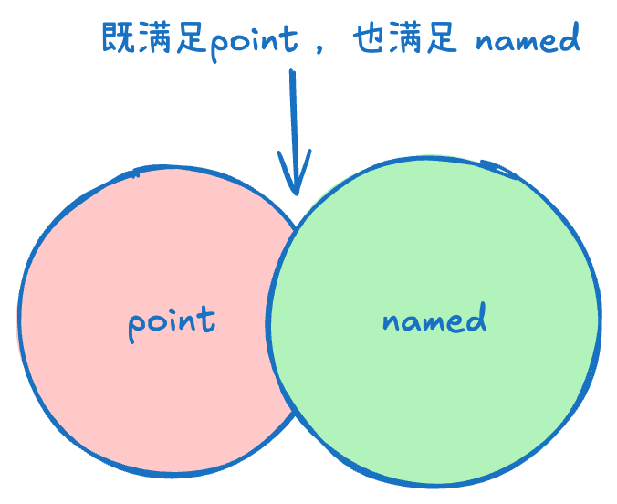

作为前端开发者，我们在日常工作中频繁使用 TypeScript 编写代码。然而，我们是否真正理解了 TypeScript 的设计理念？本文将从语言设计者的视角，深入剖析 TypeScript 的核心设计思想。

## 1. Interface 与 Type：设计意图的差异

TypeScript 提供了两种主要方式来定义类型：`interface`和`type`。虽然它们在很多场景下可以互换使用，但背后的设计理念和适用场景却有着本质区别。

### 1.1 共同特性

- 都可以定义对象结构、函数签名等类型
- 都支持泛型
- 都可以被用于类型注解
- 都支持索引签名和可选属性

```typescript
// 使用interface定义对象结构
interface User {
  id: number;
  name: string;
  email?: string; // 可选属性
}

// 使用type定义相同的结构
type User = {
  id: number;
  name: string;
  email?: string;
};
```

### 1.2 核心差异

#### 声明合并与扩展性

`interface`设计为**开放式**，支持声明合并（Declaration Merging）：

```typescript
interface ApiResponse {
  status: number;
}

interface ApiResponse {
  data: unknown;
}

// 自动合并为:
// interface ApiResponse {
//   status: number;
//   data: unknown;
// }
```

而`type`则是**封闭式**的，一旦定义就不能再添加新属性：

```typescript
type ApiResponse = {
  status: number;
};

// 错误: 标识符'ApiResponse'重复
type ApiResponse = {
  data: unknown;
};
```

#### 继承与交叉

`interface`使用`extends`关键字实现继承，语义更接近面向对象编程：

```typescript
interface Animal {
  name: string;
}

interface Dog extends Animal {
  bark(): void;
}
```

`type`则使用交叉类型（`&`）组合类型：

```typescript
type Animal = {
  name: string;
};

type Dog = Animal & {
  bark(): void;
};
```

#### 高级类型操作

`type`能够表达更复杂的类型关系，如联合类型、条件类型等：

```typescript
// 联合类型
type Status = "pending" | "fulfilled" | "rejected";

// 条件类型
type ExtractReturnType<T> = T extends (...args: any[]) => infer R ? R : never;
```

### 1.3 设计意图解析

为什么 TypeScript 设计了两种看似重叠的类型定义方式？这背后有深思熟虑的考量：

#### 语义区分

- `interface`：强调**契约**和**结构一致性**，更适合定义 API 形状、类实现的接口、对象的公共结构等。名称本身就暗示了"接口"的概念——一个组件与外界交互的边界。

- `type`：本质上是**类型别名**（Type Alias），**强调为类型提供名称和组合现有类型**。它更适合表达复杂类型关系、类型转换和类型操作。

#### 实际应用指南

基于设计理念，我们可以遵循以下实践原则：

- 当定义公共 API、类实现的接口、对象结构时，优先使用`interface`
- 当需要利用联合类型、交叉类型、条件类型等高级类型特性时，使用`type`
- 当需要扩展第三方类型时，优先考虑`interface`的声明合并特性

## 2. 协变与逆变：类型关系的本质

在 TypeScript 的类型系统中，协变(Covariance)和逆变(Contravariance)是两个核心概念，它们决定了复杂类型之间的兼容性关系。理解这些概念对于掌握 TypeScript 的类型检查逻辑至关重要。

### 2.1 协变（Covariance）

协变是类型系统中的一种类型关系，它描述了**子类型可以替代父类型**的情况。

#### 定义与原理

- 子类型可以替代父类型（如果`T`是`U`的子类型，那么`Covariant<T>`也是`Covariant<U>`的子类型）
- 符号表示：`T extends U → Covariant<T> extends Covariant<U>`
- 典型场景：容器类型（如数组、对象属性）的数据输出方向

```typescript
class Animal {
  name: string;
  constructor(name: string) {
    this.name = name;
  }

  eat(): void {
    console.log(`${this.name} is eating.`);
  }
}

class Dog extends Animal {
  breed: string;
  constructor(name: string, breed: string) {
    super(name);
    this.breed = breed;
  }

  bark(): void {
    console.log(`${this.name} says: Woof!`);
  }
}

// 协变示例
class Container<T> {
  value: T;
  constructor(value: T) {
    this.value = value;
  }
}

// Dog是Animal的子类型，所以Container<Dog>是Container<Animal>的子类型
const dogContainer = new Container<Dog>(new Dog("Rex", "German Shepherd"));
const animalContainer: Container<Animal> = dogContainer; // 协变允许这种赋值

// 读取操作是安全的
animalContainer.value.eat(); // 正常工作
```

#### 设计原因

- **里氏替换原则**：子类型对象在父类型接口下应能无缝替换，协变为此提供了类型安全保障
- **数据读取安全性**：当容器仅用于读取数据时，子类型的数据可以被父类型容器接收，因为子类型满足父类型的所有契约
- **代码复用性**：允许更通用的代码处理特定子类型，减少重复代码

### 2.2 逆变（Contravariance）

逆变是类型系统中的一种类型关系，它描述了父类型可以替代子类型的情况，主要出现在函数参数类型中。

#### 定义与原理

- 父类型可以替代子类型（如果`U`是`T`的父类型，那么`Contravariant<U>`是`Contravariant<T>`的子类型）
- 符号表示：`U extends T → Contravariant<U> extends Contravariant<T>`
- 典型场景：函数参数类型的数据输入方向

```typescript
// 函数类型定义
type AnimalHandler = (animal: Animal) => void;
type DogHandler = (dog: Dog) => void;

// 创建一个处理任何动物的函数
const handleAnimal: AnimalHandler = (animal: Animal) => {
  console.log(`Handling animal: ${animal.name}`);
  animal.eat();
};

// 创建一个专门处理狗的函数
const handleDog: DogHandler = (dog: Dog) => {
  console.log(`Handling dog: ${dog.name} (${dog.breed})`);
  dog.eat();
  dog.bark();
};

// 逆变示例
// 可以将接受更一般类型(Animal)的函数赋值给接受更具体类型(Dog)的函数变量
const safeDogHandler: DogHandler = handleAnimal; // 这是安全的

// 这是安全的，因为handleAnimal只使用了Animal共有的方法
safeDogHandler(new Dog("Fido", "Mixed"));

// 但反过来是不安全的
// const unsafeAnimalHandler: AnimalHandler = handleDog; // 类型错误！
```

#### 设计原因

- **函数参数的宽松性**：当函数接受输入参数时，父类型的处理函数可以安全地处理子类型的实例
- **类型安全保障**：防止在运行时调用不存在的方法，如将期望`Dog`参数的函数赋值给接受`Animal`的变量，可能导致调用不存在的`bark()`方法
- **多态性支持**：允许更通用的处理函数替代特定类型的处理函数，增强代码的灵活性

### 2.3 理解协变和逆变的关键点

1. **协变（Covariance）**：
   - 允许子类型替换父类型
   - 适用于数据输出位置（返回值、读取属性）
   - 符合直觉：如果需要 Animal，提供 Dog 是安全的

:::details 符合直觉
想象你去宠物店，店员问你想要什么动物作为宠物。你说："我想要一只动物，任何动物都行。"

然后店员给你带来一只狗。

这完全满足了你的要求，因为狗确实是动物，它具备所有动物应有的特性（比如吃、睡等）。你不会说："等等，我要的是动物，不是狗！"因为狗就是动物的一种。
:::

2. **逆变（Contravariance）**：
   - 允许父类型替换子类型
   - 适用于数据输入位置（函数参数）
   - 不太直观但合理：如果函数能处理任何 Animal，它也能处理 Dog

:::details 不太直观但合理
想象你有一个动物医院，需要雇佣一位兽医。你有两个应聘者：

- **通用兽医**：能治疗任何动物
- **狗专科兽医**：只能治疗狗

现在，如果你的医院专门只收治狗，你会雇佣哪一位？

显然，两位都可以胜任这份工作，因为通用兽医虽然能力更广（能治疗任何动物），但当然也包括了治疗狗的能力。这就是为什么接受 `Animal` 参数的函数可以安全地替代接受 `Dog` 参数的函数。

```ts
// 通用兽医 - 能处理任何动物
function generalVet(animal: Animal) {
  console.log(`检查${animal.name}的健康`)
  animal.eat() // 只调用Animal共有的方法
}

// 狗专科兽医 - 只能处理狗
function dogVet(dog: Dog) {
  console.log(`检查${dog.name}的健康`)
  dog.bark() // 调用Dog特有的方法
}

// 在只需要处理狗的场景中：
type DogDoctor = (dog: Dog) => void

// 通用兽医可以安全地替代狗专科医生的职位
const dogDoctor: DogDoctor = generalVet // 类型安全！

// 但反过来不行
// const animalDoctor: (animal: Animal) => void = dogVet // 类型错误！
```

:::

## 3. 函数的兼容性

### 3.1 函数重载

TypeScript 只能模拟函数重载，因为如果真的有同名函数，则会覆盖。TypeScript 会根据参数类型和数量来决定调用哪个重载。

**重载签名**：

```ts
function add(a: number, b: number): number;
function add(a: string, b: string): string;
```

**实现签名**（需要兼容所有重载签名）：

```ts
function add(a: number | string, b: number | string): number | string {
  return a + b;
}

const res = add(1, 2); // number
const res2 = add("1", "2"); // string
```

### 3.2 函数参数的兼容性

函数参数的兼容性是指函数参数的类型是否可以被其他类型替换。

```ts
type Func = (a: string, b: string) => void;
let sum: Func;

let f1 = (a: string) => {};
let f2 = () => {};
let f3 = (a: string, b: string, c: string) => {};

sum = f1; // ✅ 可以，参数少
sum = f2; // ✅ 可以，参数少
sum = f3; // ❌ 错误！参数多了
```

**疑问**：`=` 赋值不应该把右边的变量赋值给左边吗，然后它们俩是一致的吗？那么为什么 `f3` 不行？

**答案**：TypeScript 的类型检查发生在**编译时**，而不是运行时。它会静态分析：

- 函数的参数数量是否匹配？
- 每个参数的类型是否兼容？
- 返回值类型是否匹配？

**关键理解**：TypeScript 不会检查函数体内部的行为，只检查函数签名。当调用 `sum(a, b)` 时：

- 如果赋值的是 `f1` 或 `f2`，它们虽然参数少，但能安全接收传入的参数
- 如果赋值的是 `f3`，它期望 3 个参数，但 `sum` 只会传 2 个，这会导致类型不安全

## 4. 泛型的位置：内部 vs 外部

### 4.1 两种泛型定义方式

```ts
// 泛型在函数内部
type ICallBack1 = <T>(item: T, idx: number) => void;

// 泛型在类型外部
type ICallBack2<T> = (item: T, idx: number) => void;
```

### 4.2 核心差异

|     特性     |    `ICallBack1`（泛型在函数内）    | `ICallBack2<T>`（泛型在类型外） |
| :----------: | :--------------------------------: | :-----------------------------: |
| 泛型参数位置 | 函数签名的一部分（`<T>` 在箭头前） |   类型参数（`T` 在类型名后）    |
| 类型确定时机 |      调用时由 TypeScript 推断      |       声明时必须显式指定        |
|    灵活性    |       每次调用可使用不同类型       |         声明时固定类型          |
|   常见用途   |       通用工具函数、数组方法       |     API 回调、固定类型约束      |

### 4.3 实际应用

**1. `ICallBack1`（泛型在函数内）**

每次调用时，TypeScript 会自动推断类型，类似于数组的 `map` 方法：

```ts
type ICallBack1 = <T>(item: T, idx: number) => void;

// 使用时不需要显式指定类型
const callback: ICallBack1 = (item, idx) => {
  console.log(item); // TypeScript 会根据实际调用推断 item 的类型
};

// 调用时自动推断
callback("hello", 0); // item 类型为 string
callback(123, 1); // item 类型为 number
```

**适用场景**：需要处理多种类型的通用函数，如数据处理、遍历等。

**2. `ICallBack2<T>`（泛型在类型外）**

声明时必须指定类型，一旦指定就固定：

```ts
type ICallBack2<T> = (item: T, idx: number) => void;

// 声明时指定类型
const handleString: ICallBack2<string> = (item, idx) => {
  console.log(item.toUpperCase()); // item 固定为 string
};

const handleNumber: ICallBack2<number> = (item, idx) => {
  console.log(item.toFixed(2)); // item 固定为 number
};
```

**适用场景**：需要严格类型约束的场景，如业务模块的专用回调、API 响应处理等。

## 5. 联合与交叉的本质

联合类型（Union Types）：

- 表示一个值可以是多种类型中的一种

交叉类型（Intersection Types）：

- 表示一个值同时满足多种约束

```ts
interface Point {
  x:number;
  y:number
}

interface Named {
  name:string
}
```



什么类型既能满足 `Point` 又可以满足 `Named` 呢，只能是把他们的属性全部加上

```ts
interface X {
  x:number;
  y:number
  name:string
}
```
所以 

```ts
type A0 = 1 & number // 1
type A1 = "1" & string // "1"
```

### 5.1 特殊情况：any 与交叉类型

```ts
type A2 = any & 1 // any
type A3 = any & boolean // any
type A4 = any & never // never (特例)
```

**为什么 `any` 与其他类型交叉会得到 `any`？**

这是 TypeScript 的设计决策，因为 `any` 有特殊的语义：

1. **`any` 的本质**：`any` 表示"**放弃类型检查**"，它可以是任何类型，也可以被当作任何类型使用

2. **交叉类型的逻辑**：
   ```ts
   type A = any & number
   // 理论上：A 应该同时满足 any 和 number
   // 但由于 any 可以是任何东西，包括 number
   // 所以 A 的约束本质上还是"任何类型"
   ```

3. **实际理解**：
   - `any & number` 表示"既是任何类型，又是 number"
   - 由于 `any` 已经包含了所有可能性，添加更多约束没有意义
   - 结果仍然是 `any`（保持"不检查"的语义）

**类比理解**：

想象 `any` 是"万能钥匙"🔑，它可以打开任何门：
- `any & 特定钥匙` = 你有万能钥匙，再加一把特定钥匙有用吗？
- 结果：你仍然是"万能钥匙持有者"（`any`）

**唯一的例外**：
```ts
type A4 = any & never // never
```
`never` 表示"**不可能存在的类型**"，即使与 `any` 交叉，也不可能存在，所以结果是 `never`。

**实践建议**：
- ⚠️ 避免使用 `any`，它会破坏类型安全
- ✅ 使用 `unknown` 代替，它需要类型检查后才能使用
- ✅ 使用具体的联合类型（如 `string | number`）而不是 `any`


