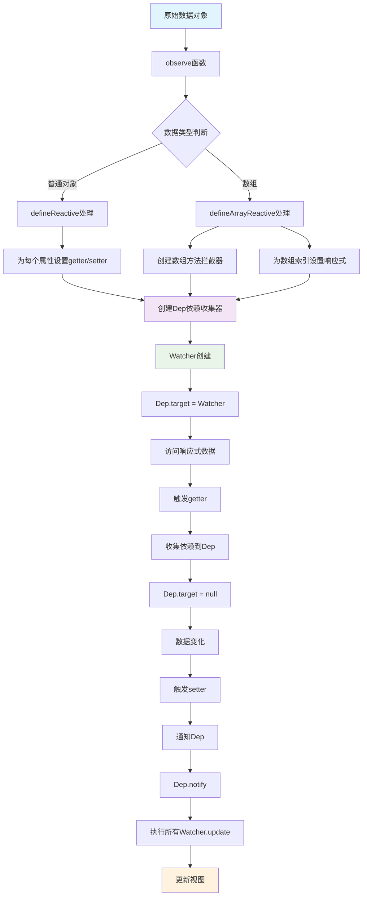
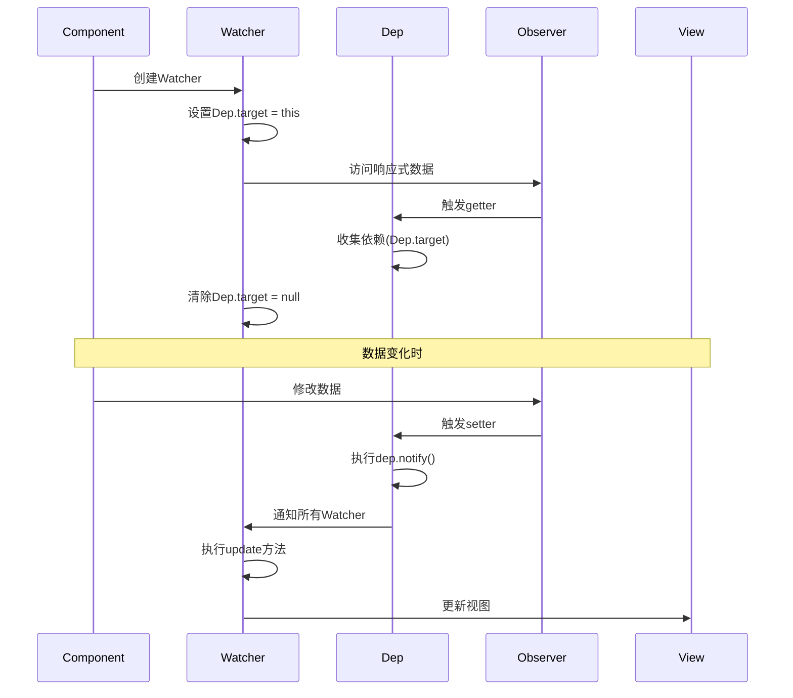
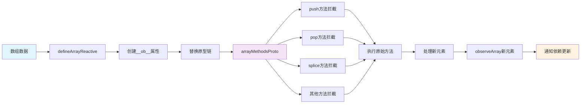
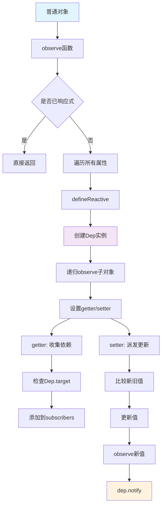
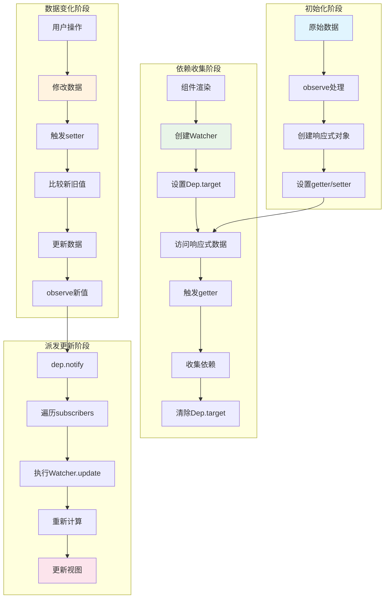

简单性不是简单，而是复杂性被很好地组织

---

## 引言

在当今前端开发领域，Vue.js 凭借其优雅的响应式系统成为了最受欢迎的框架之一。当你修改数据时，视图会自动更新；当你操作数组时，界面会实时响应。这种"魔法"般的体验背后，隐藏着精妙的设计思想和复杂的实现机制。

正如计算机科学家 Alan Kay 所说："**简单性不是简单，而是复杂性被很好地组织**"。Vue2 的响应式系统正是这种哲学的最佳体现——它让复杂的数据绑定变得简单易用，但内部实现却蕴含着深刻的计算机科学原理。

本文将带你深入 Vue2 响应式系统的核心，从设计理念到具体实现，从基础概念到高级特性，让你真正理解这个"魔法"是如何工作的。

## Vue2 响应式系统流程图

### 整体架构流程



### 依赖收集与派发更新流程



### 数组响应式处理流程



### 对象响应式处理流程



### 完整的数据流向图



## 什么是响应式系统？

### 基本概念

响应式系统（Reactive System）是一种编程范式，它能够自动追踪数据的变化并执行相应的副作用。在 Vue2 中，当你修改数据时，相关的视图会自动更新，这就是响应式系统的体现。

```javascript
// 简单的响应式示例
const data = {
  message: 'Hello Vue'
}

// 当 data.message 改变时，视图会自动更新
data.message = 'Hello World' // 视图自动更新
```

## 核心原理：Object.defineProperty

### 属性描述符的威力

Vue2 响应式系统的核心基于 ES5 的 `Object.defineProperty` API。这个 API 允许我们拦截对象的属性访问和修改操作。

```javascript
// Object.defineProperty 的基本用法
const obj = {}
let value = 'initial'

Object.defineProperty(obj, 'property', {
  get() {
    console.log('属性被访问')
    return value
  },
  set(newValue) {
    console.log('属性被修改:', newValue)
    value = newValue
  }
})

obj.property // 输出: 属性被访问
obj.property = 'new value' // 输出: 属性被修改: new value
```

### 依赖收集与派发更新

Vue2 的响应式系统基于两个核心概念：

1. **依赖收集（Dependency Collection）**：当组件渲染时，记录所有被访问的响应式数据
2. **派发更新（Dependency Notification）**：当数据变化时，通知所有依赖该数据的组件重新渲染

## 实现细节：从简单到复杂

### 第一步：基础的响应式实现

让我们从一个最简单的响应式实现开始：

```javascript
// 简单的响应式系统
class Dep {
  constructor() {
    this.subscribers = [] // 存储所有依赖
  }
  
  addSub(sub) {
    this.subscribers.push(sub)
  }
  
  notify() {
    this.subscribers.forEach(sub => sub.update())
  }
}

class Watcher {
  constructor(vm, exp, cb) {
    this.vm = vm
    this.exp = exp
    this.cb = cb
    this.value = this.get()
  }
  
  get() {
    Dep.target = this // 设置当前活跃的 Watcher
    const value = this.vm[this.exp] // 触发 getter，收集依赖
    Dep.target = null // 清除当前活跃的 Watcher
    return value
  }
  
  update() {
    const newValue = this.vm[this.exp]
    const oldValue = this.value
    this.value = newValue
    this.cb.call(this.vm, newValue, oldValue)
  }
}

function defineReactive(obj, key, val) {
  const dep = new Dep()
  
  Object.defineProperty(obj, key, {
    enumerable: true,
    configurable: true,
    get() {
      if (Dep.target) {
        dep.addSub(Dep.target) // 收集依赖
      }
      return val
    },
    set(newVal) {
      if (val === newVal) return
      val = newVal
      dep.notify() // 派发更新
    }
  })
}
```

### 第二步：对象的深度响应式

对于嵌套对象，我们需要递归地将其所有属性都转换为响应式：

```javascript
function observe(obj) {
  if (!obj || typeof obj !== 'object') return
  
  // 如果已经是响应式对象，直接返回
  if (obj.__ob__) return obj.__ob__
  
  // 遍历对象的所有属性
  Object.keys(obj).forEach(key => {
    defineReactive(obj, key, obj[key])
  })
  
  return obj
}

function defineReactive(obj, key, val) {
  const dep = new Dep()
  
  // 递归观察子对象
  let childOb = observe(val)
  
  Object.defineProperty(obj, key, {
    enumerable: true,
    configurable: true,
    get() {
      if (Dep.target) {
        dep.addSub(Dep.target)
        // 如果是对象，也要收集对象的依赖
        if (childOb) {
          childOb.dep.addSub(Dep.target)
        }
      }
      return val
    },
    set(newVal) {
      if (val === newVal) return
      val = newVal
      // 新值也需要转换为响应式
      childOb = observe(newVal)
      dep.notify()
    }
  })
}
```

## 数组响应式：Vue2 的巧妙设计

### 为什么数组需要特殊处理？

数组的响应式处理是 Vue2 中最复杂也最巧妙的部分。问题在于：

1. **数组索引的响应式**：`Object.defineProperty` **无法拦截数组索引的访问和修改**
2. **数组方法的重写**：需要重写数组的变异方法（如 `push`、`pop` 等）
3. **新元素的响应式**：通过数组方法添加的新元素需要转换为响应式

### 数组方法拦截器

Vue2 通过创建数组方法拦截器来解决这个问题：

```javascript
// 需要拦截的数组方法
const arrayMethods = ['push', 'pop', 'shift', 'unshift', 'splice', 'sort', 'reverse']

// 创建数组方法拦截器
const arrayProto = Array.prototype
const arrayMethodsProto = Object.create(arrayProto)

// 为每个数组方法添加响应式支持
arrayMethods.forEach(method => {
  arrayMethodsProto[method] = function(...args) {
    // 获取原始方法的结果
    const result = arrayProto[method].apply(this, args)
    
    // 获取数组的观察者对象
    const ob = this.__ob__
    
    // 对于可能添加新元素的方法，需要将新元素也转换为响应式
    let inserted
    switch (method) {
      case 'push':
      case 'unshift':
        inserted = args
        break
      case 'splice':
        inserted = args.slice(2) // splice 的第三个参数开始是新元素
        break
    }
    
    if (inserted) {
      ob.observeArray(inserted)
    }
    
    // 通知依赖更新
    ob.dep.notify()
    return result
  }
})
```

## 完整的响应式系统实现

现在让我们整合所有的代码，实现一个完整的响应式系统：

```javascript
// 完整的 Vue2 响应式系统实现
class Dep {
  constructor() {
    this.subscribers = []
  }
  
  addSub(sub) {
    this.subscribers.push(sub)
  }
  
  notify() {
    this.subscribers.forEach(sub => sub.update())
  }
}

class Watcher {
  constructor(vm, exp, cb) {
    this.vm = vm
    this.exp = exp
    this.cb = cb
    this.value = this.get()
    console.log('Watcher创建，初始值:', this.value)
  }
  
  get() {
    Dep.target = this
    const value = this.vm[this.exp]
    Dep.target = null
    return value
  }
  
  update() {
    const newValue = this.vm[this.exp]
    const oldValue = this.value
    this.value = newValue
    this.cb.call(this.vm, newValue, oldValue)
  }
}

// 数组方法拦截器
const arrayMethods = ['push', 'pop', 'shift', 'unshift', 'splice', 'sort', 'reverse']
const arrayProto = Array.prototype
const arrayMethodsProto = Object.create(arrayProto)

arrayMethods.forEach(method => {
  arrayMethodsProto[method] = function(...args) {
    const result = arrayProto[method].apply(this, args)
    const ob = this.__ob__
    
    let inserted
    switch (method) {
      case 'push':
      case 'unshift':
        inserted = args
        break
      case 'splice':
        inserted = args.slice(2)
        break
    }
    
    if (inserted) {
      ob.observeArray(inserted)
    }
    
    ob.dep.notify()
    return result
  }
})

function defineReactive(obj, key, val) {
  const dep = new Dep()
  let childOb = observe(val)
  
  Object.defineProperty(obj, key, {
    enumerable: true,
    configurable: true,
    get() {
      if (Dep.target) {
        dep.addSub(Dep.target)
        if (childOb) {
          childOb.dep.addSub(Dep.target)
        }
      }
      return val
    },
    set(newVal) {
      if (val === newVal) return
      val = newVal
      childOb = observe(newVal)
      dep.notify()
    }
  })
}

function observeArray(arr) {
  for (let i = 0; i < arr.length; i++) {
    observe(arr[i])
  }
}

function defineArrayReactive(arr) {
  const dep = new Dep()
  
  Object.defineProperty(arr, '__ob__', {
    value: {
      dep: dep,
      observeArray: observeArray
    },
    enumerable: false,
    writable: true,
    configurable: true
  })

  arr.__proto__ = arrayMethodsProto

  for (let i = 0; i < arr.length; i++) {
    defineArrayIndexReactive(arr, i, arr[i])
  }
}

function defineArrayIndexReactive(arr, index, val) {
  const dep = arr.__ob__.dep
  let childOb = observe(val)
  
  Object.defineProperty(arr, index, {
    enumerable: true,
    configurable: true,
    get() {
      if (Dep.target) {
        dep.addSub(Dep.target)
        if (childOb) {
          childOb.dep.addSub(Dep.target)
        }
      }
      return val
    },
    set(newVal) {
      if (val === newVal) return
      val = newVal
      childOb = observe(newVal)
      dep.notify()
    }
  })
}

function observe(obj) {
  if (!obj || typeof obj !== 'object') return
  if (obj.__ob__) return obj.__ob__
  
  if (Array.isArray(obj)) {
    defineArrayReactive(obj)
    return obj.__ob__
  }
  
  Object.keys(obj).forEach(key => {
    defineReactive(obj, key, obj[key])
  })
  
  return obj
}
```

## 实际应用示例

让我们通过一个完整的示例来演示这个响应式系统：

```javascript
// 使用示例
console.log('=== Vue Observer 响应式系统演示 ===\n')

// 1. 创建包含数组的响应式数据
const data = {
  message: 'Hello Vue',
  count: 0,
  user: {
    name: 'John',
    age: 25
  },
  items: [1, 2, 3, 4, 5]
}

console.log('1. 原始数据:', data)

// 2. 将数据转换为响应式
observe(data)
console.log('2. 数据已转换为响应式对象')

// 3. 创建Watcher监听数据变化
const watcher1 = new Watcher(data, 'message', function(newVal, oldVal) {
  console.log(`📢 message变化: "${oldVal}" → "${newVal}"`)
})

const watcher2 = new Watcher(data, 'count', function(newVal, oldVal) {
  console.log(`📢 count变化: ${oldVal} → ${newVal}`)
})

const watcher3 = new Watcher(data, 'items', function(newVal, oldVal) {
  console.log(`📢 items数组变化: [${oldVal}] → [${newVal}]`)
})

console.log('3. 创建了3个Watcher监听器')

// 4. 测试各种数据变化
console.log('\n4. 测试数据变化...')

// 测试基本属性修改
data.message = 'Hello World'
data.count = 42

// 测试数组方法
data.items.push(6)
data.items.pop()
data.items.unshift(0)
data.items.splice(1, 1, 10)

// 测试数组索引修改
data.items[0] = 100

// 测试嵌套对象
data.user.name = 'Jane'
```

## 性能优化与限制

### Vue2 响应式系统的优势

1. **精确的依赖收集**：只更新真正变化的部分
2. **深度响应式**：自动处理嵌套对象和数组
3. **数组方法拦截**：支持所有数组变异方法

### 已知限制

1. **无法检测对象属性的添加和删除**：需要使用 `Vue.set` 和 `Vue.delete`
2. **无法检测数组索引的直接赋值**：虽然我们实现了，但 Vue2 官方版本不支持
3. **无法检测数组长度的变化**：通过 `length` 属性修改数组长度不会触发响应式更新

### 性能考虑

1. **初始化开销**：需要遍历所有属性并设置 getter/setter
2. **内存占用**：每个响应式对象都会创建额外的依赖收集器
3. **深度监听**：嵌套对象会递归创建响应式，可能影响性能

## 与 Vue3 的对比

### Vue2 的局限性

Vue2 基于 `Object.defineProperty` 的响应式系统存在一些根本性的限制：

1. **无法监听数组索引和长度变化**
2. **无法监听对象属性的添加和删除**
3. **需要递归遍历对象的所有属性**

### Vue3 的改进

Vue3 使用 `Proxy` 替代 `Object.defineProperty`，解决了这些问题：

```javascript
// Vue3 的响应式实现（简化版）
function reactive(obj) {
  return new Proxy(obj, {
    get(target, key, receiver) {
      track(target, key) // 依赖收集
      return Reflect.get(target, key, receiver)
    },
    set(target, key, value, receiver) {
      const result = Reflect.set(target, key, value, receiver)
      trigger(target, key) // 派发更新
      return result
    },
    deleteProperty(target, key) {
      const result = Reflect.deleteProperty(target, key)
      trigger(target, key) // 派发更新
      return result
    }
  })
}
```

## 最佳实践

### 1. 合理使用响应式数据

```javascript
// 好的做法：只对需要响应式的数据使用 observe
const data = {
  user: { name: 'John', age: 25 }, // 需要响应式
  config: { theme: 'dark' }        // 需要响应式
}

// 不好的做法：对静态数据使用响应式
const staticData = {
  version: '1.0.0',  // 静态数据，不需要响应式
  apiUrl: '/api'     // 静态数据，不需要响应式
}
```

### 2. 避免深层嵌套

```javascript
// 好的做法：扁平化数据结构
const data = {
  userName: 'John',
  userAge: 25,
  userEmail: 'john@example.com'
}

// 不好的做法：过度嵌套
const data = {
  user: {
    profile: {
      personal: {
        name: 'John',
        age: 25
      }
    }
  }
}
```

### 3. 合理使用数组方法

```javascript
// 好的做法：使用变异方法
data.items.push(newItem)
data.items.splice(index, 1)

// 不好的做法：直接赋值（在 Vue2 中不会触发响应式）
data.items[0] = newItem
data.items.length = 0
```

## 总结

Vue2 的响应式系统是一个精心设计的架构，它巧妙地利用了 JavaScript 的语言特性，实现了数据与视图的自动同步。虽然存在一些限制，但它为前端开发带来了革命性的变化。

正如计算机科学家 Edsger Dijkstra 所说："**简单性是可靠性的先决条件**"。Vue2 的响应式系统虽然内部复杂，但对外提供了简单易用的 API，这正是优秀软件设计的体现。

通过深入理解 Vue2 响应式系统的原理，我们不仅能更好地使用 Vue.js，还能从中学习到优秀的设计思想和编程技巧。这些知识对于理解现代前端框架的工作原理，以及设计自己的响应式系统都具有重要的参考价值。

## 引用来源

1. Vue.js 官方文档 - 响应式原理：https://v2.vuejs.org/v2/guide/reactivity.html
2. 《深入浅出 Vue.js》- 刘博文著
3. 《JavaScript 高级程序设计》第4版 - Nicholas C. Zakas著
4. 《设计模式：可复用面向对象软件的基础》- Gang of Four著
5. Vue.js 源码分析：https://github.com/vuejs/vue
6. 《计算机程序的构造和解释》- Harold Abelson, Gerald Jay Sussman著 