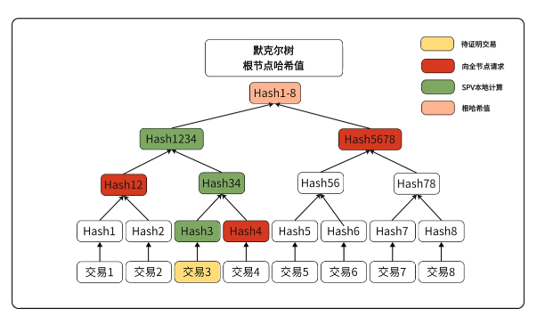

在传统的金融世界中，当你想要买卖股票时，需要找到愿意与你交易的对手方。如果市场上买家和卖家都很少，你可能需要等待很久，或者接受不利的价格。

而在Uniswap这样的去中心化交易所中，**流动性池（Liquidity Pool）**充当了"自动做市商（AMM）即（Automated Market Maker​）"的角色。你不需要等待对手方，而是直接与智能合约进行交易。这种革命性的机制改变了整个金融交易的方式。

## 第零部分：区块链基础概念

在深入了解Uniswap之前，我们需要先理解一些区块链的基础概念，这些概念对于理解DeFi的运作方式至关重要。

### 区块确认时间：我的交易需要等多久？

很多人对区块链交易有一个常见的误解：**"比特币区块间隔是10分钟，那我的交易是不是要等10分钟才能确认？"**

让我们用一个生动的例子来解释这个问题。

#### 区块链就像一辆公交车

想象区块链是一辆每10分钟发车一次的公交车：

```
时间轴：
00:00 - 第1辆车发车（装载100笔交易）
00:10 - 第2辆车发车（装载100笔交易）
00:20 - 第3辆车发车（装载100笔交易）
...
```

**关键问题：你的交易什么时候被确认？**

这取决于你什么时候到达"车站"（发起交易）：

#### 情况1：运气好的情况
```
09:59 - 你发起交易（刚好赶上10:00的车）
10:00 - 矿工打包这个区块（你的交易被包含）
10:00 - 你的交易获得第一次确认 ✓

等待时间：约1分钟
```

#### 情况2：运气不好的情况
```
10:01 - 你发起交易（刚好错过10:00的车）
10:10 - 矿工打包下一个区块（你的交易被包含）
10:10 - 你的交易获得第一次确认 ✓

等待时间：约9分钟
```

#### 情况3：更现实的情况
```
10:05 - 你发起交易（在两个区块之间）
10:10 - 矿工打包区块（你的交易被包含）
10:10 - 你的交易获得第一次确认 ✓

平均等待时间：约5分钟
```

#### 核心理解：交易确认的真实流程

**阶段1：交易进入内存池（Mempool）**
```
你发起交易 → 交易被广播到网络 → 进入矿工的内存池
时间：几秒钟
状态：Pending（待确认）
```

**阶段2：矿工选择交易**
```
矿工从内存池中选择交易 → 优先选择手续费高的交易
时间：取决于你的位置（何时发起交易）
影响因素：
- 手续费高低（Gas Price）
- 网络拥堵程度
- 运气（是否刚好赶上下一个区块）
```

**阶段3：区块被挖出**
```
矿工挖出新区块 → 你的交易被包含在区块中
时间：平均5分钟（比特币10分钟区块间隔的一半）
状态：1次确认
```

**阶段4：等待更多确认**
```
后续区块继续生成 → 你的交易获得更多确认
推荐确认数：
- 小额交易：1-3次确认（10-30分钟）
- 大额交易：6次确认（约60分钟）
- 交易所充值：通常要求6次确认
```

#### 为什么需要多次确认？

**单次确认的风险：双花攻击（Double Spending）**

想象一个恶意用户试图欺骗系统：

```
步骤1：用户A向商家B转账1 BTC
步骤2：这笔交易被包含在区块N中（1次确认）
步骤3：商家B看到确认，发货
步骤4：用户A控制算力，创建一条新链
步骤5：在新链中，用户A把这1 BTC转给自己
步骤6：如果新链超过原链，商家B的交易会被撤销
```

**多次确认的保护机制：**

```
1次确认：攻击者需要51%的算力
3次确认：攻击者需要持续51%算力3个区块（成本很高）
6次确认：几乎不可能被攻击（需要持续51%算力1小时）
```

**形象比喻：**
- 1次确认：就像用铅笔写字，还可以擦掉
- 3次确认：像用圆珠笔写字，很难擦掉
- 6次确认：像用刻刀刻在石头上，几乎不可能改变

#### 不同区块链的确认时间

| 区块链 | 区块间隔 | 推荐确认数 | 实际等待时间 |
|--------|----------|------------|--------------|
| 比特币 | 10分钟 | 6次 | 约60分钟 |
| 以太坊 | 12秒 | 12次 | 约2.4分钟 |
| BSC | 3秒 | 15次 | 约45秒 |
| Polygon | 2秒 | 128次 | 约4分钟 |

#### 实际建议

**普通用户：**
- 小额支付：等待1次确认即可
- 中等金额：等待3次确认
- 大额转账：等待6次确认

**交易所/商家：**
- 必须等待足够的确认数
- 根据金额和风险调整策略
- 使用链上监控工具实时追踪

**提高交易速度的方法：**
1. **提高Gas费**：矿工优先打包高手续费交易
2. **选择快速链**：使用Layer2或高性能公链
3. **使用闪电网络**：比特币的即时支付方案

### 区块链钱包：全节点vs轻钱包

在区块链世界中，钱包是你与区块链交互的入口。但你知道吗？钱包也分为不同类型，它们的工作原理大不相同。

#### 钱包的本质：管理私钥的工具

首先要明确一个关键概念：**钱包不存储你的币，你的币永远在区块链上**。

```
错误理解：钱包 = 存钱的地方
正确理解：钱包 = 管理钥匙的钥匙串

比喻：
- 区块链 = 银行保险柜
- 你的地址 = 保险柜编号
- 私钥 = 保险柜钥匙
- 钱包 = 管理钥匙的工具
```

#### 钱包的三种类型

**1. 全节点钱包（Full Node Wallet）**

全节点钱包会下载并验证整条区块链的所有数据。

```
工作原理：
1. 下载整个区块链（比特币约500GB）
2. 验证每一笔交易
3. 维护完整的UTXO集合
4. 可以独立验证所有信息

代表产品：
- Bitcoin Core
- Geth（以太坊）
```

**优点：**
- ✅ 最高的安全性（不依赖第三方）
- ✅ 完全去中心化
- ✅ 可以验证所有交易
- ✅ 支持挖矿和完整节点功能

**缺点：**
- ❌ 需要大量存储空间（数百GB）
- ❌ 初次同步需要数天时间
- ❌ 需要持续保持在线
- ❌ 对硬件要求高

**2. 轻钱包（Light Wallet / SPV Wallet）**

轻钱包只下载区块头信息，通过SPV（Simplified Payment Verification）技术验证交易。

```
SPV的核心思想：
不下载所有交易数据，只下载区块头（约80字节/块）
通过Merkle树验证交易的存在性

比特币区块头结构：
- 版本号：4字节
- 前一区块哈希：32字节
- Merkle根：32字节
- 时间戳：4字节
- 难度目标：4字节
- Nonce：4字节
总共：80字节/块
```

**工作原理详解：**

**步骤1：下载区块头**
```
全节点区块数据：约2MB/块
轻钱包只下载：80字节/块

比特币800,000个区块：
- 全节点需要：约500GB
- 轻钱包只需要：约64MB（800,000 × 80字节）

巨大的优势！
```

**步骤2：使用Merkle树验证交易**

Merkle树是一种哈希树结构，可以高效验证交易是否在区块中。

```
区块结构：
┌─────────────────┐
│   区块头(80B)    │ ← 轻钱包下载这个
├─────────────────┤
│   Merkle根      │ ← 包含在区块头中
├─────────────────┤
│   交易1         │
│   交易2         │ ← 全节点下载这些
│   ...           │
│   交易N         │
└─────────────────┘
```

**Merkle树验证过程：**

假设一个区块有8笔交易，你想验证"交易3"是否真实存在：

```
                  Merkle根 (在区块头中)
                 /         \
               H12          H34
              /  \         /  \
            H1    H2     H3    H4
           / \   / \    / \   / \
          T1 T2 T3 T4  T5 T6 T7 T8
                 ↑
              你的交易

验证步骤：
1. 全节点发送：T3, H4, H12
2. 轻钱包计算：
   - H3 = Hash(T3)
   - H34 = Hash(H3 + H4)
   - Root = Hash(H12 + H34)
3. 对比Root与区块头中的Merkle根
4. 如果相同 → 交易有效 ✓
```

**为什么这样是安全的？**

**核心原理：工作量证明（PoW）的保护**

```
攻击者想要伪造交易：
1. 需要伪造Merkle根
2. 需要伪造区块头
3. 需要重新计算PoW（需要巨大算力）
4. 需要让后续区块也承认这个伪造的区块
5. 成本极高，几乎不可能

形象比喻：
- 区块头像一个"数字指纹"
- Merkle根像"内容摘要"
- PoW像"防伪标签"
- 要伪造需要"重印整本书"并获得"官方认证"
```

**轻钱包的安全保障：**

**1. 区块头链的完整性**
```
轻钱包下载所有区块头（80字节/块）
每个区块头包含前一个区块的哈希
形成一条不可篡改的链

区块N-1 → 区块N → 区块N+1
   ↑         ↑         ↑
  PoW验证   PoW验证   PoW验证

要伪造一个区块 = 要重做所有后续区块的PoW
```

**2. Merkle证明的数学保障**
```
哈希函数的特性：
- 单向性：无法从哈希值反推原始数据
- 抗碰撞性：无法找到两个数据产生相同哈希
- 确定性：相同输入总是产生相同输出

所以：
- 无法伪造Merkle证明
- 无法篡改交易数据
- 可以信任全节点提供的证明
```

如何证明一笔交易发生,因为轻节点只保留的头部信息，所以为了验证是否发生，可以使用默克尔树，只需要请求几个关键的hash值，再和根节点相比，就知道是否存在或者篡改过，这就是默克尔证明了，说明已经上链了


**3. 多节点验证**
```
轻钱包不只连接一个全节点：
- 同时连接多个节点
- 对比不同节点的响应
- 如果有节点作恶，会被其他节点揭露
- 采用"多数派"原则

类似"陪审团制度"：
- 不只听一个证人的说法
- 需要多个证人的一致证词
```

**代表产品：**
- Electrum（比特币）
- MetaMask（以太坊）
- Trust Wallet
- imToken

**优点：**
- ✅ 占用空间小（几十MB）
- ✅ 快速启动（几分钟）
- ✅ 适合移动设备
- ✅ 仍然保持较高安全性

**缺点：**
- ❌ 依赖全节点提供数据
- ❌ 隐私性略差（需要向节点查询）
- ❌ 无法验证所有区块链规则

**3. 托管钱包（Custodial Wallet）**

托管钱包完全依赖第三方服务器，用户不控制私钥。

```
工作原理：
1. 私钥由服务商保管
2. 用户通过账号密码登录
3. 所有操作通过服务商API

代表产品：
- 交易所钱包（币安、Coinbase）
- 一些网页钱包
```

**优点：**
- ✅ 最简单易用
- ✅ 可以找回密码
- ✅ 支持客服服务

**缺点：**
- ❌ 不控制私钥（Not your keys, not your coins）
- ❌ 依赖服务商信誉
- ❌ 可能被冻结账户
- ❌ 服务商倒闭风险

#### 三种钱包的对比

| 特性 | 全节点钱包 | 轻钱包(SPV) | 托管钱包 |
|------|-----------|------------|----------|
| 存储空间 | 500GB+ | 64MB | 几乎为0 |
| 同步时间 | 数天 | 几分钟 | 即时 |
| 安全性 | ⭐⭐⭐⭐⭐ | ⭐⭐⭐⭐ | ⭐⭐ |
| 去中心化 | ✅ | ✅ | ❌ |
| 易用性 | 困难 | 中等 | 简单 |
| 私钥控制 | 完全控制 | 完全控制 | 无控制 |
| 隐私性 | ⭐⭐⭐⭐⭐ | ⭐⭐⭐ | ⭐ |
| 适用场景 | 开发者/矿工 | 日常使用 | 新手入门 |

#### 轻钱包的技术细节：Merkle树深度解析

为了更好地理解轻钱包如何只用区块头信息就能确保安全，让我们深入了解Merkle树的数学原理。

**Merkle树的效率优势：**

```
假设一个区块有2048笔交易：

验证方式对比：
1. 下载所有交易：
   2048笔 × 约250字节 = 512KB

2. 使用Merkle证明：
   只需11个哈希值 × 32字节 = 352字节
   
效率提升：1500倍！
```

**为什么只需要11个哈希？**

```
Merkle树的深度 = log₂(交易数量)
2048笔交易 = 2¹¹
所以树深度 = 11层

验证一笔交易只需要：
- 每层提供1个兄弟节点的哈希
- 总共11个哈希值
- 就能验证到树根
```

**实际验证案例：**

```
区块高度：750000
交易数量：2500笔
你的交易：第1234笔

轻钱包请求：
"请证明交易1234在区块750000中"

全节点响应：
{
  "transaction": "0x1234...",
  "merkle_proof": [
    "0xabc...",  // 层1：兄弟节点哈希
    "0xdef...",  // 层2：兄弟节点哈希
    ...
    "0x789..."   // 层12：兄弟节点哈希
  ],
  "index": 1234
}

轻钱包验证：
1. 计算交易哈希
2. 使用merkle_proof逐层计算
3. 最终得到Merkle根
4. 与区块头中的Merkle根对比
5. 相同 → 验证通过 ✓

数据量：约400字节
验证时间：毫秒级
安全性：与全节点相同
```

#### 实际建议：如何选择钱包？

**日常使用（推荐轻钱包）：**
```
✅ MetaMask（以太坊）
✅ Electrum（比特币）
✅ Trust Wallet（多链）

原因：
- 安全性足够
- 使用方便
- 移动友好
```

**大额存储（推荐硬件钱包）：**
```
✅ Ledger
✅ Trezor

原因：
- 私钥离线存储
- 最高安全性
- 专业设计
```

**新手入门（可以用托管钱包）：**
```
⚠️ 交易所钱包（币安、Coinbase）

注意：
- 只用于小额
- 尽快学习使用非托管钱包
- 记住："Not your keys, not your coins"
```

#### 安全提示

**全节点钱包用户：**
- 定期备份钱包数据
- 确保有足够的存储空间
- 保持节点在线以同步最新区块

**轻钱包用户：**
- 备份助记词（12/24个单词）
- 不要在联网设备上存储助记词
- 使用知名的开源钱包

**所有用户：**
- 永远不要分享私钥/助记词
- 警惕钓鱼网站
- 使用硬件钱包存储大额资产
- "如果你不拥有私钥，你就不拥有币"

### 以太坊账户：外部账户vs合约账户

在以太坊中，有两种完全不同的账户类型。理解它们的区别对于掌握以太坊的运作机制至关重要。

#### 账户的本质：以太坊的"身份证"

在以太坊网络中，每个账户都有一个唯一的地址，类似于银行账户号码。但与传统银行不同，以太坊有两种完全不同类型的"账户"。

```
传统银行：只有一种账户类型
以太坊：两种账户类型
├── 外部账户（EOA - Externally Owned Account）
└── 合约账户（Contract Account）
```

#### 外部账户（EOA - Externally Owned Account）

外部账户是由人类用户控制的账户，就像你的MetaMask钱包地址。

**核心特征：**
```
外部账户 = 地址 + 私钥

关键要素：
- 由私钥控制
- 可以主动发起交易
- 不包含任何代码
- 由人或程序通过私钥操作
```

**账户结构：**
```
外部账户包含：
├── Address（地址）：0x742d35Cc6634C0532925a3b844Bc9e7595f0bEb
├── Balance（余额）：10.5 ETH
├── Nonce（交易计数）：已发送23笔交易
└── 私钥（离线保存）：控制账户的唯一凭证
```

**生成过程：**
```
步骤1：生成私钥（256位随机数）
↓
步骤2：通过椭圆曲线加密算法生成公钥
↓
步骤3：对公钥进行Keccak-256哈希
↓
步骤4：取哈希值的后20字节作为地址
↓
最终：得到以0x开头的40个十六进制字符地址

示例：
私钥：0x4c0883a69102937d6231471b5dbb6204fe512961708279f8b8d3d7c5c3f3c3f3
  ↓
公钥：（通过ECDSA算法生成）
  ↓
地址：0x742d35Cc6634C0532925a3b844Bc9e7595f0bEb
```

**外部账户能做什么？**
```
✅ 发送ETH给其他账户
✅ 调用智能合约
✅ 部署新的智能合约
✅ 签名交易
✅ 授权其他操作

例子：
- 你的MetaMask钱包地址
- 交易所的提现地址
- 硬件钱包的地址
```

#### 合约账户（Contract Account）

合约账户是由智能合约代码控制的账户，没有私钥，只能被动响应。

**核心特征：**
```
合约账户 = 地址 + 代码 + 存储

关键要素：
- 没有私钥
- 无法主动发起交易
- 包含智能合约代码
- 由代码逻辑控制
```

**账户结构：**
```
合约账户包含：
├── Address（地址）：0x7a250d5630B4cF539739dF2C5dAcb4c659F2488D
├── Balance（余额）：1000 ETH（池子中的资金）
├── Nonce（创建的合约计数）：创建了5个子合约
├── Code（智能合约代码）：合约的业务逻辑
└── Storage（存储）：合约的状态数据
```

**生成过程：**
```
步骤1：外部账户发送部署交易
↓
步骤2：包含合约代码的交易被打包
↓
步骤3：EVM（以太坊虚拟机）执行部署
↓
步骤4：计算合约地址（基于创建者地址 + nonce）
↓
最终：合约被部署到区块链上

合约地址计算公式：
address = keccak256(rlp([sender_address, sender_nonce]))[12:]

示例：
创建者：0x742d35Cc6634C0532925a3b844Bc9e7595f0bEb
Nonce：23
  ↓
合约地址：0x7a250d5630B4cF539739dF2C5dAcb4c659F2488D
```

**合约账户能做什么？**
```
✅ 接收ETH和代币
✅ 存储数据
✅ 执行代码逻辑
✅ 调用其他合约
✅ 创建新合约

例子：
- Uniswap的流动性池合约
- USDT的代币合约
- OpenSea的NFT交易合约
```

#### 两种账户的相同点 🤝

**1. 都有唯一的地址**
```
EOA地址：0x742d35Cc6634C0532925a3b844Bc9e7595f0bEb
合约地址：0x7a250d5630B4cF539739dF2C5dAcb4c659F2488D

特点：
- 都是42个字符（0x + 40个十六进制）
- 都是全网唯一的
- 都可以接收和发送ETH
- 外观上无法区分（需要查询区块链）
```

**2. 都能持有ETH和代币**
```
EOA余额：
- ETH：10.5 ETH
- USDT：1000 USDT
- UNI：500 UNI

合约余额：
- ETH：1000 ETH（例如：流动性池）
- USDT：500,000 USDT（例如：交易合约）
- 其他代币：根据合约逻辑
```

**3. 都有Nonce值**
```
EOA的Nonce：
- 记录发送的交易数量
- 用于防止重放攻击
- 每发送一笔交易+1

合约的Nonce：
- 记录创建的合约数量
- 用于计算新创建的合约地址
- 每创建一个合约+1
```

**4. 都能接收交易**
```
接收方式：
- 都可以作为交易的接收方
- 都会在区块链上显示余额变化
- 都需要支付Gas费（由发送方支付）
```

**5. 都在以太坊状态树中**
```
全局状态存储：
World State（世界状态）
├── EOA1的状态
├── EOA2的状态
├── Contract1的状态
├── Contract2的状态
└── ...

每个账户都有：
- Balance（余额）
- Nonce（计数器）
- 存储根（Storage Root）
- 代码哈希（Code Hash）
```

#### 两种账户的核心区别 ⚡

##### 1. 控制方式的区别

**外部账户：私钥控制**
```
控制权：
- 拥有私钥 = 完全控制
- 可以随时发起交易
- 只有一个"主人"

形象比喻：
- 像你的银行卡
- 知道密码就能使用
- 完全由人控制
```

**合约账户：代码控制**
```
控制权：
- 由智能合约代码控制
- 无法主动发起交易
- 遵循预设的规则

形象比喻：
- 像自动售货机
- 按照程序运行
- 没有"主人"（去中心化）
```

##### 2. 主动性的区别

**外部账户：主动发起者**
```
可以做：
✅ 主动发送交易
✅ 主动调用合约
✅ 主动转账
✅ 签名授权

示例交易：
from: 0x742d35Cc... (EOA)
to: 0x7a250d56... (Contract)
value: 1 ETH
data: 调用swap函数
```

**合约账户：被动响应者**
```
只能做：
⚠️ 无法主动发起交易
✅ 只能被调用后执行
✅ 可以在执行中调用其他合约
✅ 可以发送ETH（在被调用时）

示例：
EOA调用合约A → 合约A调用合约B → 合约B执行逻辑
     主动           被动             被动
```

##### 3. 代码的区别

**外部账户：无代码**
```
Code Hash: 0x (空)
Code: 无代码

特点：
- 只是一个地址
- 没有任何逻辑
- 完全由私钥持有者决定行为
```

**合约账户：有代码**
```
Code Hash: 0xc5d2460186f7233c927e7db2dcc703c0e500b653ca82273b7bfad8045d85a470
Code: 
pragma solidity ^0.8.0;
contract MyContract {
    function transfer() public {...}
    function swap() public {...}
}

特点：
- 包含可执行代码
- 代码一旦部署不可更改
- 行为完全由代码决定
```

##### 4. 创建方式的区别

**外部账户：随时可创建**
```
创建步骤：
1. 生成随机私钥（离线即可）
2. 计算对应的地址
3. 完成（无需上链）

成本：免费
时间：瞬间
位置：可在离线环境生成
```

**合约账户：需要部署交易**
```
创建步骤：
1. 编写智能合约代码
2. 编译成字节码
3. 发送部署交易（需要EOA发起）
4. 支付Gas费
5. 等待区块确认

成本：需要Gas费（可能几十到几百美元）
时间：取决于网络拥堵（15秒~几分钟）
位置：必须在区块链上
```

##### 5. Gas消耗的区别

**外部账户：简单转账便宜**
```
ETH转账：
- 基础Gas：21,000
- 成本：约$3-10（根据Gas价格）

操作类型：
- 转账ETH：21,000 gas
- 无其他固定成本
```

**合约账户：执行代码昂贵**
```
调用合约：
- 基础Gas：21,000
- 执行代码：+50,000~500,000+（取决于复杂度）
- 存储数据：+20,000每个槽位

示例：
- Uniswap交易：约150,000 gas
- NFT铸造：约100,000 gas
- 复杂DeFi操作：500,000+ gas

成本：$20-100+（根据操作复杂度）
```

##### 6. 存储的区别

**外部账户：只存储余额**
```
存储内容：
├── Balance（余额）
└── Nonce（交易计数）

就这些！
```

**合约账户：可以存储大量数据**
```
存储内容：
├── Balance（余额）
├── Nonce（合约计数）
├── Code（智能合约代码）
└── Storage（任意数据）
    ├── 用户余额映射
    ├── 权限列表
    ├── 游戏状态
    └── ... 任何合约需要的数据

例如，Uniswap合约存储：
- 流动性池的ETH和代币数量
- LP代币持有者信息
- 交易历史数据
- 费率设置
```

#### 实际应用场景对比

##### 场景1：转账ETH

**使用外部账户：**
```solidity
// Alice的EOA直接发送给Bob的EOA
从：0x742d35Cc... (Alice)
到：0x8c3d91f2... (Bob)
金额：1 ETH
Gas：21,000

特点：
✅ 简单直接
✅ Gas费低
✅ 速度快
```

**使用合约账户：**
```solidity
// Alice调用合约，合约发送ETH给Bob
从：0x742d35Cc... (Alice)
到：0x7a250d56... (Contract)
调用：transfer(Bob, 1 ETH)
Gas：50,000+

特点：
⚠️ 需要调用合约
⚠️ Gas费高
✅ 可以添加条件逻辑（例如：定时转账）
```

##### 场景2：创建多签钱包

**外部账户：无法实现**
```
问题：
- EOA只有一个私钥
- 无法实现多人共同控制
- 一旦私钥泄露，资金全部丢失
```

**合约账户：完美实现**
```solidity
contract MultiSigWallet {
    address[] public owners;
    uint public required; // 需要的签名数
    
    function submitTransaction() public onlyOwner {...}
    function confirmTransaction() public onlyOwner {...}
    function executeTransaction() public {...}
}

优势：
✅ 需要多个EOA共同签名
✅ 提高安全性
✅ 灵活的权限管理
✅ 可以设置复杂的规则

真实案例：
- Gnosis Safe多签钱包
- DAO组织的财库
- 企业级资金管理
```

##### 场景3：自动化操作

**外部账户：需要人工操作**
```
问题：
- 每次操作都需要私钥签名
- 无法自动执行
- 需要人一直在线

例子：
- 定时转账：需要人工每次发起
- 条件触发：需要人工监控条件
```

**合约账户：可以自动执行**
```solidity
contract AutoPayment {
    function pay() public {
        if (block.timestamp > nextPaymentTime) {
            // 自动发送工资
            employee.transfer(salary);
        }
    }
}

优势：
✅ 可以设置触发条件
✅ 无需人工干预
✅ 透明可验证
✅ 不可篡改

真实案例：
- Aave的自动清算机制
- Compound的利息自动计算
- Uniswap的自动做市
```

#### 两种账户的交互模型

```
交互规则：
┌─────────────────────────────────────────────┐
│ 1. EOA → EOA        ✅ 直接转账            │
│ 2. EOA → Contract   ✅ 调用合约            │
│ 3. Contract → EOA   ✅ 合约发送（被调用时）│
│ 4. Contract → Contract ✅ 合约间调用       │
│ 5. Contract主动发起 ❌ 不可能！           │
└─────────────────────────────────────────────┘

重要规则：
所有交易链的起点必须是EOA！

示例交易链：
EOA(Alice) → Contract(Uniswap) → Contract(USDT) → EOA(Bob)
   主动         被动调用           被动调用        接收
```

#### 实际例子：完整的DeFi交易流程

```
场景：Alice在Uniswap上用ETH换USDT

步骤1：Alice（EOA）发起交易
账户类型：外部账户
操作：签名交易并发送
Gas支付：Alice支付

步骤2：调用Uniswap合约（Contract）
账户类型：合约账户
操作：执行swap函数
特点：被动响应，无私钥

步骤3：Uniswap合约调用USDT合约（Contract）
账户类型：合约账户
操作：执行transfer函数
特点：合约间调用

步骤4：USDT发送到Alice账户（EOA）
账户类型：外部账户
操作：接收代币
结果：Alice获得USDT

完整链条：
EOA(Alice) → Contract(Uniswap) → Contract(USDT) → EOA(Alice)
  主动           被动              被动              接收
```

#### 安全性对比

**外部账户的安全性：**
```
风险点：
⚠️ 私钥泄露 = 资金全部丢失
⚠️ 私钥丢失 = 永久无法找回
⚠️ 单点故障（只有一个私钥）
⚠️ 无法撤销误操作

防护措施：
✅ 使用硬件钱包
✅ 助记词多重备份
✅ 不要在线存储私钥
✅ 小额使用，大额冷存储
```

**合约账户的安全性：**
```
风险点：
⚠️ 代码漏洞
⚠️ 重入攻击
⚠️ 权限管理不当
⚠️ 升级机制的风险

防护措施：
✅ 代码审计
✅ 开源代码
✅ 多签控制
✅ 时间锁
✅ 使用经过验证的合约模板

优势：
✅ 没有私钥被盗风险
✅ 可以设置复杂的安全规则
✅ 透明可验证
✅ 社区监督
```

#### 如何区分两种账户？

**方法1：通过区块链浏览器（Etherscan）**
```
查看地址：0x7a250d5630B4cF539739dF2C5dAcb4c659F2488D

如果是EOA：
- Contract: 显示 "This is not a contract"
- Code: 无代码

如果是合约：
- Contract: 显示合约名称和验证标志
- Code: 显示源代码或字节码
- Read Contract: 可以查看状态
- Write Contract: 可以调用函数
```

**方法2：通过Web3.js代码**
```javascript
// 检查是否是合约账户
const code = await web3.eth.getCode(address);

if (code === '0x') {
    console.log('这是外部账户（EOA）');
} else {
    console.log('这是合约账户（Contract）');
    console.log('合约代码:', code);
}
```

**方法3：观察交易记录**
```
EOA的特征：
- 发送了很多交易
- 交易都是"from"这个地址
- 经常与各种合约交互

合约的特征：
- 从不主动发起交易
- 只出现在"to"字段
- 有很多"internal transactions"（内部调用）
```

#### 未来趋势：账户抽象（Account Abstraction）

以太坊正在推进账户抽象，让合约账户也能像EOA一样主动发起交易。

```
EIP-4337: Account Abstraction

目标：
✅ 合约账户可以支付Gas费
✅ 社交恢复（不再担心私钥丢失）
✅ 批量交易
✅ 自定义签名算法
✅ 无需私钥的钱包

未来场景：
- 用指纹/Face ID控制钱包
- 丢失密码可以通过朋友恢复
- 一次交易完成多个操作
- Gas费由第三方代付
```

#### 总结对比表

| 特性 | 外部账户（EOA） | 合约账户（Contract） |
|------|----------------|---------------------|
| **控制方式** | 私钥控制 | 代码控制 |
| **创建成本** | 免费 | 需要Gas费 |
| **创建方式** | 生成私钥 | 部署交易 |
| **主动性** | 可主动发起交易 | 只能被动响应 |
| **代码** | 无代码 | 有智能合约代码 |
| **存储** | 只有余额和Nonce | 可存储任意数据 |
| **Gas消耗** | 转账21,000 gas | 取决于代码复杂度 |
| **安全风险** | 私钥泄露 | 代码漏洞 |
| **使用场景** | 个人钱包、交易发起 | DeFi协议、DAO、NFT |
| **可升级性** | 不适用 | 可通过代理模式升级 |
| **地址外观** | 0x开头42字符 | 0x开头42字符 |
| **相同点** | ✅ 都有地址和余额 | ✅ 都有地址和余额 |
| **相同点** | ✅ 都可接收交易 | ✅ 都可接收交易 |

#### 实际建议

**使用外部账户（EOA）场景：**
- ✅ 个人日常转账
- ✅ 与DeFi协议交互
- ✅ NFT买卖
- ✅ 快速操作

**使用合约账户场景：**
- ✅ 需要多人共同控制（多签）
- ✅ 需要自动化操作
- ✅ 需要复杂的权限管理
- ✅ 需要代码逻辑保证安全

**组合使用：**
```
最佳实践：
1. 日常小额 → EOA（MetaMask）
2. 大额存储 → 多签合约（Gnosis Safe）
3. DeFi操作 → EOA调用合约
4. DAO治理 → 合约控制的财库
```

#### 关键要点记忆

**🔑 核心区别：**
- EOA = 人控制（私钥）
- Contract = 代码控制（智能合约）

**⚡ 主动性：**
- EOA = 可以主动发起交易
- Contract = 只能被动响应

**💻 代码：**
- EOA = 无代码
- Contract = 有代码

**🎯 记住这个公式：**
```
所有交易的起点 = EOA（外部账户）
交易执行者 = EOA + Contract（两者配合）
交易的终点 = EOA 或 Contract（都可以）
```

**💡 简单记忆法：**
```
外部账户（EOA）= 你的钱包
合约账户（Contract）= 智能程序

就像：
人（EOA）使用自动售货机（Contract）
人主动投币 → 机器被动执行 → 人收到商品
```

## 第一部分：流动性基础概念

### 什么是流动性？

在传统金融中，**流动性**指的是资产能够快速转换为现金而不影响其价格的能力。而在去中心化金融（DeFi）的世界里，流动性有了全新的含义：

- **传统金融**：需要找到对手方进行交易
- **DeFi流动性**：通过智能合约自动匹配交易

### 流动性池的工作原理

想象一下，有一个"智能银行"：
- 用户存入两种代币（如ETH和USDC）
- 银行自动为交易者提供兑换服务
- 交易者支付手续费，手续费分给存款用户
- 这就是流动性池的基本概念

## 第二部分：Uniswap核心机制

### 恒定乘积公式：x × y = k

Uniswap使用**恒定乘积公式**来维持流动性：

```
x × y = k
```

其中：
- `x` 是池中代币A的数量
- `y` 是池中代币B的数量  
- `k` 是一个常数

### 实际例子：ETH/USDC交易对

假设有一个ETH/USDC流动性池：
- 池中有1000个ETH
- 池中有3,000,000个USDC
- 当前ETH价格 = 3,000 USDC

当有人用100个USDC购买ETH时：

```
交易前：1000 ETH × 3,000,000 USDC = 3,000,000,000
交易后：(1000 - x) ETH × (3,000,000 + 100) USDC = 3,000,000,000
```

通过数学计算，用户将获得约0.0333个ETH，实际价格略高于3000 USDC。

**精确计算**：
- 交易后ETH数量：999.9667 ETH
- 交易后USDC数量：3,000,100 USDC
- 新的k值：999.9667 × 3,000,100 = 2,999,999,999.67
- 与原始k值差异：仅0.33，几乎可以忽略不计

### 流动性提供者（LP）的角色

流动性提供者向池子中**存入等值**的两种代币，获得**LP代币**作为凭证。这些代币被用来：

- 为交易者提供流动性
- 赚取交易手续费（通常为0.3%）
- 获得代币价格变动的收益

## 第三部分：深入理解常数k

### 常数k的本质

很多读者会问：**常数k是从哪里来的？** 这是一个非常好的问题！

实际上，常数k并不是人为设定的，而是根据池子中代币的**初始数量**计算出来的。

#### k的计算过程

假设有人要创建一个新的ETH/USDC流动性池：

```
初始状态：
- 提供者存入：1000 ETH
- 提供者存入：3,000,000 USDC
- 此时ETH价格 = 3000 USDC

计算k：
k = 1000 × 3,000,000 = 3,000,000,000
```

#### k的数学意义

k代表的是**池子的总价值**（以代币数量的乘积形式表示）。这个值一旦确定，就永远不会改变，除非：

- 有人添加新的流动性（k会增加）
- 有人移除流动性（k会减少）
- 有人进行交易（k保持不变）

#### 为什么k必须保持不变？

这是AMM机制的核心原理：

```javascript
// 交易前
x × y = k

// 交易后  
(x - Δx) × (y + Δy) = k
```

如果k可以随意改变，那么：
- 交易者可以"凭空创造"价值
- 流动性提供者会遭受损失
- 整个系统会失去信任

### 实际例子：k的变化过程

让我展示一个完整的生命周期：

#### 阶段1：创建池子
```
用户A存入：1000 ETH + 3,000,000 USDC
k = 1000 × 3,000,000 = 3,000,000,000
```

#### 阶段2：有人交易
```
交易者用100 USDC买ETH
交易前：1000 ETH × 3,000,000 USDC = 3,000,000,000
交易后：999.97 ETH × 3,000,100 USDC = 2,999,999,997
k几乎保持不变（微小差异由计算精度造成）
```

**为什么会有微小差异？**

1. **计算精度限制**：在示例中，我使用了四舍五入的数字（如999.97），但实际计算需要更高精度
2. **实际智能合约**：在真实的Uniswap合约中，使用高精度数学库，确保k值完全保持不变
3. **教学目的**：为了便于理解，示例中使用了简化的数字

**关键理解**：虽然示例中有微小差异，但核心原理不变——k值在交易中必须保持恒定，这是AMM机制的基础。

#### 阶段3：新的流动性提供者加入
```
用户B存入：500 ETH + 1,500,000 USDC
新的k = (1000 + 500) × (3,000,000 + 1,500,000) = 6,750,000,000
k增加了，因为池子变大了！
```

### 为什么叫"恒定乘积"？

因为无论怎么交易，**两个代币数量的乘积必须保持恒定**。这就是为什么：

- 买一个代币时，另一个代币的数量必须增加
- 价格会随着交易自动调整
- 池子永远不会"耗尽"（除非一个代币数量变为0）

## 第四部分：流动性的重要性

### 1. 价格发现
流动性池中的代币比例决定了交易价格，市场通过套利行为来维持价格与外部市场的一致性。

### 2. 交易效率
充足的流动性意味着：
- 更小的价格滑点
- 更快的交易执行
- 更低的交易成本

### 3. 市场稳定性
流动性提供者承担了价格风险，但同时也获得了收益，这种机制鼓励了长期的市场参与。

## 第五部分：流动性挖矿与激励

### 什么是流动性挖矿？

流动性挖矿是DeFi项目用来激励用户提供流动性的机制：

1. **用户提供流动性** → 获得LP代币
2. **将LP代币质押** → 获得项目代币奖励
3. **持续获得收益** → 交易手续费 + 挖矿奖励

### 收益来源
- 交易手续费分成
- 流动性挖矿奖励
- 代币价格上涨收益

### 主要风险
- **无常损失（Impermanent Loss）**：当代币价格比例发生变化时，LP可能面临损失
- **智能合约风险**：代码漏洞可能导致资金损失
- **市场风险**：代币价格剧烈波动

## 第六部分：深入理解无常损失

### 什么是无常损失？

无常损失是流动性提供者面临的最大风险之一。简单来说，**无常损失是指当你提供流动性后，如果代币价格发生变化，你最终得到的代币价值会比直接持有代币要少**。

### 为什么叫"无常"损失？

"无常"意味着这种损失是**暂时的**：
- 如果代币价格回到初始状态，损失会消失
- 只有在移除流动性时，损失才会"实现"
- 如果价格继续向有利方向变化，损失可能被手续费收益覆盖

### 无常损失的根本原因

无常损失源于AMM的**恒定乘积公式**。当价格发生变化时，池子会自动重新平衡代币比例，这个过程会导致LP的代币组合发生变化。

### 实际例子：ETH/USDC池子

让我们通过一个具体例子来理解：

#### 初始状态
```
你提供流动性：
- 存入：1 ETH + 3000 USDC
- 总价值：6000 USDC
- ETH价格：3000 USDC
```

#### 情况1：ETH价格上涨50%
```
外部市场：ETH价格 = 4500 USDC
池子自动调整：0.816 ETH + 3673 USDC
你的代币价值：0.816 × 4500 + 3673 = 7345 USDC

如果直接持有：1 × 4500 + 3000 = 7500 USDC
无常损失：7500 - 7345 = 155 USDC (约2.1%)
```

**为什么ETH数量变成0.816？**

这是AMM自动再平衡的结果。当ETH价格上涨时：

1. **套利者发现机会**：池子中ETH价格低于外部市场
2. **套利者买入ETH**：用USDC从池子中购买ETH
3. **池子自动调整**：ETH减少，USDC增加
4. **价格趋于一致**：直到池子价格与外部市场一致

**数学计算过程**：
- 初始：1 ETH + 3000 USDC，k = 3000
- 当ETH价格涨到4500 USDC时：
- 根据恒定乘积公式：x × y = 3000
- 当y = 3673时，x = 3000 ÷ 3673 = 0.816
- 所以池子变成：0.816 ETH + 3673 USDC

#### 情况2：ETH价格下跌50%
```
外部市场：ETH价格 = 1500 USDC
池子自动调整：1.414 ETH + 2121 USDC
你的代币价值：1.414 × 1500 + 2121 = 4242 USDC

如果直接持有：1 × 1500 + 3000 = 4500 USDC
无常损失：4500 - 4242 = 258 USDC (约5.7%)
```

**为什么ETH数量变成1.414？**

当ETH价格下跌时，过程相反：

1. **套利者发现机会**：池子中ETH价格高于外部市场
2. **套利者卖出ETH**：向池子中出售ETH换取USDC
3. **池子自动调整**：ETH增加，USDC减少
4. **价格趋于一致**：直到池子价格与外部市场一致

**数学计算过程**：
- 初始：1 ETH + 3000 USDC，k = 3000
- 当ETH价格跌到1500 USDC时：
- 根据恒定乘积公式：x × y = 3000
- 当y = 2121时，x = 3000 ÷ 2121 = 1.414
- 所以池子变成：1.414 ETH + 2121 USDC

### 关键理解：为什么代币数量会变化？

**核心原理**：AMM通过套利机制"自动"调整价格，这个过程会改变池子中的代币比例。

**"自动"的真正含义**：
- AMM本身不会主动调整价格
- 而是通过**套利者**的交易来实现价格调整
- 当价格出现差异时，套利者会自动进行交易
- 这个过程看起来是"自动"的，实际上是市场机制在起作用

**简单类比**：
- 想象一个"智能天平"
- 当一边变重时，不是天平自己调整
- 而是有人（套利者）看到了不平衡，主动去平衡它
- 但总重量（k值）保持不变
- 这就是为什么代币数量会变化的原因

**详细过程解析**：

1. **价格差异出现**：
   - 外部市场：ETH = 4500 USDC
   - 池子中：ETH = 3000 USDC（因为k值没变）

2. **套利者发现机会**：
   - 套利者看到：池子中ETH便宜，外部市场ETH贵
   - 套利者决定：从池子买ETH，到外部市场卖ETH

3. **套利者执行交易**：
   - 套利者用USDC从池子中购买ETH
   - 池子中ETH减少，USDC增加
   - 根据恒定乘积公式，价格开始调整

4. **价格逐渐趋同**：
   - 随着更多套利者参与，价格差异缩小
   - 最终池子价格与外部市场一致
   - 代币比例也相应调整

**为什么看起来是"自动"的？**
- 套利者会**自动**发现价格差异
- 套利者会**自动**执行交易
- 整个过程**无需人工干预**
- 所以看起来像是AMM"自动"调整

**更直观的比喻**：
想象一个"自动售货机"：
- 售货机本身不会主动调整价格
- 但当有人发现价格差异时，会主动去"套利"
- 比如：售货机里可乐3元，外面卖5元
- 人们会**自动**去售货机买可乐，然后到外面卖
- 这个过程看起来是"自动"的，实际上是市场机制在起作用

**AMM的"自动"机制**：
- AMM就像一个"智能售货机"
- 它不会主动调整价格
- 但当价格出现差异时，套利者会**自动**进行交易
- 最终实现价格平衡

**实际影响**：
- 你的LP代币代表池子中的份额
- 当代币比例改变时，你的代币组合也会改变
- 这就是无常损失的根本原因

### 无常损失的计算公式

对于价格变化比例`r`，无常损失的计算公式为：

```
无常损失 = 2√r / (1 + r) - 1
```

其中`r = 新价格 / 原价格`

#### 常见价格变化的无常损失：

| 价格变化 | 无常损失 |
|---------|---------|
| ±10%    | 0.6%    |
| ±25%    | 3.8%    |
| ±50%    | 13.4%   |
| ±100%   | 25.5%   |
| ±200%   | 41.4%   |

### 为什么会有无常损失？

#### 1. 自动再平衡机制
当价格变化时，AMM会自动调整池子中的代币比例，这个过程会"卖出"涨价的代币，"买入"跌价的代币。

#### 2. 套利者的作用
套利者会利用价格差异进行交易，推动池子价格与外部市场保持一致，但这个过程会改变LP的代币组合。

#### 3. 数学必然性
由于恒定乘积公式`x × y = k`，当代币价格比例改变时，代币数量必须相应调整，这导致了LP的代币组合变化。

### 如何减少无常损失？

#### 1. 选择价格相对稳定的代币对
- 稳定币对（如USDC/USDT）几乎无无常损失
- 主流币对（如ETH/USDC）风险相对较低

#### 2. 长期持有策略
- 无常损失是暂时的，长期持有可能被手续费收益覆盖
- 避免频繁进出流动性池

#### 3. 选择高手续费池子
- 手续费收益可以部分抵消无常损失
- 一些池子提供额外奖励

#### 4. 使用专业工具
- 使用无常损失计算器评估风险
- 监控代币价格变化

### 无常损失vs直接持有

| 策略 | 优点 | 缺点 |
|------|------|------|
| 提供流动性 | 获得手续费收益 | 面临无常损失风险 |
| 直接持有 | 无无常损失 | 无额外收益 |

### 实际案例：2021年牛市

在2021年牛市中，许多ETH/USDC流动性提供者经历了严重的无常损失：

```
初始：1 ETH + 2000 USDC (总价值4000 USDC)
ETH涨到4000 USDC时：
- 直接持有：1 × 4000 + 2000 = 6000 USDC
- 提供流动性：约0.707 ETH + 2828 USDC = 5656 USDC
- 无常损失：约344 USDC (5.7%)
```

但考虑到手续费收益，许多长期LP仍然获得了不错的回报。

### 无常损失的"永久化"

无常损失在以下情况下会变成**永久损失**：
- 移除流动性时价格与初始价格不同
- 代币价格长期偏离初始比例
- 手续费收益无法覆盖损失

## 总结

Uniswap的流动性机制是DeFi生态系统的基石之一。它通过数学公式和智能合约，创造了一个无需许可、去中心化的交易环境。虽然存在一定风险，但为参与者提供了新的收益机会，同时也推动了整个加密货币市场的发展。

理解流动性机制不仅有助于更好地使用DeFi产品，也是深入Web3世界的重要一步。随着技术的不断发展，我们可以期待更多创新的流动性解决方案出现。

无常损失是DeFi流动性提供中不可避免的风险，但通过合理的策略和风险管理，仍然可以获得可观的收益。关键是要在风险和收益之间找到平衡点。
