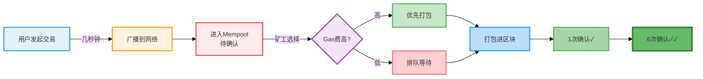
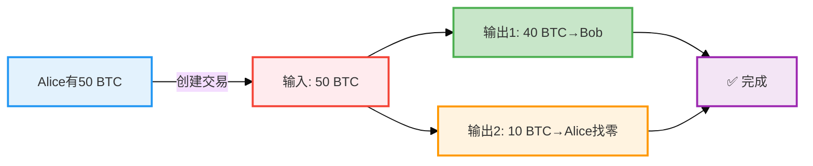
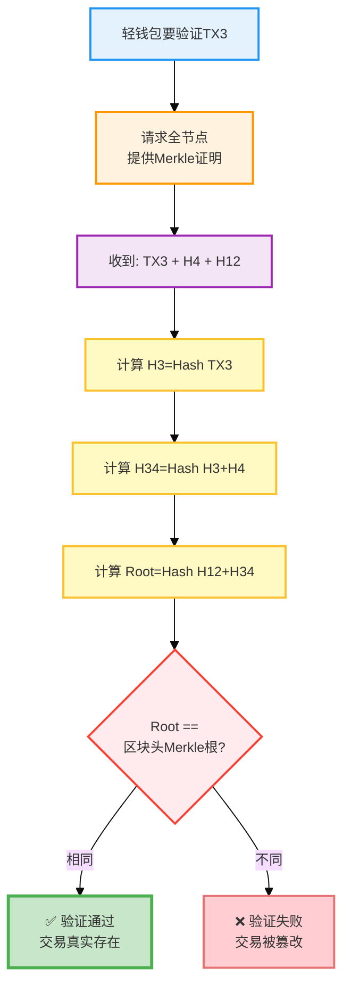
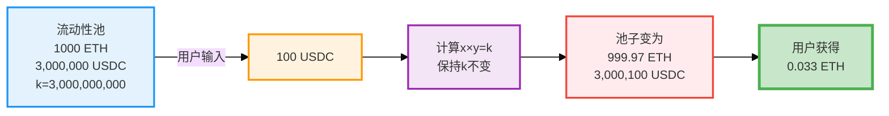

在传统的金融世界中，当你想要买卖股票时，需要找到愿意与你交易的对手方。如果市场上买家和卖家都很少，你可能需要等待很久，或者接受不利的价格。

而在Uniswap这样的去中心化交易所中，**流动性池(Liquidity Pool)** 充当了"自动做市商（AMM）即（Automated Market Maker​）"的角色。你不需要等待对手方，而是直接与智能合约进行交易。这种革命性的机制改变了整个金融交易的方式。

## 第一部分：流动性基础概念

### 什么是流动性？

很多人对区块链交易有一个常见的误解：**"比特币区块间隔是10分钟，那我的交易是不是要等10分钟才能确认？"**

让我们用一个生动的例子来解释这个问题。

#### 区块链就像一辆公交车

想象区块链是一辆每10分钟发车一次的公交车：

```
时间轴：
00:00 - 第1辆车发车（装载100笔交易）
00:10 - 第2辆车发车（装载100笔交易）
00:20 - 第3辆车发车（装载100笔交易）
...
```

**关键问题：你的交易什么时候被确认？**

这取决于你什么时候到达"车站"（发起交易）：

#### 情况1：运气好的情况
```
09:59 - 你发起交易（刚好赶上10:00的车）
10:00 - 矿工打包这个区块（你的交易被包含）
10:00 - 你的交易获得第一次确认 ✓

等待时间：约1分钟
```

#### 情况2：运气不好的情况
```
10:01 - 你发起交易（刚好错过10:00的车）
10:10 - 矿工打包下一个区块（你的交易被包含）
10:10 - 你的交易获得第一次确认 ✓

等待时间：约9分钟
```

#### 情况3：更现实的情况
```
10:05 - 你发起交易（在两个区块之间）
10:10 - 矿工打包区块（你的交易被包含）
10:10 - 你的交易获得第一次确认 ✓

平均等待时间：约5分钟
```

#### 核心理解：交易确认的真实流程



**关键影响因素**：
- 💰 **Gas费高低**：矿工优先选择手续费高的交易
- 🚦 **网络拥堵**：拥堵时低Gas费交易需等待更久
- 🎲 **时间运气**：何时发起交易影响等待时间

#### 为什么需要多次确认？

**单次确认的风险：双花攻击（Double Spending）**

想象一个恶意用户试图欺骗系统：

```
步骤1：用户A向商家B转账1 BTC
步骤2：这笔交易被包含在区块N中（1次确认）
步骤3：商家B看到确认，发货
步骤4：用户A控制算力，创建一条新链
步骤5：在新链中，用户A把这1 BTC转给自己
步骤6：如果新链超过原链，商家B的交易会被撤销
```

**多次确认的保护机制：**

```
1次确认：攻击者需要51%的算力
3次确认：攻击者需要持续51%算力3个区块（成本很高）
6次确认：几乎不可能被攻击（需要持续51%算力1小时）
```

**形象比喻：**
- 1次确认：就像用铅笔写字，还可以擦掉
- 3次确认：像用圆珠笔写字，很难擦掉
- 6次确认：像用刻刀刻在石头上，几乎不可能改变

#### 不同区块链的确认时间

| 区块链 | 区块间隔 | 推荐确认数 | 实际等待时间 |
|--------|----------|------------|--------------|
| 比特币 | 10分钟 | 6次 | 约60分钟 |
| 以太坊 | 12秒 | 12次 | 约2.4分钟 |
| BSC | 3秒 | 15次 | 约45秒 |
| Polygon | 2秒 | 128次 | 约4分钟 |

#### 实际建议

**普通用户：**
- 小额支付：等待1次确认即可
- 中等金额：等待3次确认
- 大额转账：等待6次确认

**交易所/商家：**
- 必须等待足够的确认数
- 根据金额和风险调整策略
- 使用链上监控工具实时追踪

**提高交易速度的方法：**
1. **提高Gas费**：矿工优先打包高手续费交易
2. **选择快速链**：使用Layer2或高性能公链
3. **使用闪电网络**：比特币的即时支付方案

### 区块链钱包：三种类型对比

**核心概念**：钱包不存储你的币，只是管理私钥的工具。你的币永远在区块链上。

#### 三种钱包类型

**1. 全节点钱包（Full Node Wallet）**

全节点钱包会下载并验证整条区块链的所有数据。

```
工作原理：
1. 下载整个区块链（比特币约500GB）
2. 验证每一笔交易
3. 维护完整的UTXO集合
4. 可以独立验证所有信息

代表产品：
- Bitcoin Core
- Geth（以太坊）
```

**什么是 UTXO（Unspent Transaction Output）？**

UTXO 是"未花费的交易输出"，就像你钱包里的一张张现金。

**核心概念：**
- 🪙 **UTXO** = 一笔未被花费的比特币（像现金）
- 💼 **UTXO集合** = 所有当前可用的比特币
- 🔍 **全节点维护UTXO集合** = 知道每一张"钱"在哪里，防止双花

**Alice 转账 40 BTC 给 Bob 的流程：**



**关键理解：** 旧的 50 BTC UTXO 被销毁，创建两个新 UTXO（40 BTC 给 Bob，10 BTC 找零给 Alice）

**特点**：
- ✅ 最高安全性，完全去中心化
- ❌ 需要数百GB存储，同步需数天

**2. 轻钱包（Light Wallet / SPV）**

**核心原理**：只下载区块头（80字节/块），通过 Merkle 树验证交易。

**Merkle 树验证流程：**



**特点**：
- ✅ 只需 64MB 存储，几分钟启动，适合日常使用
- ❌ 依赖全节点提供数据，隐私性略差

**代表产品**：MetaMask、Trust Wallet、Electrum

**3. 托管钱包（Custodial Wallet）**

**核心特征**：私钥由第三方（如交易所）保管，用户通过账号密码登录。

**特点**：
- ✅ 最简单易用，可找回密码
- ❌ 不控制私钥（Not your keys, not your coins），依赖服务商

**代表产品**：币安、Coinbase 等交易所钱包

#### 三种钱包的对比

| 特性 | 全节点钱包 | 轻钱包(SPV) | 托管钱包 |
|------|-----------|------------|----------|
| 存储空间 | 500GB+ | 64MB | 几乎为0 |
| 同步时间 | 数天 | 几分钟 | 即时 |
| 安全性 | ⭐⭐⭐⭐⭐ | ⭐⭐⭐⭐ | ⭐⭐ |
| 去中心化 | ✅ | ✅ | ❌ |
| 易用性 | 困难 | 中等 | 简单 |
| 私钥控制 | 完全控制 | 完全控制 | 无控制 |
| 隐私性 | ⭐⭐⭐⭐⭐ | ⭐⭐⭐ | ⭐ |
| 适用场景 | 开发者/矿工 | 日常使用 | 新手入门 |

#### 如何选择钱包？

- **日常使用**：轻钱包（MetaMask、Trust Wallet）
- **大额存储**：硬件钱包（Ledger、Trezor）
- **新手入门**：托管钱包（交易所），但尽快学习使用非托管钱包

**核心原则**：备份助记词，永远不要分享私钥！"Not your keys, not your coins"

### 以太坊账户：EOA vs 合约账户

以太坊有两种账户类型，理解它们的区别至关重要。

#### 1. 外部账户（EOA）

**核心特征**：由私钥控制，可主动发起交易（如你的 MetaMask 钱包）

**功能**：
- ✅ 发送 ETH、调用/部署合约、签名交易
- 📍 例子：MetaMask 钱包地址

#### 2. 合约账户（Contract）

**核心特征**：由代码控制，无私钥，只能被动响应

**功能**：
- ✅ 接收 ETH/代币、存储数据、执行代码、调用其他合约
- 📍 例子：Uniswap 流动性池、USDT 合约

| 特性 | EOA | 合约账户 |
|------|-----|---------|
| **控制方式** | 私钥控制 | 代码控制 |
| **主动性** | 可主动发起交易 | 只能被动响应 |
| **代码** | 无代码 | 有智能合约代码 |
| **创建** | 免费、离线生成 | 需部署交易、付 Gas 费 |
| **Gas 消耗** | 转账 21,000 gas | 执行代码 50k-500k+ gas |
| **存储** | 只存余额和 Nonce | 可存储大量数据 |
| **应用场景** | 个人钱包、转账 | DeFi 协议、DAO、NFT |


## 第二部分：Uniswap与流动性机制

### 什么是流动性？

**流动性**是资产快速交易而不影响价格的能力：
- **传统交易所**：需要找到买卖双方进行配对
- **DeFi 流动性池**：直接与智能合约交易，无需等待

**流动性池**就像一个"自动售货机"：用户存入两种代币（如 ETH 和 USDC），智能合约自动提供兑换，交易者支付 0.3% 手续费由流动性提供者分享。

### Uniswap核心机制

### 恒定乘积公式：x × y = k

Uniswap使用**恒定乘积公式**来维持流动性：

```
x × y = k
```

其中：
- `x` 是池中代币A的数量
- `y` 是池中代币B的数量  
- `k` 是一个常数

### 实际例子：ETH/USDC交易对

**Uniswap 交易流程：**



**关键理解**：
- 💰 用户支付 100 USDC → 池子 USDC 增加
- 🔄 保持 k 值不变 → 自动计算 ETH 输出
- ✅ 用户获得约 0.033 ETH → 池子 ETH 减少
- 📊 **价格略高于市场价**（滑点效应）

### 流动性提供者（LP）

流动性提供者向池子存入**等值的两种代币**，获得 **LP 代币**作为凭证：
- 为交易者提供流动性
- 赚取 0.3% 交易手续费
- 但面临**无常损失**风险（价格变化时的潜在损失）

## 第三部分：理解常数 k

### 常数 k 的本质

k 是根据池子中代币的**初始数量**计算出来的：

```
例如：存入 1000 ETH + 3,000,000 USDC
k = 1000 × 3,000,000 = 3,000,000,000
```

**k 值的变化规则**：
- ✅ 添加流动性 → k 增加
- ✅ 移除流动性 → k 减少  
- ❌ 交易时 → k **必须保持不变**

**为什么 k 不能改变？**

因为恒定乘积公式 `x × y = k` 是 AMM 的核心：
- 如果 k 能随意改变，交易者可以"凭空创造"价值
- 保持 k 不变确保公平交易
- 价格由代币比例自动决定（`价格 = y / x`）

**关键理解**：
- 买入一个代币时，另一个代币数量必须增加
- 价格随交易自动调整
- 池子永远不会"耗尽"（除非一个代币数量变为 0）

## 第四部分：流动性挖矿与风险

### 流动性挖矿

**流动性挖矿**是 DeFi 项目激励用户提供流动性的机制：
1. 提供流动性 → 获得 LP 代币
2. 质押 LP 代币 → 获得项目代币奖励
3. 持续收益 = 交易手续费 + 挖矿奖励

**主要风险**：
- 💸 **无常损失**：价格变化导致的潜在损失
- 🔒 **智能合约风险**：代码漏洞可能导致资金损失
- 📉 **市场风险**：代币价格剧烈波动

## 第五部分：理解无常损失

### 什么是无常损失？

**无常损失**是指提供流动性后，代币价格变化导致的潜在损失。你最终得到的代币价值会比直接持有要少。

**为什么叫"无常"？** 因为是暂时的：
- 价格回到初始状态 → 损失消失
- 只有移除流动性时 → 损失才"实现"
- 手续费收益可能覆盖损失

### 实际例子

**初始状态**：存入 1 ETH + 3000 USDC（总价值 6000 USDC，ETH 价格 3000 USDC）

#### 情况1：ETH 涨到 4500 USDC（+50%）
```
池子自动调整：0.816 ETH + 3673 USDC = 7345 USDC
直接持有：1 ETH + 3000 USDC = 7500 USDC
无常损失：155 USDC (约 2.1%)
```

**为什么 ETH 数量变少？**
- 外部市场 ETH 涨价 → 套利者发现池子里便宜
- 套利者用 USDC 买走池子里的 ETH
- 池子保持 k 不变 → ETH 减少，USDC 增加

#### 情况2：ETH 跌到 1500 USDC（-50%）
```
池子自动调整：1.414 ETH + 2121 USDC = 4242 USDC
直接持有：1 ETH + 3000 USDC = 4500 USDC
无常损失：258 USDC (约 5.7%)
```

**为什么 ETH 数量变多？**
- 外部市场 ETH 跌价 → 套利者发现池子里贵
- 套利者卖 ETH 给池子换 USDC
- 池子保持 k 不变 → ETH 增加，USDC 减少

**核心理解**：
- 套利者通过交易让池子价格趋于市场价
- 过程"自动"发生（市场机制驱动）
- 价格变化越大 → 无常损失越大

### 常见价格变化的无常损失

| 价格变化 | 无常损失 |
|---------|---------|
| ±25%    | 0.6%    |
| ±50%    | 2.0%    |
| ±100%   | 5.7%    |
| ±200%   | 13.4%   |
| ±400%   | 25.5%   |

### 如何应对无常损失？

**选择策略**：
- 💰 **稳定币对**（USDC/USDT）：几乎无损失
- 📈 **主流币对**（ETH/WBTC）：相关性高，损失较小
- ⚠️ **波动币对**（ETH/山寨币）：高收益但高风险

**降低风险**：
- 长期持有，让手续费收益覆盖损失
- 选择交易量大的池子（更多手续费）
- 使用无常损失计算器评估风险

**核心权衡**：

| 策略 | 优点 | 缺点 |
|------|------|------|
| 提供流动性 | 赚取手续费收益 | 面临无常损失 |
| 直接持有 | 无损失风险 | 无额外收益 |

## 总结

**核心要点**：

1. **区块确认机制**：交易确认时间取决于区块间隔和 Gas 费，多次确认保护双花攻击
2. **钱包类型**：全节点（最安全）、轻钱包（实用）、托管钱包（简单但有风险）
3. **Uniswap 流动性**：通过恒定乘积公式 `x × y = k` 实现自动做市
4. **流动性提供**：赚取手续费，但面临无常损失风险
5. **无常损失**：价格变化导致的潜在损失，可通过长期持有和手续费收益弥补

**关键建议**：
- 新手从托管钱包开始，逐步学习非托管钱包
- 提供流动性前，使用计算器评估无常损失
- 选择稳定币对或相关性高的代币对降低风险
- "Not your keys, not your coins" - 掌握私钥至关重要
