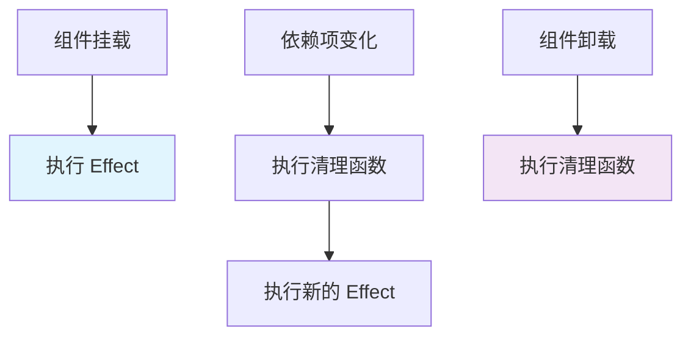

本文档整理了币安交易所前端开发岗位面试中可能涉及的 React、性能优化和 Next.js 核心知识点，帮助面试者系统化准备。

---

## 📋 目录

1. [React 核心知识点](#一-react-核心知识点)
2. [React 性能优化](#二-react-性能优化)
3. [Next.js 核心知识点](#三-nextjs-核心知识点)
4. [Web 性能优化](#四-web-性能优化)
5. [实战场景题](#五-实战场景题)
6. [面试技巧](#六-面试技巧)

---

## 一、React 核心知识点

### 1.1 React 基础概念

#### Q1: 什么是虚拟 DOM？为什么需要虚拟 DOM？

**答案要点：**

虚拟 DOM 是用 JavaScript 对象来描述真实 DOM 结构的一种技术。

```jsx
// 真实 DOM
<div className="container">
  <h1>Hello</h1>
</div>

// 虚拟 DOM 对象
{
  type: 'div',
  props: {
    className: 'container',
    children: [
      {
        type: 'h1',
        props: { children: 'Hello' }
      }
    ]
  }
}
```

**为什么需要虚拟 DOM：**

1. **性能优化**：直接操作 DOM 成本高，虚拟 DOM 在内存中操作更快
2. **跨平台**：虚拟 DOM 可以渲染到不同平台（Web、Native、Canvas）
3. **批量更新**：React 可以将多次更新合并，减少 DOM 操作次数
4. **Diff 算法**：通过比较虚拟 DOM 树，找出最小变更集

#### Q2: React 的 Diff 算法原理是什么？

**核心策略：**

1. **Tree Diff**：只比较同层节点，不跨层级比较
2. **Component Diff**：相同类型的组件会复用，不同类型会重建
3. **Element Diff**：通过 key 值识别可复用的节点

```jsx
// ❌ 错误：没有 key，React 无法识别节点
{items.map(item => <div>{item.name}</div>)}

// ✅ 正确：使用唯一 key
{items.map(item => <div key={item.id}>{item.name}</div>)}
```

**Diff 算法的时间复杂度：**
- 传统 Diff 算法：O(n³)
- React Diff 算法：O(n)（通过启发式算法优化）

#### Q3: React Fiber 架构是什么？解决了什么问题？

**Fiber 架构的核心：**

1. **可中断的渲染**：将渲染工作分解成小的单元（Fiber 节点）
2. **优先级调度**：根据更新来源分配不同优先级
3. **时间切片**：使用 `requestIdleCallback` 在浏览器空闲时执行

```js
// Fiber 节点的结构
const fiber = {
  type: 'div',           // 节点类型
  child: null,           // 第一个子节点
  sibling: null,         // 下一个兄弟节点
  return: null,          // 父节点
  alternate: null,       // 对应的旧 Fiber（用于 Diff）
  effectTag: null,       // 标记需要执行的操作
}
```

**解决的问题：**
- 解决了 React 15 及之前版本渲染阻塞主线程的问题
- 支持并发渲染，提升用户体验
- 支持 Suspense、时间切片等新特性

### 1.2 Hooks 深入理解

#### Q4: useState 的实现原理是什么？

**核心机制：**

```jsx
function useState(initialValue) {
  // 1. 获取当前 Fiber 节点
  const fiber = getCurrentFiber();
  const hookIndex = getHookIndex();
  
  // 2. 获取旧的 Hook（用于更新时恢复状态）
  const oldHook = fiber.alternate?.hooks?.[hookIndex];
  
  // 3. 创建新的 Hook
  const hook = {
    state: oldHook ? oldHook.state : initialValue,
    queue: [], // 存储状态更新队列
  };
  
  // 4. 执行队列中的更新
  const actions = oldHook ? oldHook.queue : [];
  actions.forEach(action => {
    hook.state = typeof action === 'function' 
      ? action(hook.state) 
      : action;
  });
  
  // 5. setState 函数
  const setState = (action) => {
    hook.queue.push(action);
    // 触发重新渲染
    scheduleUpdate();
  };
  
  fiber.hooks.push(hook);
  return [hook.state, setState];
}
```

**关键点：**
- Hooks 存储在 Fiber 节点上，而不是组件实例
- 通过调用顺序识别不同的 Hook
- 状态更新是异步的，会被批量处理

#### Q5: useEffect 的执行时机和清理机制？

```jsx
useEffect(() => {
  // 副作用逻辑
  const subscription = subscribe();
  
  // 清理函数
  return () => {
    subscription.unsubscribe();
  };
}, [dependencies]); // 依赖数组
```

**执行时机：**



**常见陷阱：**

```jsx
// ❌ 错误：缺少依赖项
useEffect(() => {
  fetchData(userId); // userId 变化时不会重新执行
}, []);

// ✅ 正确：包含所有依赖
useEffect(() => {
  fetchData(userId);
}, [userId]);

// ✅ 使用 useCallback 避免无限循环
const fetchData = useCallback(() => {
  // ...
}, [userId]);

useEffect(() => {
  fetchData();
}, [fetchData]);
```

#### Q6: useMemo 和 useCallback 的区别和使用场景？

```jsx
// useMemo: 缓存计算结果
const expensiveValue = useMemo(() => {
  return computeExpensiveValue(a, b);
}, [a, b]);

// useCallback: 缓存函数引用
const handleClick = useCallback(() => {
  doSomething(a, b);
}, [a, b]);
```

**使用场景：**

| Hook | 用途 | 示例 |
|------|------|------|
| `useMemo` | 缓存计算结果 | 复杂计算、过滤数组 |
| `useCallback` | 缓存函数引用 | 传递给子组件的回调函数 |

**性能优化示例：**

```jsx
// 没有优化：每次渲染都创建新函数
function Parent() {
  const [count, setCount] = useState(0);
  
  const handleClick = () => {
    console.log('clicked');
  };
  
  return <Child onClick={handleClick} />; // Child 会不必要地重新渲染
}

// 优化后：使用 useCallback
function Parent() {
  const [count, setCount] = useState(0);
  
  const handleClick = useCallback(() => {
    console.log('clicked');
  }, []); // 空依赖数组，函数引用不变
  
  return <Child onClick={handleClick} />;
}

// 配合 React.memo 使用
const Child = React.memo(({ onClick }) => {
  return <button onClick={onClick}>Click</button>;
});
```

### 1.3 组件设计模式

#### Q7: 受控组件 vs 非受控组件

```jsx
// 受控组件：状态由 React 管理
function ControlledInput() {
  const [value, setValue] = useState('');
  
  return (
    <input 
      value={value} 
      onChange={(e) => setValue(e.target.value)} 
    />
  );
}

// 非受控组件：使用 ref 直接访问 DOM
function UncontrolledInput() {
  const inputRef = useRef(null);
  
  const handleSubmit = () => {
    console.log(inputRef.current.value);
  };
  
  return (
    <input ref={inputRef} />
  );
}
```

**选择原则：**
- 需要实时验证或格式化：使用受控组件
- 简单表单，性能要求高：使用非受控组件

#### Q8: 高阶组件（HOC）和 Render Props 模式

```jsx
// HOC 模式
function withAuth(WrappedComponent) {
  return function AuthenticatedComponent(props) {
    const isAuthenticated = useAuth();
    
    if (!isAuthenticated) {
      return <Login />;
    }
    
    return <WrappedComponent {...props} />;
  };
}

// Render Props 模式
function AuthProvider({ children }) {
  const isAuthenticated = useAuth();
  
  return children({ isAuthenticated });
}

// 使用
<AuthProvider>
  {({ isAuthenticated }) => 
    isAuthenticated ? <Dashboard /> : <Login />
  }
</AuthProvider>
```

**现代替代方案：自定义 Hooks**

```jsx
// 更推荐的方式：自定义 Hook
function useAuth() {
  const [isAuthenticated, setIsAuthenticated] = useState(false);
  // ...
  return { isAuthenticated, login, logout };
}

function Dashboard() {
  const { isAuthenticated } = useAuth();
  // ...
}
```

---

## 二、React 性能优化

### 2.1 渲染性能优化

#### Q9: 如何避免不必要的重新渲染？

**优化策略：**

1. **React.memo**：浅比较 props
2. **useMemo/useCallback**：缓存值和函数
3. **状态提升/下降**：减少影响范围

```jsx
// ❌ 问题：父组件更新导致所有子组件重新渲染
function Parent() {
  const [count, setCount] = useState(0);
  const [name, setName] = useState('John');
  
  return (
    <div>
      <button onClick={() => setCount(count + 1)}>Count: {count}</button>
      <ExpensiveChild name={name} /> {/* 即使 name 没变也会重新渲染 */}
    </div>
  );
}

// ✅ 优化：使用 React.memo
const ExpensiveChild = React.memo(({ name }) => {
  // 只有 name 变化时才重新渲染
  return <div>{name}</div>;
});

// ✅ 进一步优化：状态下降
function Parent() {
  const [count, setCount] = useState(0);
  
  return (
    <div>
      <button onClick={() => setCount(count + 1)}>Count: {count}</button>
      <NameProvider /> {/* 将 name 状态隔离 */}
    </div>
  );
}
```

#### Q10: 虚拟列表（Virtual List）的实现原理

**问题场景：** 渲染大量列表项（如币安的交易列表）

```jsx
// ❌ 问题：渲染 10000 条数据会卡顿
function TradeList({ trades }) {
  return (
    <div>
      {trades.map(trade => (
        <TradeItem key={trade.id} trade={trade} />
      ))}
    </div>
  );
}

// ✅ 解决方案：虚拟列表
import { FixedSizeList } from 'react-window';

function VirtualizedTradeList({ trades }) {
  return (
    <FixedSizeList
      height={600}
      itemCount={trades.length}
      itemSize={50}
      width="100%"
    >
      {({ index, style }) => (
        <div style={style}>
          <TradeItem trade={trades[index]} />
        </div>
      )}
    </FixedSizeList>
  );
}
```

**原理：**
- 只渲染可见区域的列表项
- 使用绝对定位，动态计算位置
- 滚动时动态添加/移除 DOM 节点

### 2.2 代码分割与懒加载

#### Q11: React.lazy 和 Suspense 的使用

```jsx
// 懒加载组件
const Dashboard = React.lazy(() => import('./Dashboard'));
const Settings = React.lazy(() => import('./Settings'));

function App() {
  return (
    <Router>
      <Suspense fallback={<Loading />}>
        <Routes>
          <Route path="/dashboard" element={<Dashboard />} />
          <Route path="/settings" element={<Settings />} />
        </Routes>
      </Suspense>
    </Router>
  );
}
```

**优化效果：**
- 减少初始包体积
- 按需加载，提升首屏性能
- 更好的用户体验

### 2.3 状态管理优化

#### Q12: 如何优化 Context 的性能？

```jsx
// ❌ 问题：Context 值变化导致所有消费者重新渲染
const AppContext = createContext();

function App() {
  const [user, setUser] = useState(null);
  const [theme, setTheme] = useState('light');
  
  return (
    <AppContext.Provider value={{ user, theme, setUser, setTheme }}>
      <Child />
    </AppContext.Provider>
  );
}

// ✅ 优化：拆分 Context
const UserContext = createContext();
const ThemeContext = createContext();

// ✅ 或者使用 useMemo 缓存值
function App() {
  const [user, setUser] = useState(null);
  const [theme, setTheme] = useState('light');
  
  const userValue = useMemo(() => ({ user, setUser }), [user]);
  const themeValue = useMemo(() => ({ theme, setTheme }), [theme]);
  
  return (
    <UserContext.Provider value={userValue}>
      <ThemeContext.Provider value={themeValue}>
        <Child />
      </ThemeContext.Provider>
    </UserContext.Provider>
  );
}
```

---

## 三、Next.js 核心知识点

### 3.1 Next.js 基础概念

#### Q13: Next.js 的渲染方式有哪些？各自适用场景？

**渲染方式对比：**

| 渲染方式 | 特点 | 适用场景 |
|---------|------|---------|
| **SSG (Static Site Generation)** | 构建时生成静态 HTML | 博客、文档、营销页面 |
| **SSR (Server-Side Rendering)** | 每次请求时生成 HTML | 需要 SEO、个性化内容 |
| **ISR (Incremental Static Regeneration)** | 静态生成 + 定时更新 | 内容更新频率中等 |
| **CSR (Client-Side Rendering)** | 客户端渲染 | 不需要 SEO 的页面 |

```jsx
// SSG: 构建时生成
export async function getStaticProps() {
  const data = await fetchData();
  return {
    props: { data },
    revalidate: 60, // ISR: 60秒后重新生成
  };
}

// SSR: 每次请求时生成
export async function getServerSideProps(context) {
  const data = await fetchData(context.params);
  return {
    props: { data },
  };
}

// 客户端数据获取
function Dashboard() {
  const { data, error } = useSWR('/api/data', fetcher);
  // ...
}
```

#### Q14: Next.js 的路由系统原理

**文件系统路由：**

```
pages/
  index.js          → /
  about.js          → /about
  blog/
    [slug].js       → /blog/:slug (动态路由)
    [...all].js     → /blog/* (捕获所有路由)
  api/
    users.js        → /api/users (API 路由)
```

**路由跳转：**

```jsx
import Link from 'next/link';
import { useRouter } from 'next/router';

// 声明式导航
<Link href="/about">
  <a>About</a>
</Link>

// 编程式导航
const router = useRouter();
router.push('/about');

// 预加载
<Link href="/about" prefetch={false}>
  <a>About</a>
</Link>
```

### 3.2 Next.js 性能优化

#### Q15: Next.js 的图片优化（next/image）

```jsx
import Image from 'next/image';

// ✅ 使用 next/image
<Image
  src="/avatar.png"
  width={500}
  height={300}
  alt="Avatar"
  priority // 关键图片，优先加载
  placeholder="blur" // 模糊占位符
  blurDataURL="data:image/..." // 占位图数据
/>

// 自动优化：
// 1. 响应式图片（srcset）
// 2. 懒加载
// 3. WebP/AVIF 格式转换
// 4. 尺寸优化
```

#### Q16: API Routes 的最佳实践

```jsx
// pages/api/trades/[symbol].js
export default async function handler(req, res) {
  const { symbol } = req.query;
  const { method } = req;
  
  if (method === 'GET') {
    try {
      const data = await fetchTradeData(symbol);
      res.status(200).json(data);
    } catch (error) {
      res.status(500).json({ error: 'Failed to fetch data' });
    }
  } else {
    res.setHeader('Allow', ['GET']);
    res.status(405).end(`Method ${method} Not Allowed`);
  }
}

// 使用中间件
export function middleware(req) {
  // 认证、日志等
}

// 配置
export const config = {
  api: {
    bodyParser: {
      sizeLimit: '1mb',
    },
    responseLimit: '8mb',
  },
};
```

### 3.3 Next.js 高级特性

#### Q17: 中间件（Middleware）的使用

```jsx
// middleware.js
import { NextResponse } from 'next/server';

export function middleware(request) {
  // 1. 认证检查
  const token = request.cookies.get('token');
  if (!token && request.nextUrl.pathname.startsWith('/dashboard')) {
    return NextResponse.redirect(new URL('/login', request.url));
  }
  
  // 2. 请求头修改
  const response = NextResponse.next();
  response.headers.set('x-custom-header', 'value');
  
  return response;
}

// 配置匹配规则
export const config = {
  matcher: '/dashboard/:path*',
};
```

#### Q18: 增量静态再生（ISR）的使用场景

```jsx
// 适用于：内容更新频率不高的页面
export async function getStaticProps() {
  const data = await fetchData();
  
  return {
    props: { data },
    // ISR: 60秒后重新生成，最多每60秒更新一次
    revalidate: 60,
  };
}

// 按需重新验证（On-Demand Revalidation）
// pages/api/revalidate.js
export default async function handler(req, res) {
  // 验证 secret token
  if (req.query.secret !== process.env.REVALIDATE_SECRET) {
    return res.status(401).json({ message: 'Invalid token' });
  }
  
  try {
    await res.revalidate('/trades');
    return res.json({ revalidated: true });
  } catch (err) {
    return res.status(500).send('Error revalidating');
  }
}
```

---

## 四、Web 性能优化

### 4.1 加载性能优化

#### Q19: 首屏加载优化策略

**优化清单：**

1. **代码分割**
```jsx
// 路由级别代码分割
const Dashboard = dynamic(() => import('./Dashboard'), {
  loading: () => <Loading />,
  ssr: false, // 禁用 SSR
});
```

2. **资源预加载**
```html
<!-- 关键资源预加载 -->
<link rel="preload" href="/fonts/main.woff2" as="font" type="font/woff2" crossorigin />
<link rel="prefetch" href="/api/data" />
```

3. **CDN 加速**
```jsx
// next.config.js
module.exports = {
  images: {
    domains: ['cdn.example.com'],
  },
  // 静态资源 CDN
  assetPrefix: process.env.CDN_URL,
};
```

4. **HTTP/2 服务器推送**
```jsx
// 服务器配置
res.setHeader('Link', '</styles.css>; rel=preload; as=style');
```

#### Q20: 运行时性能优化

**优化策略：**

1. **防抖和节流**
```jsx
import { debounce, throttle } from 'lodash';

// 防抖：搜索输入
const handleSearch = debounce((value) => {
  searchAPI(value);
}, 300);

// 节流：滚动事件
const handleScroll = throttle(() => {
  updatePosition();
}, 100);
```

2. **Web Workers**
```jsx
// 主线程
const worker = new Worker('/worker.js');
worker.postMessage({ data: largeData });
worker.onmessage = (e) => {
  console.log('Result:', e.data);
};

// worker.js
self.onmessage = (e) => {
  const result = heavyComputation(e.data.data);
  self.postMessage({ result });
};
```

3. **虚拟滚动**
```jsx
// 使用 react-window 或 react-virtualized
import { FixedSizeList } from 'react-window';
```

### 4.2 网络优化

#### Q21: 请求优化策略

```jsx
// 1. 请求合并
const useMultipleQueries = (queries) => {
  return useQueries(
    queries.map(query => ({
      queryKey: query.key,
      queryFn: query.fn,
    }))
  );
};

// 2. 请求去重（使用 SWR/React Query）
import useSWR from 'swr';

function useTradeData(symbol) {
  const { data, error } = useSWR(
    `/api/trades/${symbol}`,
    fetcher,
    {
      dedupingInterval: 2000, // 2秒内相同请求去重
      revalidateOnFocus: false,
    }
  );
  return { data, error };
}

// 3. 请求缓存
const cache = new Map();

async function fetchWithCache(url) {
  if (cache.has(url)) {
    return cache.get(url);
  }
  const data = await fetch(url).then(r => r.json());
  cache.set(url, data);
  return data;
}
```

---

## 五、实战场景题

### 5.1 币安交易所相关场景

#### Q22: 如何实现实时价格更新（WebSocket）？

```jsx
function useWebSocket(url) {
  const [data, setData] = useState(null);
  const [error, setError] = useState(null);
  const wsRef = useRef(null);
  
  useEffect(() => {
    const ws = new WebSocket(url);
    wsRef.current = ws;
    
    ws.onopen = () => {
      console.log('WebSocket connected');
      // 订阅交易对
      ws.send(JSON.stringify({
        method: 'SUBSCRIBE',
        params: ['btcusdt@ticker'],
        id: 1,
      }));
    };
    
    ws.onmessage = (event) => {
      const message = JSON.parse(event.data);
      setData(message);
    };
    
    ws.onerror = (error) => {
      setError(error);
    };
    
    ws.onclose = () => {
      console.log('WebSocket disconnected');
      // 重连逻辑
      setTimeout(() => {
        // 重新连接
      }, 3000);
    };
    
    return () => {
      ws.close();
    };
  }, [url]);
  
  return { data, error };
}

// 使用
function PriceDisplay({ symbol }) {
  const { data } = useWebSocket(`wss://stream.binance.com/ws/${symbol}@ticker`);
  
  return (
    <div>
      <h2>{symbol}</h2>
      <p>Price: {data?.c}</p>
      <p>24h Change: {data?.P}%</p>
    </div>
  );
}
```

#### Q23: 如何处理大量实时数据的性能问题？

```jsx
// 1. 数据采样（只显示部分数据点）
function sampleData(data, maxPoints = 1000) {
  if (data.length <= maxPoints) return data;
  
  const step = Math.ceil(data.length / maxPoints);
  return data.filter((_, index) => index % step === 0);
}

// 2. 使用虚拟列表
function TradeList({ trades }) {
  return (
    <FixedSizeList
      height={600}
      itemCount={trades.length}
      itemSize={50}
    >
      {({ index, style }) => (
        <div style={style}>
          <TradeItem trade={trades[index]} />
        </div>
      )}
    </FixedSizeList>
  );
}

// 3. 使用 Web Worker 处理数据
const worker = new Worker('/data-processor.js');
worker.postMessage({ trades: rawTrades });
worker.onmessage = (e) => {
  setProcessedTrades(e.data);
};
```

#### Q24: 如何实现订单簿（Order Book）的高性能渲染？

```jsx
// 关键优化点：
// 1. 使用 Canvas 渲染（大量数据时）
// 2. 数据聚合（合并相同价格的订单）
// 3. 防抖更新（避免频繁渲染）

function OrderBook({ orders }) {
  const [displayOrders, setDisplayOrders] = useState([]);
  
  // 数据聚合
  const aggregatedOrders = useMemo(() => {
    const map = new Map();
    orders.forEach(order => {
      const price = order.price;
      if (map.has(price)) {
        map.set(price, map.get(price) + order.quantity);
      } else {
        map.set(price, order.quantity);
      }
    });
    return Array.from(map.entries())
      .map(([price, quantity]) => ({ price, quantity }))
      .sort((a, b) => b.price - a.price);
  }, [orders]);
  
  // 防抖更新
  const debouncedUpdate = useMemo(
    () => debounce((data) => {
      setDisplayOrders(data);
    }, 16), // 约 60fps
    []
  );
  
  useEffect(() => {
    debouncedUpdate(aggregatedOrders);
  }, [aggregatedOrders, debouncedUpdate]);
  
  return (
    <div className="order-book">
      {displayOrders.map(order => (
        <OrderRow key={order.price} order={order} />
      ))}
    </div>
  );
}
```

### 5.2 通用场景题

#### Q25: 如何实现一个高性能的搜索功能？

```jsx
function SearchComponent() {
  const [query, setQuery] = useState('');
  const [results, setResults] = useState([]);
  const [loading, setLoading] = useState(false);
  
  // 防抖搜索
  const debouncedSearch = useMemo(
    () => debounce(async (searchQuery) => {
      if (!searchQuery) {
        setResults([]);
        return;
      }
      
      setLoading(true);
      try {
        const data = await searchAPI(searchQuery);
        setResults(data);
      } catch (error) {
        console.error(error);
      } finally {
        setLoading(false);
      }
    }, 300),
    []
  );
  
  useEffect(() => {
    debouncedSearch(query);
    return () => {
      debouncedSearch.cancel();
    };
  }, [query, debouncedSearch]);
  
  return (
    <div>
      <input
        value={query}
        onChange={(e) => setQuery(e.target.value)}
        placeholder="Search..."
      />
      {loading && <Spinner />}
      <SearchResults results={results} />
    </div>
  );
}
```

---

## 六、面试技巧

### 6.1 回答问题的框架

**STAR 法则：**
- **S**ituation（情境）：项目背景
- **T**ask（任务）：需要解决的问题
- **A**ction（行动）：采取的具体措施
- **R**esult（结果）：取得的成果和量化指标

**示例：**

> **问题：** 你如何优化一个 React 应用的性能？
> 
> **回答：**
> - **情境**：在币安项目中，交易列表页面有 10000+ 条数据，导致页面卡顿
> - **任务**：优化列表渲染性能，提升用户体验
> - **行动**：
>   1. 使用 `react-window` 实现虚拟滚动
>   2. 使用 `React.memo` 优化子组件渲染
>   3. 使用 `useMemo` 缓存计算结果
>   4. 实现数据分页和懒加载
> - **结果**：
>   - 首屏渲染时间从 3s 降低到 0.5s
>   - 滚动帧率从 20fps 提升到 60fps
>   - 内存占用减少 70%

### 6.2 常见问题准备

#### 技术深度问题

1. **React 18 的新特性有哪些？**
   - Concurrent Rendering（并发渲染）
   - Automatic Batching（自动批处理）
   - Suspense 改进
   - useTransition、useDeferredValue

2. **如何实现一个自定义 Hook？**
   - 遵循 Hooks 规则
   - 使用其他 Hooks 组合
   - 返回稳定的 API

3. **Next.js 13 App Router 的变化？**
   - 基于文件系统的路由
   - Server Components
   - Streaming SSR
   - 新的数据获取方式

#### 项目经验问题

1. **你遇到的最大的技术挑战是什么？**
   - 准备 2-3 个具体案例
   - 说明问题、解决方案、结果

2. **如何保证代码质量？**
   - 代码审查
   - 单元测试
   - TypeScript
   - ESLint/Prettier

3. **如何与团队协作？**
   - Git 工作流
   - 代码规范
   - 技术分享

### 6.3 准备清单

**技术准备：**
- [ ] 熟悉 React 核心概念和 API
- [ ] 理解 React Hooks 原理
- [ ] 掌握性能优化技巧
- [ ] 熟悉 Next.js 核心特性
- [ ] 了解 Web 性能优化方法
- [ ] 准备项目经验案例

**面试准备：**
- [ ] 准备自我介绍（1-2 分钟）
- [ ] 准备 3-5 个项目案例
- [ ] 准备技术问题的回答
- [ ] 准备反问问题（公司技术栈、团队情况等）
- [ ] 准备在线编程环境（CodeSandbox/CodePen）

**心理准备：**
- [ ] 保持自信，但不过度自信
- [ ] 遇到不会的问题，诚实说明
- [ ] 展示学习能力和解决问题的思路
- [ ] 准备提问环节的问题

---

## 七、推荐学习资源

### 官方文档
- [React 官方文档](https://react.dev/)
- [Next.js 官方文档](https://nextjs.org/docs)
- [Web.dev 性能优化](https://web.dev/performance/)

### 深入理解
- [React 源码解析](https://github.com/facebook/react)
- [Next.js GitHub](https://github.com/vercel/next.js)
- [Web.dev 性能指南](https://web.dev/fast/)

### 实战项目
- 实现一个简化版的币安交易界面
- 使用 Next.js 构建全栈应用
- 性能优化实战项目

---

## 总结

币安交易所作为全球领先的加密货币交易平台，对前端开发者的要求包括：

1. **扎实的 React 基础**：理解核心原理，熟练使用 Hooks
2. **性能优化能力**：能够识别和解决性能瓶颈
3. **Next.js 实战经验**：熟悉 SSR、SSG、API Routes 等特性
4. **实时数据处理**：WebSocket、大量数据渲染优化
5. **工程化能力**：代码质量、团队协作、问题解决

**面试建议：**
- 准备充分，但保持真实
- 展示解决问题的思路，而不仅仅是答案
- 结合项目经验，说明实际应用场景
- 保持学习态度，展示成长潜力

---

> 💡 **最后提醒**：面试是双向选择的过程，除了展示你的能力，也要了解公司文化、技术栈、团队情况，确保这是一个适合你的机会。祝你面试顺利！🚀

